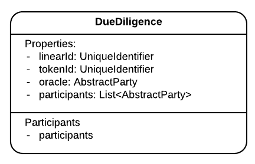
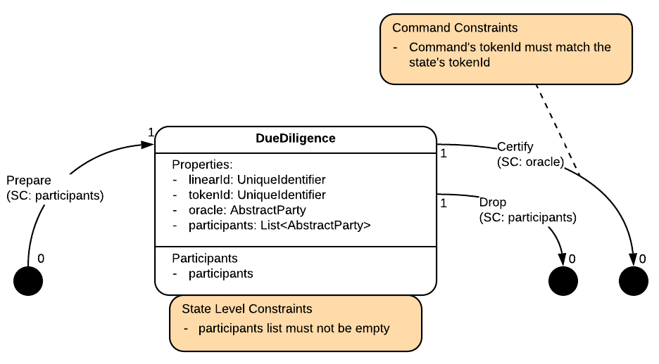

import HighlightBox from "../../src/HighlightBox"

import {
  ExpansionPanel,
  ExpansionPanelList,
  ExpansionPanelListItem
} from 'gatsby-theme-apollo-docs';

This is an example solution to the simplified project exercise of the previous chapter. By no means should you interpret this implementation as the only possible one -- just one of many valid ones.

## Design decisions

The decision was taken to not alter the existing `SalesProposal` and contract, and leave them as they are. Adding complexity to something that works well is always risky. The DMV's _lien_ oracle will be handled by other, new, elements.

Another decision is that the buyer could singlehandedly decide to have a verification done at the time of purchase, or involve the seller in it as well. Also, the ledger constraints are designed to allow purchases even if there are liens. The control of the desired situation is left to flows. It is a business decision.

Because there needs to be some enforcement nonetheless, and the `SalesProposalContract` is left intact, there needs to be a new state to require this contract.

## [`DueDiligence`](https://github.com/corda/corda-training-code/blob/master/080-oracle/contracts/src/main/java/com/template/diligence/state/DueDiligence.java)



This is the new state. It is a `LinearState` created by its participants and it lists the vehicle id and the lien oracle:

```java
@BelongsToContract(DueDiligenceContract.class)
public class DueDiligence implements LinearState {
    @NotNull
    private final UniqueIdentifier linearId;
    @NotNull
    private final UniqueIdentifier tokenId;
    @NotNull
    private final AbstractParty oracle;
    @NotNull
    private final List<AbstractParty> participants;

    // Plus constructor, getters, equals and hashCode.
    [...]
```

The idea is that it is created independently, and then added to the purchase `Accept` transaction, where the desired status is enforced.

Which brings us to the contract that controls it:

## [`DueDiligenceContract`](https://github.com/corda/corda-training-code/blob/master/080-oracle/contracts/src/main/java/com/template/diligence/state/DueDiligenceContract.java)



It defines 3 commands:

```java
public interface Commands extends CommandData {
    class Prepare implements Commands {
    }

    class Certify implements Commands {
        @NotNull
        private final UniqueIdentifier tokenId;
        @NotNull
        private final Status status;

        // Plus constructor, getters, equals and hashCode.
        [...]
    }

    class Drop implements Commands {
    }
}
```
`Prepare` is used to simply create the instance in the first place, `Drop` is used to simply consume, i.e. take the state out of the ledger, and `Certify` is used to ask confirmation from the oracle, consuming the state at the same time.

`Status` needs to be defined:

```java
@CordaSerializable
public enum Status {
    Linked, Clear
}
```
A simple response from the oracle, boolean-like. So the `Certify` command is there for the oracle to confirm the status of the given vehicle id.

As for the [contract constraints](https://github.com/corda/corda-training-code/blob/master/080-oracle/contracts/src/main/java/com/template/diligence/state/DueDiligenceContract.java#L29-L66), beside the classic ones, they are:

* All participants need to sign on `Prepare` and `Drop`.
* Only the oracle needs to sign on `Certify`.
* On `Certify`, the command' `tokenId` should match that of the `DueDiligence` input.

Not overly restrictive.

The [tests](https://github.com/corda/corda-training-code/tree/master/080-oracle/contracts/src/test/java/com/template/diligence/state) test these few constraints in turn.

## [`DiligenceOracleUtilities`](https://github.com/corda/corda-training-code/blob/master/080-oracle/contracts/src/main/java/com/template/diligence/state/DiligenceOracleUtilities.java)

Defining those early on can minimise future mental overhead. When the oracle informs about a status, the information returned has a certain validity period:

```java
public static final Duration VALID_DURATION = Duration.ofMinutes(10);
```
Yes, it means that, at signing, the oracle will check the time-window, which leads to the way transactions will be filtered:

```java
@NotNull
public static FilteredTransaction filter(
        @NotNull final WireTransaction tx,
        @NotNull final AbstractParty oracle) {
    return tx.buildFilteredTransaction(element -> {
        //noinspection rawtypes
        return (element instanceof Command)
                && ((Command) element).getSigners().contains(oracle.getOwningKey())
                && (((Command) element).getValue() instanceof DueDiligenceContract.Commands.Certify)
                || element instanceof TimeWindow;
    });
}
```
Note how the predicate selects the `TimeWindow` too.

Time to move to the oracle proper.

## [`DiligenceOracle`](https://github.com/corda/corda-training-code/blob/master/080-oracle/workflows/src/main/java/com/template/diligence/flow/DiligenceOracle.java)

Let's start with the obvious:

```java
@CordaService
public class DiligenceOracle extends SingletonSerializeAsToken {
    @NotNull
    private final AppServiceHub serviceHub;
```
Then it will sign with a certain key. Let's not assume this is the default key of the node, and instead find another way to select it:

```java
    @Nullable
    private PublicKey oracleKey;
```

<HighlightBox type="info">

Why not assume that the oracle will use the node's `Party`'s key? It would make sense to assume so since an oracle is a source of authority, and a clearly identifiable track back to an identity assists in backing this authority. However, all that is needed by the oracle to sign is the identification of the `PublicKey` to use. This is what is expressed here.

Let's stay on this topic. Further down, you will see that the oracle will be associated to an `AnonymousParty` indeed. Although one that has to be disclosed to any party that wants to query and obtain a signature. If you want to create your own oracle in the future, it is probably overkill, and you could stick to having it identified as a `Party`. Part of the rationale in this example is to use an account, where the oracle is a mere tenant in a node. And potentially one of many oracles hosted on the same node. If your oracle is a temperature oracle for your home town, then the use case is small and your town likely shares a node with neighbouring towns. In this case _partitioning_ makes sense. On the other hand, if your oracle use case is for a large corporation, the name of the corporation is on the line so it night make sense to use a `Party`.

In either situation, letting the oracle know only about the `PublicKey` gets the job done.

</HighlightBox>

Moving on. For simplicity's sake, assume that it keeps a mapping in memory:

```java
    private final Map<UniqueIdentifier, Status> freeAndClears = new HashMap<>(10);
```
The constructor is unremarkable, let's look at the query function:

```java
@NotNull
public Status query(@NotNull final UniqueIdentifier tokenId) {
    final Status status = freeAndClears.get(tokenId);
    return status == null ? Status.Clear : status;
}
```
Where it assumes that absence (`status == null`) is proof of absence (`Status.Clear`), the perks of being a centralised authority. What about the sign function?

```java
    @NotNull
    public TransactionSignature sign(@NotNull final FilteredTransaction ftx)
            throws FilteredTransactionVerificationException,
            ComponentVisibilityException {
        if (oracleKey == null) throw new NullPointerException("oracleKey not initialised");
        ftx.verify();
        if (!ftx.checkWithFun(this::isCommandWithCorrectParameters))
            throw new IllegalArgumentException("Oracle signature requested over an invalid transaction.");
        ftx.checkCommandVisibility(oracleKey);
        return serviceHub.createSignature(ftx, oracleKey);
    }
```
Looks like a copy-paste of what you learned, with the additional check that the key needs to have been set. What is this `isCommandWithCorrectParameters`:

```java
private boolean isCommandWithCorrectParameters(@NotNull final Object elem) {
    //noinspection rawtypes
    if (elem instanceof Command && ((Command) elem).getValue() instanceof Certify) {
        //noinspection rawtypes
        final Certify cmdData = (Certify) ((Command) elem).getValue();
        // Check that the oracle is a required signer.
        //noinspection rawtypes
        return ((Command) elem).getSigners().contains(oracleKey)
                // Certify that it is of the right status.
                && cmdData.getStatus().equals(query(cmdData.getTokenId()));
    } else if (elem instanceof TimeWindow) {
        final Instant untilTime = ((TimeWindow) elem).getUntilTime();
        // This is valid for only so long.
        return untilTime != null && untilTime.isBefore(Instant.now().plus(VALID_DURATION));
    }
    // We don't want to jinx checkCommandVisibility.
    return false;
}
```
It must look familiar to you. It accepts a `Certify` command with valid parameters, i.e. where the status passed in the command matches the status in the oracle:

> `cmdData.getStatus().equals(query(cmdData.getTokenId()))`

Here you can see that it can certify either that the vehicle is clear or that it is linked. And it checks, via the time-window, that the transaction will be notarised before the status expires.

<ExpansionPanel title="The other functions are example boilerplate">

```java
public void setStatus(@NotNull final UniqueIdentifier tokenId, @NotNull final Status status) {
    if (status == Status.Clear) freeAndClears.remove(tokenId);
    else freeAndClears.put(tokenId, status);
}

protected void setOracleKey(@NotNull final PublicKey oracleKey) {
    //noinspection ConstantConditions
    if (oracleKey == null) throw new NullPointerException("oracleKey cannot be null");
    this.oracleKey = oracleKey;
}

@Nullable
public PublicKey getOracleKey() {
    return oracleKey;
}
```

</ExpansionPanel>

## [`DiligenceOracleInternalFlows`](https://github.com/corda/corda-training-code/blob/master/080-oracle/workflows/src/main/java/com/template/diligence/flow/DiligenceOracleInternalFlows.java)

To assist in controlling the state of the oracle, a couple of internal flows were created. They are meant to run on the same node of the oracle and do not have handling counterpart:

```java
class SetOracleKeyFlow extends FlowLogic<Void> {
    [...]
    getServiceHub().cordaService(DiligenceOracle.class).setOracleKey(oracleKey);
    [...]
```
And:

```java
class SetStatus extends FlowLogic<Void> {
    [...]
    getServiceHub().cordaService(DiligenceOracle.class).setStatus(tokenId, status);
    [...]
```
Do as their names suggest.

## [`DueDiligenceOracleFlows`](https://github.com/corda/corda-training-code/blob/master/080-oracle/workflows/src/main/java/com/template/diligence/flow/DueDiligenceOracleFlows.java)

This big flows container is itself sub-divided into:

```java
public interface DueDiligenceOracleFlows {
    interface Query {
        [...]
    }

    interface Prepare {
        [...]
    }

    interface Drop {
        [...]
    }

    interface Certify {
        [...]
    }
}
```

## [`Query` flows](https://github.com/corda/corda-training-code/blob/master/080-oracle/workflows/src/main/java/com/template/diligence/flow/DueDiligenceOracleFlows.java#L35)

As expected, and learned earlier, it just passes data from the requester, for instance the buyer's node:

```java
[...]
return initiateFlow(oracleHost).sendAndReceive(Status.class, tokenId)
                        .unwrap(it -> it);
```
To the oracle's node, in order to obtain a status:

```java
[...]
final Status status = getServiceHub().cordaService(DiligenceOracle.class)
        .query(requesterSession.receive(UniqueIdentifier.class).unwrap(it -> it));
requesterSession.send(status);
```

## [`Prepare` flows](https://github.com/corda/corda-training-code/blob/master/080-oracle/workflows/src/main/java/com/template/diligence/flow/DueDiligenceOracleFlows.java#L93)

These allow any party to `Prepare`, i.e. create, a new `DueDiligence` state:

```java
@InitiatingFlow
class PrepareFlow extends FlowLogic<StateAndRef<DueDiligence>> {
    @NotNull
    private final List<AbstractParty> participants;
    @NotNull
    private final UniqueIdentifier tokenId;
    @NotNull
    private final Party notary;
    @NotNull
    private final AbstractParty oracle;
```
It collects the signatures of all participants when applicable. Its handler is a bit more interesting:

```java
@InitiatedBy(PrepareFlow.class)
class PrepareHandlerFlow extends FlowLogic<StateAndRef<DueDiligence>> {
```
It only signs as a participant if it can find that it owns a token with a matching id:

```java
final QueryCriteria idCriteria = new QueryCriteria.LinearStateQueryCriteria()
        .withUuid(Collections.singletonList(output.getTokenId().getId()));
final List<StateAndRef<NonFungibleToken>> found = getServiceHub().getVaultService()
        .queryBy(NonFungibleToken.class, idCriteria).getStates();
if (found.size() != 1)
    throw new FlowException("Unknown or too many such tokenId");
final AbstractParty holder = found.get(0).getState().getData().getHolder();
final boolean myKey = getServiceHub().getKeyManagementService()
        .filterMyKeys(Collections.singletonList(holder.getOwningKey()))
        .iterator()
        .hasNext();
if (!myKey) throw new FlowException("The underlying NonFungibleToken is not held by me");
```
That should ward off spam. It could also be made to check if there is a `SalesProposal` offered by this responder.

## [`Drop` flows](https://github.com/corda/corda-training-code/blob/master/080-oracle/workflows/src/main/java/com/template/diligence/flow/DueDiligenceOracleFlows.java#L266)

Yes, you need to go through all the basic stuff before munching on the interesting bits. These `Drop` flows are the mirror image of the `Prepare` flows. Expectedly, the handler checks that it is a participant in the input `DueDiligence`. That's a strong check, because you have to sign to become a participant in the first place.

## [`Certify` flows](https://github.com/corda/corda-training-code/blob/master/080-oracle/workflows/src/main/java/com/template/diligence/flow/DueDiligenceOracleFlows.java#L410)

### The [`Request`](https://github.com/corda/corda-training-code/blob/master/080-oracle/workflows/src/main/java/com/template/diligence/flow/DueDiligenceOracleFlows.java#L528) / [`Answer`](https://github.com/corda/corda-training-code/blob/master/080-oracle/workflows/src/main/java/com/template/diligence/flow/DueDiligenceOracleFlows.java#L564) pair

This one is the simple data passing of a signature that you saw in the learning chapter:

```java
@InitiatingFlow
class Request extends FlowLogic<TransactionSignature> {
    @NotNull
    private final AbstractParty oracle;
    @NotNull
    private final WireTransaction tx;
```
Again, keeping the oracle generic, where it can be either a `Party` or an `AnonymousParty`. What it does is:

* Resolve the oracle's host.
* Filter the transaction. This runs on the requester's host, this is an important detail, as it would defeat the purpose to ask the oracle's node to filter the transaction.
* Send it over the wire.
* Get a signature.
* Verify and return it.

```java
final Party oracleHost = getServiceHub().getIdentityService()
        .requireWellKnownPartyFromAnonymous(oracle);
return initiateFlow(oracleHost)
        .sendAndReceive(TransactionSignature.class, DiligenceOracleUtilities.filter(tx, oracle))
        .unwrap(sig -> {
            if (sig.getBy().equals(oracle.getOwningKey())) {
                tx.checkSignature(sig);
                return sig;
            }
            throw new IllegalArgumentException("Unexpected key used for signature");
        });
```
On the other end, the handler passes it on to the oracle before returning the signature:

```java
final FilteredTransaction received = requesterSession.receive(FilteredTransaction.class)
        .unwrap(it -> it);
final TransactionSignature sig;
try {
    sig = getServiceHub().cordaService(DiligenceOracle.class)
            .sign(received);
} catch (Exception e) {
    throw new FlowException(e);
}
requesterSession.send(sig);
```

### The [`RequestStraight`](https://github.com/corda/corda-training-code/blob/master/080-oracle/workflows/src/main/java/com/template/diligence/flow/DueDiligenceOracleFlows.java#L416) / [`FinaliseStraight`](https://github.com/corda/corda-training-code/blob/master/080-oracle/workflows/src/main/java/com/template/diligence/flow/DueDiligenceOracleFlows.java#L505) pair

Ok so far, if you are meticulous, you will notice that there has been no flow that does a proper `Certify` transaction, one where the oracle's opinion is used materially. So far, it has all been data passed around.

The role of this flow is to demonstrate how a simple transaction can be built where a `DueDiligence` is consumed. There is no vehicle sale just yet. It's coming in a bit.

```java
@InitiatingFlow
class RequestStraight extends FlowLogic<SignedTransaction> {
```
And, it takes what is needed for resolution:

```java
@NotNull
private final StateAndRef<DueDiligence> dueDilRef;
@NotNull
private final Status status;
```
You will recall that a `DueDiligence` contains a `tokenId` and an `oracle`. With this information, the flow goes straight to business, creating the transaction:

```java
final DueDiligence dueDil = dueDilRef.getState().getData();
final TransactionBuilder builder = new TransactionBuilder(dueDilRef.getState().getNotary())
        .addInputState(dueDilRef)
        .addCommand(new Commands.Certify(dueDil.getTokenId(), status),
                dueDil.getOracle().getOwningKey())
        .setTimeWindow(TimeWindow.untilOnly(
                Instant.now().plus(VALID_DURATION).minus(Duration.ofSeconds(1))));
```
Note that the token id and oracle key are taken from the `DueDiligence` instance, and that the time-window is taking the maximum possible. After all, supposing this node and the oracle's node have the same time, given delays in communication, when the oracle checks validity, it should pass. On the other hand, if this node runs fast (in terms of time), then the time-window should be adjusted to be less aggressive, i.e. less close to the validation limit.

Then, the time comes to ask for a signature:

```java
final WireTransaction wtx = builder.toWireTransaction(getServiceHub());
final TransactionSignature oracleSig = subFlow(new Request(dueDil.getOracle(), wtx));
```
The `Request` flow helps chip away at the boilerplate that would otherwise be here. Then, it is time to add the signature to the transaction:

```java
final SignedTransaction signed = new SignedTransaction(wtx, Collections.singletonList(oracleSig));
```
That's right. This node does not need to sign. Only the oracle signature is required, so you might as well build your `SignedTransaction` out of its constituents...

<ExpansionPanel title="Then it is just a matter of sending it to participants">

```java
final List<Party> otherParticipants = new ArrayList<>(dueDil.getParticipants()).stream()
        .map(it -> getServiceHub().getIdentityService().requireWellKnownPartyFromAnonymous(it))
        .filter(it -> !getOurIdentity().equals(it))
        .distinct()
        .collect(Collectors.toList());
final ArrayList<FlowSession> sessions = new ArrayList<>(otherParticipants.size());
otherParticipants.forEach(it -> sessions.add(initiateFlow(it)));
return subFlow(new FinalityFlow(signed, sessions));
```

</ExpansionPanel>

Its handler, `FinaliseStraight` just does a finalisation.

Check out the [tests](https://github.com/corda/corda-training-code/tree/master/080-oracle/workflows/src/test/java/com/template/diligence/flow) as well.

Ok, this flow demonstrates the interaction of a `DueDiligence` and an oracle in a single transaction. But, what about a `SalesProposal`, a buyer and all those things that this work was intended to improve?

<HighlightBox type="tip">

Remember that the `SalesProposal` state and contract were not modified to address this `DueDiligence` concern. They are 2 separate entities and they have no knowledge of each other. This separation of concerns at the ledger level in no way forces you to a symmetrical separation of concerns at the business layer, i.e. flows.

</HighlightBox>

You are free to keep your existing `SalesProposalAcceptFlows` as they are and add other sales proposal accept flows that require a `DueDiligence` in their process. The decision taken here is to modify the existing accept flow and make it take an optional `DueDiligence`.

## [Modified `SalesProposalAcceptFlows`](https://github.com/corda/corda-training-code/blob/master/080-oracle/workflows/src/main/java/com/template/proposal/flow/SalesProposalAcceptFlows.java)


In fact, the initiator takes additionally:

```java
@Nullable
private final StateAndRef<DueDiligence> dueDiligenceRef;
@Nullable
private final Status diligenceStatus;
```
With the additional constraint that if `dueDiligenceId == null`, then `diligenceStatus` is not even looked at. This loose coupling is somewhat expressed through public constructors that [take both](https://github.com/corda/corda-training-code/blob/master/080-oracle/workflows/src/main/java/com/template/proposal/flow/SalesProposalAcceptFlows.java#L100-L101) of them, or [none](https://github.com/corda/corda-training-code/blob/master/080-oracle/workflows/src/main/java/com/template/proposal/flow/SalesProposalAcceptFlows.java#L94) of them.

So how is it modified? When building the transaction, it adds it:

```java
if (dueDiligenceRef != null) {
    if (!dueDil.getTokenId().equals(asset.getLinearId())) {
        throw new FlowException("The due diligence does not match that of the asset");
    }
    //noinspection ConstantConditions
    builder.addInputState(dueDiligenceRef)
            // We know for sure that diligenceStatus is not null, because dueDiligenceRef is not null.
            .addCommand(new Certify(asset.getLinearId(), diligenceStatus),
                    dueDil.getOracle().getOwningKey());
    final Instant diligenceValid = Instant.now().plus(DiligenceOracleUtilities.VALID_DURATION);
    if (diligenceValid.isBefore(proposal.getExpirationDate()))
        // Overwrite time-window
        builder.setTimeWindow(TimeWindow.untilOnly(diligenceValid.minus(Duration.ofSeconds(1))));
}
```
You will recognise the same additions as those seen in `RequestStraight`, with the following difference:

* The match between the token id and the asset id is done here, in the flow. This flow is started by the buyer, so this check expresses the intent of the buyer to have the due diligence run on the purchased vehicle.
* The time-window is made more restrictive if necessary. There is a single time-window, as expressed by the name `setTimeWindow`, so the code conditionally overwrites it.

Further down, when it is time to inform the seller about the dollar states, the due diligence is added to it, just in case:

```java
final ArrayList<StateAndRef<? extends ContractState>> allStateRef =
        new ArrayList<>(moniesInOut.getFirst());
if (dueDiligenceRef != null) allStateRef.add(dueDiligenceRef);
subFlow(new SendStateAndRefFlow(sellerSession, allStateRef));
```
Ditto when it is time to send the used public keys:

```java
final List<AbstractParty> allKeys = new ArrayList<>(moniesKeys);
if (dueDil != null) {
    allKeys.addAll(dueDil.getParticipants());
    allKeys.add(dueDil.getOracle());
}
subFlow(new SyncKeyMappingFlow(sellerSession, allKeys));
```
And when it's time to sign with the private keys:

```java
if (dueDil != null) {
    getServiceHub().getKeyManagementService()
            .filterMyKeys(dueDil.getParticipants()
                    .stream()
                    .map(AbstractParty::getOwningKey)
                    .collect(Collectors.toList()))
            .forEach(ourKeys::add);
}
```
This node is not the oracle, so no need to check if it is a known key. After having signed locally, it is time to ask the oracle's imprimatur:

```java
final SignedTransaction certifiedTx;
if (dueDil != null) {
    final TransactionSignature oracleSig = subFlow(new DueDiligenceOracleFlows.Certify.Request(
            dueDil.getOracle(),
            acceptTx.getTx()));
    certifiedTx = acceptTx.withAdditionalSignature(oracleSig);
} else {
    certifiedTx = acceptTx;
}
```
This time, there already is a `SignedTransaction` so, the new signature needs to be added with `withAdditionalSignature`. After that, signature collection and finalisation is as before.

On the handler side, it is changed to allow a `DueDiligence` state in inputs:

```java
else if (state instanceof DueDiligence) {
    //noinspection unchecked
    certifyCommands.addAll(stx.getTx().getCommands().stream()
            .filter(it -> it.getValue() instanceof DueDiligenceContract.Commands)
            .map(it -> (Command<DueDiligenceContract.Commands>) it)
            .collect(Collectors.toList()));
```
And if that is the case, that the command is formed as expected:

```java
if (!certifyCommands.isEmpty()) {
    if (certifyCommands.size() != 1)
        throw new FlowException("Found more than 1 due diligence command");
    if (!(certifyCommands.get(0).getValue() instanceof Certify))
        throw new FlowException("Found a due diligence command but not Certify");
    final Certify certify = (Certify) certifyCommands.get(0).getValue();
    if (!certify.getTokenId().equals(assetIn.getLinearId()))
        throw new FlowException("The due diligence is not for this token");
}
```
Other than that, the handler is unchanged.

Check out the [new test file](https://github.com/corda/corda-training-code/blob/master/080-oracle/workflows/src/test/java/com/template/proposal/flow/SalesProposalAcceptDueDiligenceFlowsTests.java) for the case when there is a `DueDiligence`.

## Conclusion

This solution implements an oracle to inform car buyers whether the purchased vehicle is free and clear, or not. It does so by creating new ledger elements instead of modifying existing ones, and by adding and modifying flows in order to achieve an atomic purchase if and only if the vehicle is, for instance, clear.
