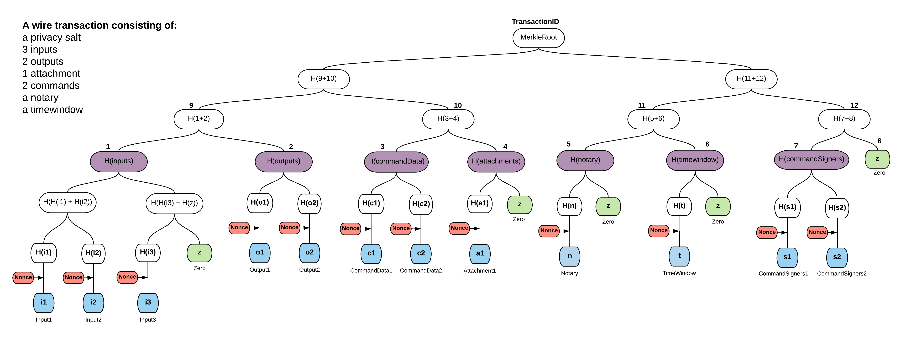
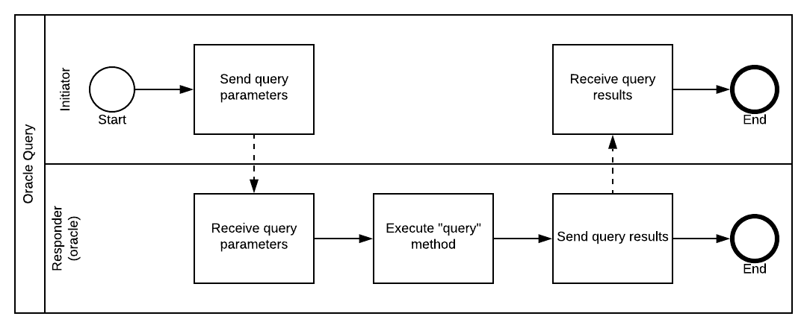
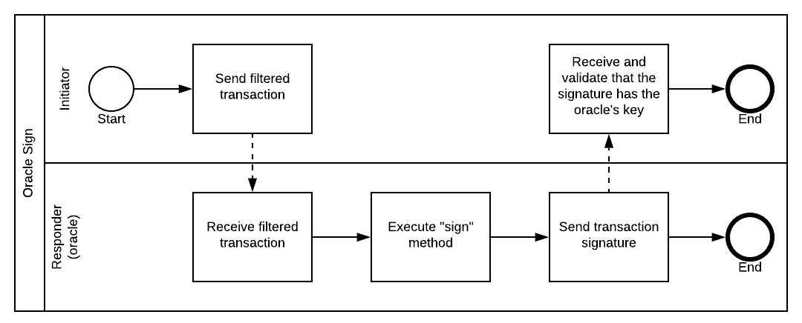

import HighlightBox from "../../src/HighlightBox"

import {
  ExpansionPanel,
  ExpansionPanelList,
  ExpansionPanelListItem
} from 'gatsby-theme-apollo-docs';

In previous chapters you were introduced to the challenges and dilemmas faced by transactions that rely on some sort of reference data to attest to their validity and you were introduced to some options to resolve that problem:

* Attachments, `zip` or `jar` files, can be used when large non-object data, e.g. Excel or pdf files, that doesn't change frequently is embedded in the transaction.
* Reference states are a good option when the data exists on-ledger, is (mostly) immutable and benefits from the notary guaranteeing that you're looking at its most recent version.

But, what if the data changes frequently? Are you going to keep sending attachments back and forth between nodes? And, most importantly, what if the reference data exists off-ledger? In this case, how will 2 nodes reach consensus about this data?

Any node will provide some data and claim that it got it from a trusted 3rd party. Different nodes will provide different values. That would lead to non-deterministic transaction verification.

<HighlightBox type="info">

For instance, imagine a contract that pays out if the temperature at the top of London's Big Ben reaches 35ºC. An event rare enough to be noticed for sure, but what if the reported temperature changes by 0.1ºC between the moments both nodes query for it? The outward API calls would have to take place in a flow for sure, because contracts can't query outward in any case.

The nodes will not reach agreement. In a fashion similar to _network time_, there is no authoritative answer, even between well-meaning nodes.

</HighlightBox>

## An answer

An answer to the above questions is oracles. Oracles are **services** that provide **facts** for which they are ready to **vouch**:

* **Facts:** It can be some reference data like the winning team in a basketball game, imagine having a sport events betting CorDapp. Or some sort of calculation that the oracle computes before returning it to your node.
* **Vouched for:** The oracle will attest to the validity of that fact by signing it.
* **Services:** This is how they are typically implemented in Corda, and, by amazing coincidence, you learned about how to implement a service in the previous chapter.

You have broad latitude when it comes to implementing your oracle. However, it has to implement at least two functions, in the business sense of the word:

* **Query:** which lets other nodes learn about valid values. For instance, a node that can expect payment when a temperature gets high will poll, or query, the temperature oracle at regular intervals to see if time has come to be paid.
* **Sign:** which provides a way for nodes to have their transactions signed by the oracle, or rather those the oracle deems worthy of its imprimatur.

Just like flows, this service piggybacks on the peer-to-peer network of Corda in order to organise a business workflow.

Oh, if you ask the oracle to sign your transaction, will the oracle not learn about your private dealings?

## Transaction structure

If you sent the oracle your whole transaction, then yes, it would learn about the whole thing and that would probably be an unacceptable compromise of confidentiality. To remedy this issue, there is what are called **transaction tear-offs**, whereby parts of the transaction have been removed so only the necessary part remains.

Before looking at the implementation, it is worth pointing out that in Corda a transaction is a [Merkle tree](https://github.com/corda/corda/blob/68bb7a0e7bb900117c2ed0d9174fea36d3d4aedc/core/src/main/kotlin/net/corda/core/transactions/WireTransaction.kt#L256-L265). And the transaction id is none other than its [Merkle root hash](https://github.com/corda/corda/blob/68bb7a0e7bb900117c2ed0d9174fea36d3d4aedc/core/src/main/kotlin/net/corda/core/transactions/WireTransaction.kt#L77-L78). Additionally, signing a transaction really means [signing its Merkle root hash](https://github.com/corda/corda/blob/68bb7a0e7bb900117c2ed0d9174fea36d3d4aedc/core/src/main/kotlin/net/corda/core/transactions/TransactionBuilder.kt#L839-L841).

What are the _leaves_ of this Merkle tree?



The above image is taken from [the documentation](https://docs.corda.net/docs/corda-os/4.3/key-concepts-tearoffs.html#transaction-merkle-trees).

The leaves are not individual commands or inputs, but component groups. You see:

* Inputs are grouped together into the _inputs group component_, to form the _inputs leaf_.
* Outputs into the _outputs group component_, to form the _outputs leaf_.
* And similarly for [the others](https://github.com/corda/corda/blob/68bb7a0e7bb900117c2ed0d9174fea36d3d4aedc/core/src/main/kotlin/net/corda/core/internal/TransactionUtils.kt#L135-L157): references, command data, attachments, notary and time-window.

For absolute reproducibility, the order in which component groups are added as leaves to the Merkle tree is crucial and therefore [clearly codified](https://github.com/corda/corda/blob/68bb7a0e7bb900117c2ed0d9174fea36d3d4aedc/core/src/main/kotlin/net/corda/core/contracts/ComponentGroupEnum.kt). By the way, you can infer from their position in the list that _references_ came late, in fact in Corda v4, same for _parameters_. Putting new groups at the end ensures a fair degree of backward hash compatibility.

As it happens, each component group is itself organised as a Merkle tree. So by convention, there is one so called top-Merkle tree, and one so called sub-Merkle tree per component group, whose roots are violet in the diagram above. Unsurprisingly, the leaves of each sub-Merkle tree are the individual objects of interest: inputs, outputs, etc., plus nonces to thwart brute-force guessing.

Given the properties of Merkle trees that you learned in the first module, you see that you could selectively remove the inputs, or the outputs, or any other component group that you do not want to disclose to the oracle. If you give only the component group hashes, the oracle is still able to reach certainty that the hash is a transaction Merkle root. Such a truncated transaction is called a [filtered transaction](https://github.com/corda/corda/blob/68bb7a0e7bb900117c2ed0d9174fea36d3d4aedc/core/src/main/kotlin/net/corda/core/transactions/MerkleTransaction.kt#L87-L90). With removed parts blacked out, this is how it could look:


## Fact in a command

On the other hand, if you filter out everything, with no visible information left, then send it to the oracle, why would the oracle blindly sign the Merkle root? You already know that the required signers are kept with the command, and the oracle is in effect a required signer. So, the convention is to put the oracle _fact_ in a command, and keep this one command visible in the transaction. You can choose to filter out fewer things, or none at all, especially if they are relevant to the oracle. But, beware that oracles are usually coded to reject filtered transactions with more information than is strictly necessary. And, your oracle should reject in this case as well. The reason will become clear shortly.

Adding data to commands is not entirely new. You already saw that being done with the Tokens SDK [commands](https://github.com/corda/token-sdk/blob/master/contracts/src/main/kotlin/com/r3/corda/lib/tokens/contracts/commands/TokenCommand.kt#L61).

With all this, the question is, is it safe for the oracle to sign a transaction with partly hidden information? After all, if the oracle happens to have some valuable tokens owned by its signing public key, you could slip in a token `Move` command so that the oracle signs off on transferring their own tokens away. This is possible. Remember that:

* When you sign, you sign the whole transaction. Its Merkle root hash to be more precise.
* And, the contract checks that the proper signers are marked as required by the commands. It is easy for someone to add the oracle to the `Move` command signers.
* Finally, the Corda nodes will finalise this transaction if all required signers have signed. It does not matter on how many commands the same signer is required to sign, a single signature is sufficient.

How can you solve that very real issue?

## Separate signers

The Merkle tree transaction is already prepared to protect oracles against this attack. There is, in fact, a separate component group, the [signers group](https://github.com/corda/corda/blob/68bb7a0e7bb900117c2ed0d9174fea36d3d4aedc/core/src/main/kotlin/net/corda/core/contracts/ComponentGroupEnum.kt#L14). Let's go back to how the transaction builder adds a command. [It needs](https://github.com/corda/corda/blob/68bb7a0e7bb900117c2ed0d9174fea36d3d4aedc/core/src/main/kotlin/net/corda/core/transactions/TransactionBuilder.kt#L785-L791):

* A `CommandData`, e.g. your `Swap` command.
* A `List<PublicKey>`, i.e. your required signers.

You add them together because they are logically linked. However, when the transaction is prepared for serialisation, a split happens:

* The `CommandData`s go into the [commands component group](https://github.com/corda/corda/blob/68bb7a0e7bb900117c2ed0d9174fea36d3d4aedc/core/src/main/kotlin/net/corda/core/internal/TransactionUtils.kt#L149).
* The `List<PublicKey>` go into the [signers component group](https://github.com/corda/corda/blob/68bb7a0e7bb900117c2ed0d9174fea36d3d4aedc/core/src/main/kotlin/net/corda/core/internal/TransactionUtils.kt#L155) **in the same order**.

The goal here is to let you filter everything except the different signer lists. So, when you filter out of your transaction, all `CommandData` except the `Swap` one, all the required signer lists are still there in the signers component group, in the same order. The oracle can then verify that its public key is present in a **single** required list, i.e. the one at the same index of the `Swap` command.

There is in fact [a function](https://github.com/corda/corda/blob/68bb7a0e7bb900117c2ed0d9174fea36d3d4aedc/core/src/main/kotlin/net/corda/core/transactions/MerkleTransaction.kt#L278-L295) that does that for you, that you **must call as well**, like so:

```java
myFilteredTransaction.checkCommandVisibility(myOracleKey);
```
It assures you that if a `CommandData` was removed and your key is required for it, then it will throw. So, to protect your oracle fully you should also refuse filtered transactions that have more than the strictly necessary commands.

Admittedly, since by default your filtered transaction includes all signers, this will be perceived as a privacy leak by some.

## Allow only the strictly necessary

To achieve that, there is a [helper function](https://github.com/corda/corda/blob/68bb7a0e7bb900117c2ed0d9174fea36d3d4aedc/core/src/main/kotlin/net/corda/core/transactions/MerkleTransaction.kt#L238) and you call it like this:

```java
myFilteredTransaction.checkWithFun(element -> {
    if (elementIsStrictlyNecessary) return true;
    return false;
});
```
Where `elementIsStrictlyNecessary` is pseudo-code for your complete verification of the element.

<HighlightBox type="info">

Notice the default `return false;`. This expresses that you do not accept anything more than the strictly necessary. This **must-do** `return false;`, combined with the **must-do** `.checkCommandVisibility` ensures that, although you are signing the whole transaction, conceptually, you are signing only the strictly necessary.

</HighlightBox>

Of course all this verification trouble is only worth going through if the partial Merkle tree at least checks out. If it was invalid, it could mean signing a very real, and possibly dangerous, Merkle root hash, after having checked dummy leaves made to fool your incomplete oracle into passing the above tests. So, your oracle should always start with a straightforward:

```java
myFilteredTransaction.verify();
```

<HighlightBox type="warn">

For your oracle's safety, it must:

1. Verify the partial Merkle tree: `.verify`
2. Allow only strictly necessary data: `.checkWithFun`
3. Confirm no other command requires signing by the oracle: `.checkCommandVisibility`

Point 3 is so easy to forget...

</HighlightBox>

This concludes the introduction of transaction tear-offs. Tear-offs can be used in other settings, for instance to prove to others that you spent a token, and prove only that. Or, other reporting situations.

In fact, there is a common usage that you have been using from the start, it is that of a non-validating notary. The [filtered transaction](https://github.com/corda/corda/blob/68bb7a0e7bb900117c2ed0d9174fea36d3d4aedc/core/src/main/kotlin/net/corda/core/flows/NotaryFlow.kt#L140-L141) such a notary sees would look like:


Where the inputs are actually [`StateRef`](https://github.com/corda/corda/blob/68bb7a0e7bb900117c2ed0d9174fea36d3d4aedc/core/src/main/kotlin/net/corda/core/contracts/Structures.kt#L161), i.e. they do not disclose the actual content of the inputs.

## Example preparation

After all this theory sprinkled with a bit of code, let's look at an example. You can find the code for it [here](TODO-link). Let's say you want to implement a foreign exchange oracle that gives current quotes for currency pairs Let's define the `FxQuote` data type that takes in:

```java
@CordaSerializable
public class FxQuote {
    @NotNull
    private final TokenType base;
    @NotNull
    private final TokenType counter;
    @NotNull
    private final BigDecimal rate;
    @NotNull
    private final Instant expirationDate;
```
Don't forget `@CordaSerializable`, and define a `Swap` command in your new `FxContract`:

```java
public class FxContract implements Contract {
    // Implement verify for the right ratios
    [...]
    public interface Commands extends CommandData {
        class Swap implements Commands {
            @NotNull
            private final FxQuote quote;

            public Swap(@NotNull final FxQuote quote) {
                //noinspection ConstantConditions
                if (quote == null) throw new NullPointerException("quote cannot be null");
                this.quote = quote;
            }

            // Plus accessor, equals and hashCode
        }
    }
```
Since we intend to let the exchange of tokens be controlled by the token contracts themselves, we need a dummy state to attach the `FxContract` in a transaction.

```java
@BelongsToContract(FxContract.class)
public class FXState implements ContractState {

    @NotNull
    private final List<AbstractParty> participants;

    public FXState(@NotNull final List<AbstractParty> participants) {
        //noinspection ConstantConditions
        if (participants == null) throw new NullPointerException("participants cannot be null");
        this.participants = participants;
    }

    @NotNull
    @Override
    public List<AbstractParty> getParticipants() {
        return participants;
    }
    // Plus equals and hashCode.
}
```

## Filtered transaction example

What type of `FilteredTransaction` does the developer of the oracle intend to receive? Let's assume that the developer made public this utility function to inform you:

```java
public class FxOracleUtilities {
    @NotNull
    public static FilteredTransaction filter(
            @NotNull final WireTransaction tx,
            @NotNull final AbstractParty oracle) {
        //noinspection rawtypes
        return tx.buildFilteredTransaction(element -> element instanceof Command
                && ((Command) element).getSigners().contains(oracle.getOwningKey())
                && ((Command) element).getValue() instanceof Swap);
    }
}
```
That's how you build a filtered transaction. You pass a predicate that tells whether the individual element makes it in.

## Example _query_ flows

The developer of the oracle also made public an example of flow pairs for you to both query and sign. The handlers of both run on the oracle's node. First the ones to query for a new quote. Here is a CDL of what it does:



 Inside an `interface Query` for encapsulation, the requester:

```java
@InitiatingFlow
class Request extends FlowLogic<FxQuote> {
    @NotNull
    private final TokenType base;
    @NotNull
    private final TokenType counter;
    @NotNull
    private final Party oracle;

    [ constructor ]

    @Suspendable
    @Override
    public FxQuote call() throws FlowException {
        return initiateFlow(oracle)
                .sendAndReceive(FxQuote.class, new Pair<>(base, counter))
                .unwrap(it -> it);
    }
}
```
Simple. It sends the currency pair and expects a quote in return. That's a **query** indeed. On the oracle node's end, the responder:

```java
@InitiatedBy(Request.class)
class Answer extends FlowLogic<FxQuote> {
    @NotNull
    private final FlowSession requesterSession;

    [ constructor ]

    @Suspendable
    @Override
    public FxQuote call() throws FlowException {
        //noinspection unchecked
        final FxQuote quote = getServiceHub().cordaService(FxOracle.class)
                .getQuote(requesterSession.receive(Pair.class).unwrap(it -> it));
        if (quote == null) throw new FlowException("Unavailable pair");
        requesterSession.send(quote);
        return quote;
    }
}
```
It's not overly complicated either. It receives the pair, retrieves the `FxOracle` singleton instance from the system, asks it for a quote and sends it. That's a lot of data passed along. We still have to define `FxOracle` obviously, with:

* `.getQuote` as the oracle's _query_ function.

## Example _sign_ flows

Now that _query_, the first function of an oracle is covered by flows, the developer of the oracle made public an example of flow pairs for this _sign_ function. Here is the CDL of what it does:



Inside an `interface Sign` for encapsulation, the requester:

```java
@InitiatingFlow
class Request extends FlowLogic<TransactionSignature> {
    @NotNull
    private final Party oracle;
    @NotNull
    private final WireTransaction tx;

    [constructor]

    @Suspendable
    @Override
    public TransactionSignature call() throws FlowException {
        return initiateFlow(oracle)
                .sendAndReceive(TransactionSignature.class, FxOracleUtilities.filter(tx, oracle))
                .unwrap(sig -> {
                    if (sig.getBy().equals(oracle.getOwningKey())) {
                        tx.checkSignature(sig);
                        return sig;
                    }
                    throw new IllegalArgumentException("Unexpected key used for signature");
                });
    }
}
```
It starts to get interesting again. The flow:

* Sends a filtered transaction, `FxOracleUtilities.filter(tx, oracle)`, not the full one, thanks to the utility.
* Receives a signature in turn.
* Verifies that the signature is from the oracle indeed, and applies to the transaction.

What about the responder:

```java
@InitiatedBy(Request.class)
class Answer extends FlowLogic<TransactionSignature> {
    @NotNull
    private final FlowSession requesterSession;

    [constructor]

    @Suspendable
    @Override
    public TransactionSignature call() throws FlowException {
        final FilteredTransaction partial = requesterSession.receive(FilteredTransaction.class)
                .unwrap(it -> it);
        final TransactionSignature sig;
        try {
            sig = getServiceHub().cordaService(FxOracle.class)
                    .sign(partial);
        } catch (FilteredTransactionVerificationException | ComponentVisibilityException e) {
            throw new FlowException(e);
        }
        requesterSession.send(sig);
        return sig;
    }
}
```
Back to buck passing, with a touch of exception catching. Here we see that we need to implement an aptly named `sign` function in our oracle:

* `.sign` as the oracle's _sign_ function.

Before moving on to the oracle proper, it is worthwhile to have a CDL for a typical end-to-end oracle workflow:


If your business requires that you query the oracle, scrutinise the returned value, then decide whether to move on to a signed transaction, then, by all means, make 2 flows, a la `SalesProposal` offer and accept.

## Example oracle

The oracle runs on a dedicated server. When you, as a user have access to the above state, contract, utility and flows, you can work with it. The oracle code itself need not be public. Anyway, here goes for the oracle:

```java
@CordaService
public class FxOracle extends SingletonSerializeAsToken {
    private final AppServiceHub serviceHub;
    private final PublicKey oracleKey;
```
It is a service after all. For the exercise we are going to make it simple and suppose it keeps a simple map of quotes:

```java
public static final Duration VALID_DURATION = Duration.ofSeconds(20);
private final Map<Pair<TokenType, TokenType>, BigDecimal> rates = new HashMap<>(10);
```
Because it will be asked to sign on previously sent quotes, it needs to remember what was sent:

```java
final Map<FxQuote, Boolean> sentQuotesMap = new HashMap<>(10);
[constructor]
```

<ExpansionPanel title="Old quotes management boilerplate">

To reduce the memory footprint.

<ExpansionPanelList>
<ExpansionPanelListItem number="1">

#### A FIFO

```java
private final LinkedList<FxQuote> sentQuotes = new LinkedList<>();
```

</ExpansionPanelListItem>
<ExpansionPanelListItem number="2">

#### A function to remove expired quotes

```java
private void popOldQuotes(@SuppressWarnings("SameParameterValue") int countLeft) {
    while (0 < countLeft) {
        final FxQuote old = sentQuotes.peekFirst();
        if (old != null && old.getExpirationDate().isBefore(Instant.now())) {
            sentQuotes.removeFirst();
            sentQuotesMap.remove(old);
            countLeft--;
        } else {
            countLeft = 0;
        }
    }
}
```

</ExpansionPanelListItem>
<ExpansionPanelListItem number="3">

#### A number of quotes to remove per time

```java
public static final int POP_COUNT = 2;
```

</ExpansionPanelListItem>
</ExpansionPanelList>
</ExpansionPanel>

<ExpansionPanel title="Dummy data fillers">

To be able to test.

```java
private void loadRates() {
    this.rates.put(createPair("USD", "CAD"), BigDecimal.valueOf(1.39));
    this.rates.put(createPair("CAD", "USD"), BigDecimal.valueOf(0.72));
}

@NotNull
private Pair<TokenType, TokenType> createPair(
        @NotNull final String base, @NotNull final String counter) {
    return new Pair<>(FiatCurrency.Companion.getInstance(base),
            FiatCurrency.Companion.getInstance(counter));
}
```

</ExpansionPanel>

As seen in the flow, it needs to be able to inform:

```java
@Nullable
public FxQuote getQuote(@NotNull final Pair<TokenType,TokenType> pair) {
    final FxQuote quote = new FxQuote(
            pair.getKey(),
            pair.getValue(),
            rates.get(pair),
            Instant.now().plus(VALID_DURATION));
    popOldQuotes(POP_COUNT);
    sentQuotes.addLast(quote);
    sentQuotesMap.put(quote, true);
    return quote;
}
```
Notice how it does a bit of cleaning up before sending something back. It is not aimed at being threadsafe here. It also needs to be able to sign:

```java
public TransactionSignature sign(@NotNull final FilteredTransaction ftx)
        throws FilteredTransactionVerificationException,
        ComponentVisibilityException {
    // Check that the partial Merkle tree is valid.
    ftx.verify();

    // Is it a valid Merkle tree that the oracle is willing to sign over?
    if (!ftx.checkWithFun(this::isCommandWithCorrectFXRate))
        throw new IllegalArgumentException("Oracle signature requested over an invalid transaction.");

    // Check that the sender of the transaction didn't filter out other commands that require
    // the oracle's signature. I.e. don't be stolen.
    ftx.checkCommandVisibility(oracleKey);

    // Sign the transaction.
    return serviceHub.createSignature(ftx, oracleKey);
}
```
Take note of the 3 validations performed before the signature is created and returned. There remains only to disclose `isCommandWithCorrectFXRate`:

```java
private boolean isCommandWithCorrectFXRate(@NotNull final Object elem) {
    if (elem instanceof Command && ((Command) elem).getValue() instanceof Swap) {
        final Swap cmdData = (Swap) ((Command) elem).getValue();
        final FxQuote quote = cmdData.getQuote();
        final Boolean isMyQuote = sentQuotesMap.get(quote);
        // Check that the oracle is a required signer.
        return ((Command) elem).getSigners().contains(oracleKey)
                // Check that the enclosed quote was indeed provided by the oracle.
                && isMyQuote != null
                && isMyQuote;
    }
    // We don't want to jinx checkCommandVisibility.
    return false;
}
```
You see, it only accepts a `Swap` command, and it must contain a previously queried quote.

## Further ideas

Of course, your oracle can choose not to keep track of what it sent. In the case of a temperature oracle, see example [here](TODO-link), it could instead:

* Check that the temperature in the command is the actual temperature, within some tolerance.
* Check that the time-window's `untilTime` is no more than, say, 5 minutes in the future.

Your oracle could also require proof of payment before signing the transaction. That would involve:

* Confirm that the visible outputs cover the fee.

## Reference Links

- [Oracles overview](https://docs.corda.net/docs/corda-os/4.4/key-concepts-oracles.html).
- [Writing oracle services](https://docs.corda.net/docs/corda-os/4.4/oracles.html).
- [Transaction tear-offs](https://docs.corda.net/docs/corda-os/4.4/key-concepts-tearoffs.html): Explains Merkle trees and filtered transactions again.
- [Oracle example](https://github.com/corda/samples/tree/release-V4/oracle-example).
- [Time-sheet example](https://github.com/corda/samples/tree/release-V4/timesheet-example): Uses oracles.
- [IRS Demo](https://github.com/corda/corda/tree/release/os/4.5/samples/irs-demo): Uses oracles.
