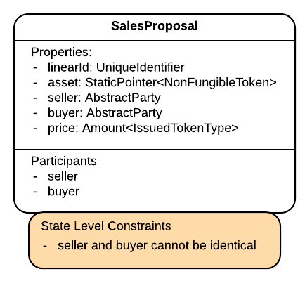
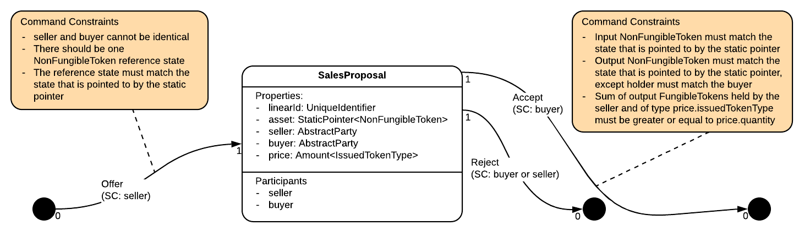
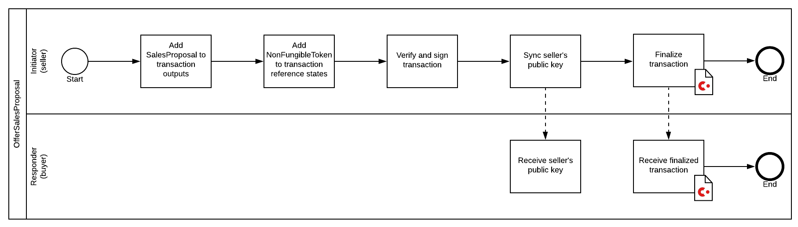
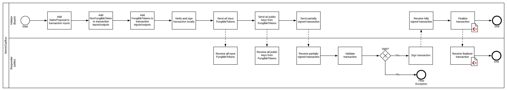

import HighlightBox from "../../src/HighlightBox"

import {
  ExpansionPanel,
  ExpansionPanelList,
  ExpansionPanelListItem
} from 'gatsby-theme-apollo-docs';

So, you worked on the exercise on your own before landing here and looking at this example solution, right? This solution comprises the following parts:

* A new `SalesProposal` state found [here](https://github.com/corda/corda-training-code/blob/master/050-ref-state/contracts/src/main/java/com/template/proposal/state/SalesProposal.java).
* A new `SalesProposalContract` contract with 3 commands `Offer`, `Reject` and `Accept`, found [here](https://github.com/corda/corda-training-code/blob/master/050-ref-state/contracts/src/main/java/com/template/proposal/state/SalesProposalContract.java).
* 3 new flow pairs found [here](https://github.com/corda/corda-training-code/tree/master/050-ref-state/workflows/src/main/java/com/template/proposal/flow):
    * `SalesProposalOfferFlows`
    * `SalesProposalRejectFlows`
    * `SalesProposalAcceptFlows`

Let's review these in order.

## `SalesProposal` state

Here is its CDL:



It makes sense to declare it as a `LinearState` as it has a linear lifecycle. It declares the following important fields:

```java
@NotNull
private final StaticPointer<NonFungibleToken> asset;
@NotNull
private final AbstractParty buyer;
@NotNull
private final Amount<IssuedTokenType> price;
```
In other words:

> I am willing to sell this `asset` to `buyer` at the given `price` in the stated `IssuedTokenType` _currency_.

Who is willing to sell it? Well, the car token holder obviously. However just the pointer is not enough to access the underlying `NonFungibleToken`, so the data is declared, for information only, explicitly:

```java
@NotNull
private final AbstractParty seller;
```
For similar reasons, it also expects the underlying asset id:

```java
@NotNull
private final UniqueIdentifier assetId;
```
Notice that the `asset` is of type `StaticPointer<NonFungibleToken>`, not just `NonFungibleToken`, so as to facilitate cross-checks with the state referenced in the transaction. Neither is it of type `LinearId` which would be a weak cross-check, even with a reference state. Additionally, it is unfalsifiable.

Admittedly, an error could have been made when instantiating the `SalesProposal`, whereby the pointed asset may not match the `assetId` and `seller`. In this case, the resolved `asset` shall be authoritative. To mitigate this type of of mistakes, there is an additional constructor that takes in a _fully-resolved_ `StateAndRef<NonFungibleToken> asset` before passing on to the _flat_ constructor. To avoid confusion (which constructor?) at deserialisation, the flat constructor is annotated with `@ConstructorForDeserialization`.

Why not use a fully resolved `StateAndRef<NonFungibleToken> asset`? It would work, at the cost of double serialisation of the `NonFungibleToken` content, itself and as part of a `SalesProposal`. A static pointer is more elegant and parcimonious.

Unremarkably, the participants are the buyer and the seller:

```java
@NotNull
@Override
public List<AbstractParty> getParticipants() {
    return ImmutableList.copyOf(Arrays.asList(seller, buyer));
}
```
Finally, there is an extra function to facilitate later identification of the `asset`:

```java
public boolean isSameAsset(@NotNull final StateAndRef<? extends ContractState> asset) {
    final ContractState aToken = asset.getState().getData();
    if (!(aToken instanceof NonFungibleToken)) return false;
    final NonFungibleToken token = (NonFungibleToken) aToken;
    return this.asset.getPointer().equals(asset.getRef())
            && this.assetId.equals(token.getLinearId())
            && this.seller.equals(token.getHolder());
}
```

## `SalesProposalContract`

Here is its CDL:



It defines 3 commands:

* `Offer`, whereby the seller declares its intention to sell the verified asset.
* `Reject`, whereby either party rejects the offer.
* `Accept`, whereby the buyer declares its acceptance of the offer and executes the purchase at the same time.

So, it makes sense for the contract to perform the following checks:

### On `Offer`

A `SalesProposal` is created, and the asset is passed as a reference:

<ExpansionPanel title="Run of the mill Offer stuff">
<ExpansionPanelList>
<ExpansionPanelListItem number="1">

Extract elements from the transaction:

```java
final List<StateAndRef<AbstractToken>> inRefs = tx.referenceInputRefsOfType(AbstractToken.class);
final List<StateAndRef<SalesProposal>> inSalesProposals = tx.inRefsOfType(SalesProposal.class);
final List<StateAndRef<SalesProposal>> outSalesProposals = tx.outRefsOfType(SalesProposal.class);
```

</ExpansionPanelListItem>
<ExpansionPanelListItem number="2">

As in so many contracts, the `SalesProposal` is in output, not in input:

```java
req.using("There should be no sales proposal inputs on offer",
        inSalesProposals.isEmpty());
req.using("There should be a single sales proposal output on offer",
        outSalesProposals.size() == 1);
```

</ExpansionPanelListItem>
</ExpansionPanelList>
</ExpansionPanel>

* There is a single reference state:

    ```java
    req.using("There should be a single reference input token on offer",
            inRefs.size() == 1);
    ```
* Ooh! Something new. The **referenced token** should **match** the **asset** for sale:

    ```java
    final StateAndRef<AbstractToken> refToken = inRefs.get(0);
    req.using("The reference token should match the sales proposal output asset",
            proposal.isSameAsset(refToken));
    ```
    It is here that the **benefit** of reference states is delivered. You are sure that:

    * The asset exists, for real.
    * The seller owns the token.
    * The asset is not sold yet. It is unconsumed.

<ExpansionPanel title="More run of the mill Offer stuff">
<ExpansionPanelList>
<ExpansionPanelListItem number="3">

The price cannot be zero:

```java
req.using("There should be no sales proposal inputs on offer",
        inSalesProposals.isEmpty());
req.using("There should be a single sales proposal output on offer",
        outSalesProposals.size() == 1);
```

</ExpansionPanelListItem>
<ExpansionPanelListItem number="4">

The seller is the only signer:

```java
req.using("The seller should be the only signer on the offer",
         Collections.singletonList(proposal.getSeller().getOwningKey()).equals(command.getSigners()));
```

</ExpansionPanelListItem>
<ExpansionPanelListItem number="5">

Note that you already have assurance that the seller is the holder of the `asset` as per the `SalesProposal` constructor.

</ExpansionPanelListItem>
</ExpansionPanelList>
</ExpansionPanel>

### On `Reject`

The proposal is consumed, and the asset remains untouched:

<ExpansionPanel title="Run of the mill Reject stuff">
<ExpansionPanelList>
<ExpansionPanelListItem number="1">

Extract elements from the transaction:

```java
final List<StateAndRef<SalesProposal>> inSalesProposals = tx.inRefsOfType(SalesProposal.class);
final List<StateAndRef<SalesProposal>> outSalesProposals = tx.outRefsOfType(SalesProposal.class);
```

</ExpansionPanelListItem>
<ExpansionPanelListItem number="2">

Unsurprisingly the `SalesProposal` is in input, not in output:

```java
req.using("There should be a single input sales proposal on reject",
        inSalesProposals.size() == 1);
req.using("There should be no sales proposal outputs on reject",
        outSalesProposals.isEmpty());
```

</ExpansionPanelListItem>
<ExpansionPanelListItem number="3">

And any of the participants can reject the offer:

```java
final SalesProposal proposal = inSalesProposals.get(0).getState().getData();
req.using("The seller or the buyer or both should be signers",
        command.getSigners().contains(proposal.getSeller().getOwningKey()) ||
                command.getSigners().contains(proposal.getBuyer().getOwningKey()));
req.using("Only the seller or the buyer or both should be signers",
        Arrays.asList(proposal.getSeller().getOwningKey(), proposal.getBuyer().getOwningKey())
                .containsAll(command.getSigners()));
```

</ExpansionPanelListItem>
</ExpansionPanelList>
</ExpansionPanel>

### On `Accept`

The proposal is consumed, and the asset changes hands for the agreed price.

<ExpansionPanel title="Run of the mill Accept stuff">
<ExpansionPanelList>
<ExpansionPanelListItem number="1">

Extract elements from the transaction:

```java
final List<StateAndRef<SalesProposal>> inSalesProposals = tx.inRefsOfType(SalesProposal.class);
final List<StateAndRef<SalesProposal>> outSalesProposals = tx.outRefsOfType(SalesProposal.class);
final List<StateAndRef<NonFungibleToken>> inNFTokens = tx.inRefsOfType(NonFungibleToken.class);
final List<StateAndRef<NonFungibleToken>> outNFTokens = tx.outRefsOfType(NonFungibleToken.class);
final List<StateAndRef<FungibleToken>> outFTokens = tx.outRefsOfType(FungibleToken.class);
```

</ExpansionPanelListItem>
<ExpansionPanelListItem number="2">

Unsurprisingly, the `SalesProposal` is in input, not in output:

```java
req.using("There should be a single input sales proposal on accept",
        inSalesProposals.size() == 1);
req.using("There should be no sales proposal outputs on accept",
        outSalesProposals.isEmpty());
final SalesProposal proposal = inSalesProposals.get(0).getState().getData();
```

</ExpansionPanelListItem>
<ExpansionPanelListItem number="3">

The buyer has to sign off on it:

```java
req.using("The buyer should be the only signer on the offer",
    Collections.singletonList(proposal.getBuyer().getOwningKey()).equals(command.getSigners()));
```

</ExpansionPanelListItem>
</ExpansionPanelList>
</ExpansionPanel>

* The asset, which was passed as a reference state on `Offer`, has to be a normal input this time:

    ```java
    final List<StateAndRef<NonFungibleToken>> candidates = inNFTokens.stream()
            .filter(proposal::isSameAsset)
            .collect(Collectors.toList());
    req.using("The asset should be an input on accept", candidates.size() == 1);
    ```
    As an important side node, this means that if the seller had created 2 proposals for the same asset, then only 1 proposal can be accepted. Also, because the asset would have changed hands, so the seller would not be able to sign the asset off.
* The buyer should own the asset on output:

    ```java
    final List<NonFungibleToken> boughtAsset = outNFTokens.stream()
            .map(it -> it.getState().getData())
            .filter(it -> it.getLinearId().equals(proposal.getAssetId()))
            .collect(Collectors.toList());
    req.using("The asset should be held by buyer in output on accept",
            boughtAsset.size() == 1 && boughtAsset.get(0).getHolder().equals(proposal.getBuyer()));
    ```
    Note that there is only a need to check the holder, and no need to check that it is referring to the same underlying asset as this part is taken care of by the token contract itself.
* The seller should be paid the agreed amount in return:

    ```java
    final long sellerPayment = outFTokens.stream()
            .map(it -> it.getState().getData())
            .filter(it -> it.getHolder().equals(proposal.getSeller()))
            .filter(it -> it.getIssuedTokenType().equals(proposal.getPrice().getToken()))
            .map(it -> it.getAmount().getQuantity())
            .reduce(0L, Math::addExact);
    req.using("The seller should be paid the agreed amount in the agreed issued token on accept",
            proposal.getPrice().getQuantity() <= sellerPayment);
    ```
* Note the absence of checks on the input `FungibleToken`s. This contract does not verify that the buyer paid. It also leaves the possibility open to atomically mix it with other states and contracts.

<HighlightBox type="info">

If your `SalesProposal` contract does not verify these parts:

* That the asset changed hands on `Accept`.
* That the seller was paid on `Accept`.

It is entirely fine as the purpose of the `SalesProposal` is to encapsulate an offer by the seller, and nothing more really. It is not a breakage of the ledger layer if the asset did not change hands or changed hands with the wrong payment. Plus, armed with a proposal whose creation is it itself signed, the seller's responder flow can run these mechanical checks.

This is to say that here there is some leeway as to what you decide to include in the contract. The decision was made here to off-load the responder flow of those checks, at the expense of future transaction flexibility.

</HighlightBox>

### [Tests](https://github.com/corda/corda-training-code/tree/master/050-ref-state/contracts/src/test/java/com/template/proposal/state)

Once more, there is 1 test file per command, and each failure point is tested. `.tweak` is used to make explicit which point is the failure point.

Time to move on to flows.

## The `SalesProposal` offer flows

This is launched by the seller. The fact that the seller decides to initiate a run of this flow indicates intent to sell the asset. From there, the presence of a `SalesProposal` state is proof enough of the original intent.

There are actually 2 flow pairs in the `SalesProposalOfferFlows` set, as can be seen [here](https://github.com/corda/corda-training-code/blob/master/050-ref-state/workflows/src/main/java/com/template/proposal/flow/SalesProposalOfferFlows.java):

* `OfferFlow`, an inlined flow that expects perfect information and executes the mechanical parts of the flow to issue a sales proposal.
    * And its handler `OfferHandlerFlow`, an inlined flow.
* `OfferSimpleFlow`, an initiating flow that takes easy information before passing on to `OfferFlow`.
    * And its automatic handler `OfferSimpleHandlerFlow`.



### `OfferFlow`

This inlined flow handles the mechanical parts to issue an offer. It is started by the seller, and the potential buyer only has to finalise a complete transaction to receive the `SalesProposal`.

<ExpansionPanel title="It does what you would expect of a flow">
<ExpansionPanelList>
<ExpansionPanelListItem number="1">

It expects accurate information as mentioned earlier. Note the presence of `StateAndRef`, not `StaticPointer`:

```java
public OfferFlow(@NotNull final StateAndRef<NonFungibleToken> asset,
                 @NotNull final AbstractParty buyer,
                 @NotNull final Amount<IssuedTokenType> price,
                 @NotNull final ProgressTracker progressTracker) {
```

</ExpansionPanelListItem>
<ExpansionPanelListItem number="2">

It creates the proposal:

```java
final SalesProposal proposal = new SalesProposal(new UniqueIdentifier(), asset, buyer, price);
```

</ExpansionPanelListItem>
</ExpansionPanelList>
</ExpansionPanel>

Then it starts creating the transaction:

```java
final TransactionBuilder builder = new TransactionBuilder(asset.getState().getNotary())
        .addOutputState(proposal)
        .addReferenceState(new ReferencedStateAndRef<>(asset))
        .addCommand(new SalesProposalContract.Commands.Offer(),
                Collections.singletonList(proposal.getSeller().getOwningKey()));
```
Note how:

* It picks the notary from the `asset`.
* It adds the proposal and lets the system [select the right contract](https://github.com/corda/corda/blob/68bb7a0e7bb900117c2ed0d9174fea36d3d4aedc/core/src/main/kotlin/net/corda/core/internal/ConstraintsUtils.kt#L29-L36).
* It adds the `asset` as a `ReferencedStateAndRef`.

<ExpansionPanel title="It continues with boilerplate">
<ExpansionPanelList>
<ExpansionPanelListItem number="3">

It verifies:

```java
builder.verify(getServiceHub());
```

</ExpansionPanelListItem>
<ExpansionPanelListItem number="4">

Signs locally:

```java
final SignedTransaction offerTx = getServiceHub().signInitialTransaction(
        builder, proposal.getSeller().getOwningKey());
```

</ExpansionPanelListItem>
</ExpansionPanelList>
</ExpansionPanel>

Then it needs to resolve the host of the buyer's public key before informing them:

```java
final Party buyerHost = getServiceHub().getIdentityService()
        .requireWellKnownPartyFromAnonymous(proposal.getBuyer());
final FlowSession buyerSession = initiateFlow(buyerHost);
```
It preemptively informs the buyer's host about who the seller is:

```java
subFlow(new SyncKeyMappingFlow(buyerSession, Collections.singletonList(proposal.getSeller())));
```
And finishes with finalisation:

```java
return subFlow(new FinalityFlow(
        offerTx,
        Collections.singletonList(buyerSession),
        FINALISING_TRANSACTION.childProgressTracker()));
```
As part of the finalisation, the notary will confirm that the reference state of the asset, and if applicable the reference state of the asset type, are the correct, i.e. latest, ones.

<ExpansionPanel title="The potential buyer's handler flow just receives">
<ExpansionPanelList>
<ExpansionPanelListItem number="5">

According to the choreography:

```java
subFlow(new SyncKeyMappingFlowHandler(sellerSession));
return subFlow(new ReceiveFinalityFlow(sellerSession));
```

</ExpansionPanelListItem>
</ExpansionPanelList>
</ExpansionPanel>

As you can see, this is a very simple flow that uses a single reference and does not require a remote signature.

### `OfferSimpleFlow`

This initiating flow is meant to make life simpler by requiring simplified information before passing on to `OfferFlow`:

```java
public OfferSimpleFlow(@NotNull final UniqueIdentifier assetId,
                       @NotNull final Party buyer,
                       final long price,
                       @NotNull final String currencyCode,
                       @NotNull final Party issuer,
                       @NotNull final ProgressTracker progressTracker) {
```
You will recognise how these fields will be combined. First, the asset needs to be fetched from the vault:

```java
final QueryCriteria assetCriteria = new QueryCriteria.LinearStateQueryCriteria()
        .withUuid(Collections.singletonList(assetId.getId()));
final List<StateAndRef<NonFungibleToken>> assets = getServiceHub().getVaultService()
        .queryBy(NonFungibleToken.class, assetCriteria)
        .getStates();
if (assets.size() != 1) throw new FlowException("Wrong number of assets found");
final StateAndRef<NonFungibleToken> asset = assets.get(0);
```
With this, it is just a matter of passing it on to `OfferFlow`:

```java
return subFlow(new OfferFlow(asset, buyer,
        AmountUtilitiesKt.amount(price, new IssuedTokenType(issuer, currency)),
        PASSING_ON.childProgressTracker()));
```
With the handler simply being a child class of `OfferFlowHandler`:

```java
@InitiatedBy(OfferSimpleFlow.class)
class OfferSimpleHandlerFlow extends OfferHandlerFlow {
```

### [Offer tests](https://github.com/corda/corda-training-code/blob/master/050-ref-state/workflows/src/test/java/com/template/proposal/flow/SalesProposalOfferFlowsTests.java)

In the tests there are 2 happy paths and 1 failed path. Take some time to look at [the failed path](https://github.com/corda/corda-training-code/blob/master/050-ref-state/workflows/src/test/java/com/template/proposal/flow/SalesProposalOfferFlowsTests.java#L226). Here is what happens in it:

1. The car is issued to its owner.
2. The DMV changes the mileage on the car but fails to inform anyone.
3. The car owner cannot create a sales proposal for it.

That's because the `StateAndRef<CarTokenType` has changed, and been recorded so by the notary. The host alice only has the old version in her vault. This is a side-effect of the fact that the state pointers are resolved when a state is added as a reference.

The [second happy path](https://github.com/corda/corda-training-code/blob/master/050-ref-state/workflows/src/test/java/com/template/proposal/flow/SalesProposalOfferFlowsTests.java#L259) confirms that the seller can create a sales proposal if it has been informed of the new car state.

## The `SalesProposal` reject flows

This is launched by either the seller or the buyer. The one starting the flow is called the _rejecter_, the other, the _rejectee_.

In fact there are 2 flow pairs which can be found [here](https://github.com/corda/corda-training-code/blob/master/050-ref-state/workflows/src/main/java/com/template/proposal/flow/SalesProposalRejectFlows.java):

* [`RejectFlow`](https://github.com/corda/corda-training-code/blob/master/050-ref-state/workflows/src/main/java/com/template/proposal/flow/SalesProposalRejectFlows.java#L92), an inlined flow that expects perfect information and executes the mechanical parts of the flow to reject a sales proposal.
    * And its handler [`RejectHandlerFlow`](https://github.com/corda/corda-training-code/blob/master/050-ref-state/workflows/src/main/java/com/template/proposal/flow/SalesProposalRejectFlows.java#L189), an inlined flow.
* [`RejectSimpleFlow`](https://github.com/corda/corda-training-code/blob/master/050-ref-state/workflows/src/main/java/com/template/proposal/flow/SalesProposalRejectFlows.java#L28), an initiating flow that takes easy information before passing on to `RejectFlow`.
    * And its automatic handler [`RejectSimpleHandlerFlow`](https://github.com/corda/corda-training-code/blob/master/050-ref-state/workflows/src/main/java/com/template/proposal/flow/SalesProposalRejectFlows.java#L178).

### `RejectFlow`

This inlined flow handles the mechanical parts of a rejection. It expects exact information:

```java
public RejectFlow(@NotNull final StateAndRef<SalesProposal> proposal,
                  // The rejecter is either the buyer or the seller.
                  @NotNull final AbstractParty rejecter,
                  @NotNull final ProgressTracker progressTracker) {
```
And deduces the `rejectee`:

```java
this.rejectee = proposal.getState().getData().getParticipants().stream()
        .filter(it -> !it.equals(rejecter))
        .collect(Collectors.toList())
        .get(0);
```

<ExpansionPanel title="Other than that, it is doing what you would expect">
<ExpansionPanelList>
<ExpansionPanelListItem number="1">

Creates the transaction:

```java
final TransactionBuilder builder = new TransactionBuilder(proposal.getState().getNotary())
        .addInputState(proposal)
        .addCommand(new SalesProposalContract.Commands.Reject(),
                Collections.singletonList(rejecter.getOwningKey()));
```

</ExpansionPanelListItem>
<ExpansionPanelListItem number="2">

Verifies and signs locally:

```java
builder.verify(getServiceHub());
final SignedTransaction rejectTx = getServiceHub().signInitialTransaction(
        builder, rejecter.getOwningKey());
```

</ExpansionPanelListItem>
<ExpansionPanelListItem number="3">

It resolves the host of the rejectee:

```java
final Party rejecteeHost = getServiceHub().getIdentityService()
        .requireWellKnownPartyFromAnonymous(rejectee);
```

</ExpansionPanelListItem>
<ExpansionPanelListItem number="4">

Before sending the result:

```java
return subFlow(new FinalityFlow(rejectTx, initiateFlow(rejecteeHost)));
```

</ExpansionPanelListItem>
</ExpansionPanelList>
</ExpansionPanel>

<ExpansionPanel title="And the rejectee's handler flow just receives">
<ExpansionPanelList>
<ExpansionPanelListItem number="5">

```java
return subFlow(new ReceiveFinalityFlow(rejecterSession));
```

</ExpansionPanelListItem>
</ExpansionPanelList>
</ExpansionPanel>

Either party of the `SalesProposal`. Yes, it means that the seller can _shut the door_ on the buyer up to the last minute. You will see in the next chapter how further assurances can be extended to the buyer against such tactics.

### `RejectSimpleFlow`

Similarly to what you saw with `OfferSimpleFlow`, it takes simplified parameters:

```java
public RejectSimpleFlow(
        @NotNull final UniqueIdentifier proposalId,
        @NotNull final AbstractParty rejecter,
        @NotNull final ProgressTracker progressTracker) {
```

<ExpansionPanel title="To then do actions reminiscent of OfferSimpleFlow">
<ExpansionPanelList>
<ExpansionPanelListItem number="1">

Namely fetching the proposal from the vault:

```java
final QueryCriteria proposalCriteria = new QueryCriteria.LinearStateQueryCriteria()
        .withUuid(Collections.singletonList(proposalId.getId()));
final List<StateAndRef<SalesProposal>> proposals = getServiceHub().getVaultService()
        .queryBy(SalesProposal.class, proposalCriteria)
        .getStates();
if (proposals.size() != 1) throw new FlowException("Wrong number of proposals found");
final StateAndRef<SalesProposal> proposal = proposals.get(0);
```

</ExpansionPanelListItem>
<ExpansionPanelListItem number="1">

Then passes it on:

```java
return subFlow(new RejectFlow(proposal, rejecter, PASSING_ON.childProgressTracker()));
```

</ExpansionPanelListItem>
</ExpansionPanelList>
</ExpansionPanel>

<ExpansionPanel title="With the handler just receiving">
<ExpansionPanelList>
<ExpansionPanelListItem number="3">

```java
final QueryCriteria proposalCriteria = new QueryCriteria.LinearStateQueryCriteria()
        .withUuid(Collections.singletonList(proposalId.getId()));
final List<StateAndRef<SalesProposal>> proposals = getServiceHub().getVaultService()
        .queryBy(SalesProposal.class, proposalCriteria)
        .getStates();
if (proposals.size() != 1) throw new FlowException("Wrong number of proposals found");
final StateAndRef<SalesProposal> proposal = proposals.get(0);
```

</ExpansionPanelListItem>
</ExpansionPanelList>
</ExpansionPanel>

### [Reject tests](https://github.com/corda/corda-training-code/blob/master/050-ref-state/workflows/src/test/java/com/template/proposal/flow/SalesProposalRejectFlowsTests.java)

They naturally check that either party can reject, which should inform the other.

## The `SalesProposal` accept flows

This is launched by the buyer. The fact that the buyer decides to initiate a run of this flow indicates intent to buy the asset.

There are actually 2 flow pairs in the `SalesProposalAccepFlows` set, as can be seen [here](https://github.com/corda/corda-training-code/blob/master/050-ref-state/workflows/src/main/java/com/template/proposal/flow/SalesProposalAcceptFlows.java):

* [`AcceptFlow`](https://github.com/corda/corda-training-code/blob/master/050-ref-state/workflows/src/main/java/com/template/proposal/flow/SalesProposalAcceptFlows.java#L114), an `abstract` inlined flow that expects perfect information and executes the mechanical parts of the flow to accept the sales proposal and affect the sale.
    * And its handler [`AcceptHandlerFlow`](https://github.com/corda/corda-training-code/blob/master/050-ref-state/workflows/src/main/java/com/template/proposal/flow/SalesProposalAcceptFlows.java#L268), an inlined flow.
* [`AcceptSimpleFlow`](https://github.com/corda/corda-training-code/blob/master/050-ref-state/workflows/src/main/java/com/template/proposal/flow/SalesProposalAcceptFlows.java#L47), an initiating flow that takes easy information before passing on to `AcceptFlow`.
    * And its automatic handler [`AcceptSimpleHandlerFlow`](https://github.com/corda/corda-training-code/blob/master/050-ref-state/workflows/src/main/java/com/template/proposal/flow/SalesProposalAcceptFlows.java#L258).



### `AcceptFlow`

It is abstract in the same way that `AtomicSaleAccountsSafe.CarSellerFlow` is, so as to give the ability to pick payment tokens:

```java
abstract protected QueryCriteria getHeldByBuyer(
        @NotNull final IssuedTokenType issuedCurrency,
        @NotNull final AbstractParty buyer) throws FlowException;
```

Other than that, it looks very much like `CarSellerFlow`. It takes the expected information:

```java
public AcceptFlow(@NotNull final StateAndRef<SalesProposal> proposalRef,
                  @NotNull final ProgressTracker progressTracker) {
```

<ExpansionPanel title="Then starts creating the transaction">
<ExpansionPanelList>
<ExpansionPanelListItem number="1">

First, by adding the proposal. Note how the pointer is `resolve`d:

```java
final SalesProposal proposal = proposalRef.getState().getData();
final NonFungibleToken asset = proposal.getAsset().resolve(getServiceHub()).getState().getData();
final TransactionBuilder builder = new TransactionBuilder(proposalRef.getState().getNotary())
        .addInputState(proposalRef)
        .addCommand(new SalesProposalContract.Commands.Accept(),
                Collections.singletonList(proposal.getBuyer().getOwningKey()));
```

</ExpansionPanelListItem>
<ExpansionPanelListItem number="2">

Then, by adding the asset for themselves:

```java
MoveTokensUtilitiesKt.addMoveNonFungibleTokens(builder, getServiceHub(),
        asset.getToken().getTokenType(), proposal.getBuyer());
```

</ExpansionPanelListItem>
<ExpansionPanelListItem number="2">

Then, by collecting tokens for payment:

```java
final IssuedTokenType issuedCurrency = proposal.getPrice().getToken();
final QueryCriteria heldByBuyer = getHeldByBuyer(issuedCurrency, proposal.getBuyer());
final Amount<TokenType> priceInCurrency = new Amount<>(
        proposal.getPrice().getQuantity(),
        proposal.getPrice().getToken());
// Generate the buyer's currency inputs, to be spent, and the outputs, the currency tokens that will be
// held by the seller.
final DatabaseTokenSelection tokenSelection = new DatabaseTokenSelection(
        getServiceHub(), MAX_RETRIES_DEFAULT, RETRY_SLEEP_DEFAULT, RETRY_CAP_DEFAULT, PAGE_SIZE_DEFAULT);
final Pair<List<StateAndRef<FungibleToken>>, List<FungibleToken>> moniesInOut = tokenSelection.generateMove(
        // Eventually held by the seller.
        Collections.singletonList(new Pair<>(proposal.getSeller(), priceInCurrency)),
        // We see here that we should not rely on the default value, because the buyer keeps the change.
        proposal.getBuyer(),
        new TokenQueryBy(
                issuedCurrency.getIssuer(),
                (Function1<? super StateAndRef<? extends FungibleToken>, Boolean> & Serializable) it -> true,
                heldByBuyer),
        getRunId().getUuid());
MoveTokensUtilitiesKt.addMoveTokens(builder, moniesInOut.getFirst(), moniesInOut.getSecond());
```
Somewhat weirdly, the `it -> true` lambda needs to be cast as `Serializable` for Quasar.

</ExpansionPanelListItem>
</ExpansionPanelList>
</ExpansionPanel>

<ExpansionPanel title="Continues with verification">
<ExpansionPanelList>
<ExpansionPanelListItem number="4">

```java
builder.verify(getServiceHub());
```

</ExpansionPanelListItem>
</ExpansionPanelList>
</ExpansionPanel>

Then, it moves on to send the token states to the seller session, so that the seller can verify:

```java
final Party sellerHost = getServiceHub().getIdentityService()
        .requireWellKnownPartyFromAnonymous(proposal.getSeller());
final FlowSession sellerSession = initiateFlow(sellerHost);
// Send potentially missing StateRefs blindly.
subFlow(new SendStateAndRefFlow(sellerSession, moniesInOut.getFirst()));
```
With the potentially missing keys used in them:

```java
final List<AbstractParty> moniesKeys = moniesInOut.getFirst().stream()
        .map(it -> it.getState().getData().getHolder())
        .collect(Collectors.toList());
subFlow(new SyncKeyMappingFlow(sellerSession, moniesKeys));
```
Then, it collects all the keys relevant to the buyer to sign locally:

```java
final List<PublicKey> ourKeys = moniesKeys.stream()
        .map(AbstractParty::getOwningKey)
        .collect(Collectors.toList());
ourKeys.add(proposal.getBuyer().getOwningKey());
final SignedTransaction acceptTx = getServiceHub().signInitialTransaction(builder, ourKeys);
```

<ExpansionPanel title="Continues with the regular stuff">
<ExpansionPanelList>
<ExpansionPanelListItem number="5">

Collecting signatures from the seller:

```java
final SignedTransaction signedTx = subFlow(new CollectSignaturesFlow(
        acceptTx,
        Collections.singletonList(sellerSession),
        ourKeys,
        GATHERING_SIGS.childProgressTracker()));
```

</ExpansionPanelListItem>
<ExpansionPanelListItem number="6">

And finalising it:

```java
return subFlow(new FinalityFlow(
        signedTx,
        Collections.singletonList(sellerSession),
        FINALISING_TRANSACTION.childProgressTracker()));
```

</ExpansionPanelListItem>
</ExpansionPanelList>
</ExpansionPanel>

<HighlightBox type="info">

You will notice that the seller can still reject the sale, simply by refusing to sign this transaction.

</HighlightBox>

Speaking of which, on the `AcceptHandlerFlow`:

<ExpansionPanel title="It receives what it was sent">
<ExpansionPanelList>
<ExpansionPanelListItem number="1">

```java
// Potentially missing StateRefs
subFlow(new ReceiveStateAndRefFlow<>(buyerSession));
// Receive potentially missing keys.
subFlow(new SyncKeyMappingFlowHandler(buyerSession));
```

</ExpansionPanelListItem>
</ExpansionPanelList>
</ExpansionPanel>

Then, it prepares itself to sign the sale transaction:

```java
final SecureHash txId = subFlow(new SignTransactionFlow(buyerSession) {
```
In which it verifies that there is a single `Accept` command:

```java
final List<Command<?>> commands = stx.getTx().getCommands().stream()
        .filter(it -> it.getValue() instanceof SalesProposalContract.Commands.Accept)
        .collect(Collectors.toList());
if (commands.size() != 1)
    throw new FlowException("There is no accept command");
```

<HighlightBox type="warn">

The above covers a potentially sneaky fraud. Imagine that Alice, the seller, made 2 proposals, 1 for Bob at 10k and 1 for Carly at 11k. By hook or crook, Carly got hold of Bob's proposal from Alice and she wants to purchase the car at the cheaper price.

Carly could try to send a transaction with Bob's proposal, a `Reject` command with Alice as the required signer and 10k of tokens from Carly.

Because the `Accept` command requires a signature from the buyer, only Bob can sign an `Accept` on his proposal.

If the _command verification_ above was missing, Alice's handler flow would be unaware of the undercover switch.

</HighlightBox>

It then assembles the different types of input states expected:

```java
final List<SalesProposal> proposals = new ArrayList<>(1);
final List<NonFungibleToken> assetsIn = new ArrayList<>(1);
final List<FungibleToken> moniesIn = new ArrayList<>(stx.getInputs().size());
for (final StateRef ref : stx.getInputs()) {
    final ContractState state = getServiceHub().toStateAndRef(ref).getState().getData();
    if (state instanceof SalesProposal)
        proposals.add((SalesProposal) state);
    else if (state instanceof NonFungibleToken)
        assetsIn.add((NonFungibleToken) state);
    else if (state instanceof FungibleToken)
        moniesIn.add((FungibleToken) state);
    else
        throw new FlowException("Unexpected state class: " + state.getClass());
}
if (proposals.size() != 1) throw new FlowException("There should be a single sales proposal in");
if (assetsIn.size() != 1) throw new FlowException("There should be a single asset in");
final SalesProposal proposal = proposals.get(0);
final NonFungibleToken assetIn = assetsIn.get(0);
```
Before confirming that no other key is required for signature:

```java
final List<PublicKey> allInputKeys = moniesIn.stream()
        .map(it -> it.getHolder().getOwningKey())
        .collect(Collectors.toList());
allInputKeys.add(assetIn.getHolder().getOwningKey());
final List<PublicKey> myKeys = StreamSupport.stream(
        getServiceHub().getKeyManagementService().filterMyKeys(allInputKeys).spliterator(),
        false)
        .collect(Collectors.toList());
if (myKeys.size() != 1) throw new FlowException("There are not the expected keys of mine");
if (!myKeys.get(0).equals(proposal.getSeller().getOwningKey()))
    throw new FlowException("The key of mine is not the seller");
```
And, that the buyer is not trying to have the seller "pay themselves" for the privilege:

```java
final List<FungibleToken> myInMonies = moniesIn.stream()
        .filter(it -> it.getHolder().equals(proposal.getSeller()))
        .collect(Collectors.toList());
if (!myInMonies.isEmpty())
    throw new FlowException("There is a FungibleToken of mine in input");
```
Note that the checks that the seller got paid is taken care of by the contract.

<ExpansionPanel title="Then finalises">
<ExpansionPanelList>
<ExpansionPanelListItem number="2">

```java
return subFlow(new ReceiveFinalityFlow(buyerSession, txId));
```

</ExpansionPanelListItem>
</ExpansionPanelList>
</ExpansionPanel>


### `AcceptSimpleFlow`

Similarly to `RejectSimpleFlow`, it takes in minimal information:

```java
public AcceptSimpleFlow(
        @NotNull final UniqueIdentifier proposalId,
        @NotNull final ProgressTracker progressTracker) {
```
<ExpansionPanel title="Before fetching from the vault">
<ExpansionPanelList>
<ExpansionPanelListItem number="1">

```java
final QueryCriteria proposalCriteria = new QueryCriteria.LinearStateQueryCriteria()
        .withUuid(Collections.singletonList(proposalId.getId()));
final List<StateAndRef<SalesProposal>> proposals = getServiceHub().getVaultService()
        .queryBy(SalesProposal.class, proposalCriteria)
        .getStates();
if (proposals.size() != 1) throw new FlowException("Wrong number of proposals found");
final StateAndRef<SalesProposal> proposal = proposals.get(0);
```

</ExpansionPanelListItem>
</ExpansionPanelList>
</ExpansionPanel>

Then, passing it on to `AcceptFlow`. Not to forget to provide the criteria to pick tokens:

```java
return subFlow(new AcceptFlow(proposal, PASSING_ON.childProgressTracker()) {
    @NotNull
    @Override
    protected QueryCriteria getHeldByBuyer(
            @NotNull final IssuedTokenType issuedCurrency,
            @NotNull final AbstractParty buyer) throws FlowException {
        return QueryUtilitiesKt.heldTokenAmountCriteria(issuedCurrency.getTokenType(), buyer);
    }
});
```
On the other end, `AcceptSimpleHandlerFlow` is just a child class of `AcceptHandlerFlow`:

```java
class AcceptSimpleHandlerFlow extends AcceptHandlerFlow {
```

### [Accept tests](https://github.com/corda/corda-training-code/blob/master/050-ref-state/workflows/src/test/java/com/template/proposal/flow/SalesProposalAcceptFlowsTests.java)

They test:

    * That a [sale is possible](https://github.com/corda/corda-training-code/blob/master/050-ref-state/workflows/src/test/java/com/template/proposal/flow/SalesProposalAcceptFlowsTests.java#L159) when all conditions are present.
    * That a sale is not possible if the token type has changed [without informing the buyer](https://github.com/corda/corda-training-code/blob/master/050-ref-state/workflows/src/test/java/com/template/proposal/flow/SalesProposalAcceptFlowsTests.java#L241).
    * That a sale is not possible if the buyer [does not have enough dollars](https://github.com/corda/corda-training-code/blob/master/050-ref-state/workflows/src/test/java/com/template/proposal/flow/SalesProposalAcceptFlowsTests.java#L291).

## Conclusion

As you have seen, the intent of selling and buying is split into 2 transactions. The `SalesProposal`, by its very existence, proves the intent of the seller with regards to asset, price and currency. Therefore, the `AcceptHandlerFlow` on the seller side can recognise its own intent, and is satisfied with classic mechanical verifications against fraud.

It was a design decision to keep a lot of verifications in the contract on accept, but a lighter version is also possible, where the fraud verifications are shifted to the flows. In this case, the `SalesProposal` serves only as the repository for the seller's intent.

As an additional note, now that you have a safe atomic sale mechanism, which expresses a desired price, the time has come to remove the `price` from `CarTokenType`.

In the next exercise, you will look at how you can protect the buyer from having the _door shut_ too early by the seller. This assures the buyer that the offer is indeed open to acceptance.
