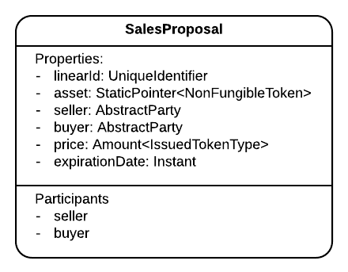
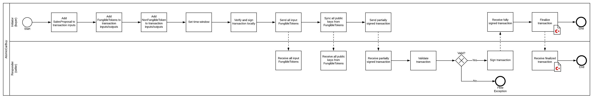

import HighlightBox from "../../src/HighlightBox"

import {
  ExpansionPanel,
  ExpansionPanelList,
  ExpansionPanelListItem
} from 'gatsby-theme-apollo-docs';

So, you worked on the exercise on your own before landing here and looking at this example solution. This solution does not add any new files but it touches them all:

* `SalesProposal` state found [here](https://github.com/corda/corda-training-code/blob/master/060-time-window/contracts/src/main/java/com/template/proposal/state/SalesProposal.java).
* `SalesProposalContract` contract, with changes for all 3 commands `Offer`, `Reject` and `Accept`, found [here](https://github.com/corda/corda-training-code/blob/master/060-time-window/contracts/src/main/java/com/template/proposal/state/SalesProposalContract.java).
* The 3 flow pairs found [here](https://github.com/corda/corda-training-code/tree/master/060-time-window/workflows/src/main/java/com/template/proposal/flow):
    * `SalesProposalOfferFlows`
    * `SalesProposalRejectFlows`
    * `SalesProposalAcceptFlows`

## `SalesProposal`

As mentioned earlier, the only change needed here is to add an expiration date, preferrably in the same type used in `TimeWindow`:

```java
@NotNull
private final Instant expirationDate;
```
Which is added to the `equals` and `hashCode` functions too. That calls for a new CDL:



<HighlightBox type="tip">

The constructor allows setting an expiration date in the past. This is necessary to allow transaction verification in the future.

</HighlightBox>

The tests add a null check in the constructor, and confirm the `equals` and `hashCode` functions.

Time to move to the contract, which is going to attest about the placement of the expiration date relative to the time window.

## `Offer` in the contract

When making an offer, the contract only needs to make sure that the expiration is _in the future_. In terms of time-window, this means that:

* There needs to be a time-window with a non-null `untilTime`.
* And the `untilTime` needs to be before the expiration date.

Therefore, the only addition is, found [here](https://github.com/corda/corda-training-code/blob/master/060-time-window/contracts/src/main/java/com/template/proposal/state/SalesProposalContract.java#L52-L57):

```java
req.using("There should be a future-bounded time window",
        tx.getTimeWindow() != null &&
                tx.getTimeWindow().getUntilTime() != null);
req.using("The expiration date should be after the time window",
        tx.getTimeWindow().getUntilTime().isBefore(proposal.getExpirationDate()));
```
Admittedly, if `untilTime` equals the expiration date minus 1 second, it does not leave much time for the buyer to accept. But that will suffice, as is.

All the existing tests need to add a time-window that passes:

```java
tx.timeWindow(Instant.now(), Duration.ofMinutes(1));
```
and new tests added to check that:

* There must be a time-window.
* It's `untilTime` must be before the expiration date.

This calls for a new CDL:


## `Accept` in the contract

Here, the goal is to enforce the fact that this transaction happened before the expiration date. So:

* There needs to be a time-window with a non-null `untilTime`.
* And the `untilTime` needs to be before the expiration date.

It looks [already familiar](https://github.com/corda/corda-training-code/blob/master/060-time-window/contracts/src/main/java/com/template/proposal/state/SalesProposalContract.java#L86-L91):

```java
req.using("There should be a future-bounded time window",
        tx.getTimeWindow() != null &&
                tx.getTimeWindow().getUntilTime() != null);
req.using("The buyer time window should be before the expiration date",
        tx.getTimeWindow().getUntilTime().isBefore(proposal.getExpirationDate()));
```

All the existing tests need to add a time-window that passes, and just like `Offer`, there are 2 new tests.

## `Reject` in the contract

Now, switching gears, the goal is to constrain the seller only, and let them reject only after expiration. So this looks a bit different:

* If the buyer rejects, it is indifferent to the presence of a time-window.
* Otherwise, there needs to be a time-window with a non-null `fromTime`.
* And the `fromTime` needs to be after the expiration date.

So, in [terms of code](https://github.com/corda/corda-training-code/blob/master/060-time-window/contracts/src/main/java/com/template/proposal/state/SalesProposalContract.java#L101-L109):

```java
if (command.getSigners().contains(proposal.getSeller().getOwningKey())) {
    req.using("There should be a past-bounded time window",
            tx.getTimeWindow() != null &&
                    tx.getTimeWindow().getFromTime() != null);
    req.using("The seller time window should be after the expiration date",
            proposal.getExpirationDate().isBefore(tx.getTimeWindow().getFromTime()));
    // The buyer can reject at any time.
}
```
Most of the existing tests need to add a time-window that passes. Then, there needs to be a difference between the buyer or the seller rejecting:

* The buyer can reject without a time-window.
* The seller needs to add a time-window.
* And the `fromTime` is after the expiration date.

Time to move to the flows.

## [The offer flows](https://github.com/corda/corda-training-code/blob/master/060-time-window/workflows/src/main/java/com/template/proposal/flow/SalesProposalOfferFlows.java)

When the transaction is being built, all that has to be done is to add a time-window that will let the notary accept it. Something like this would probably work:

```java
builder.setTimeWindow(TimeWindow.withTolerance(Instant.now(), Duration.ofMinutes(1)))
```
But, that does not account for congestion and other delays. After all, your can improve reliability with:

```java
builder.setTimeWindow(TimeWindow.untilOnly(expirationDate.minus(Duration.ofSeconds(1))))
```
That's right. The time-window extends up to the expiration date. If this doesn't work then it really was too late.

As for [tests](https://github.com/corda/corda-training-code/blob/master/060-time-window/workflows/src/test/java/com/template/proposal/flow/SalesProposalOfferFlowsTests.java), it only needs an additional test with a sales proposal that has an expiration [in the past](https://github.com/corda/corda-training-code/blob/master/060-time-window/workflows/src/test/java/com/template/proposal/flow/SalesProposalOfferFlowsTests.java#L336-L337):

```java
final OfferFlowInitiating offerFlow = new OfferFlowInitiating(bmw1, buyerParty,
        AmountUtilitiesKt.amount(11_000L, usMintDollars),
        Instant.now().minus(Duration.ofSeconds(1)));
//                   ^ in the past
```
And confirm that the cause of the failure:

```java
try {
    offerFuture.get();
} catch (ExecutionException e) {
    throw e.getCause();
}
```
Is a notary exception:

```java
@Test(expected = NotaryException.class)
```

## [The accept flows](https://github.com/corda/corda-training-code/blob/master/060-time-window/workflows/src/main/java/com/template/proposal/flow/SalesProposalAcceptFlows.java)

Here too, in transaction building, it just needs a time-window that makes it easy to pass:

```java
builder.setTimeWindow(TimeWindow.untilOnly(proposal.getExpirationDate().minus(Duration.ofSeconds(1))))
```
And the [additional test](https://github.com/corda/corda-training-code/blob/master/060-time-window/workflows/src/test/java/com/template/proposal/flow/SalesProposalAcceptFlowsTests.java#L352-L353) confirms that the buyer cannot accept after expiration, first by making a short-lived offer:

```java
final OfferSimpleFlow offerFlow = new OfferSimpleFlow(
        bmw1.getState().getData().getLinearId(), buyerParty, 11_000L, "USD",
        usMint.getInfo().getLegalIdentities().get(0), 10);
//                                                    ^ 10 seconds
```
Then forcefully advance time on the mock notary, so that it _believes_ that it is already past the expiration. It is possible because in `MockServices`, the clock [is a test clock](https://github.com/corda/corda/blob/68bb7a0e7bb900117c2ed0d9174fea36d3d4aedc/testing/node-driver/src/main/kotlin/net/corda/testing/node/MockServices.kt#L423):

```java
((TestClock) notary.getServices().getClock()).advanceBy(Duration.ofSeconds(11));
```
And, similarly, check that the cause is a `NotaryException`.



## [The reject flows](https://github.com/corda/corda-training-code/blob/master/060-time-window/workflows/src/main/java/com/template/proposal/flow/SalesProposalRejectFlows.java)

This time, the time-window needs to be added only when the seller rejects:

```java
if (proposalState.getSeller().equals(rejecter)) {
    builder.setTimeWindow(TimeWindow.fromOnly(
            proposalState.getExpirationDate().plus(Duration.ofSeconds(1))));
}
```
And, [2 new tests](https://github.com/corda/corda-training-code/blob/master/060-time-window/workflows/src/test/java/com/template/proposal/flow/SalesProposalRejectFlowsTests.java#L239-L328) for either side of the expiration date. First, when the seller waits long enough. A short-lived proposal:

```java
final OfferSimpleFlow offerFlow = new OfferSimpleFlow(
        bmw1.getState().getData().getLinearId(), buyerParty, 11_000L, "USD",
        usMint.getInfo().getLegalIdentities().get(0), 3);
//                                                    ^ 3 seconds
```
Then "wait a bit":

```java
((TestClock) notary.getServices().getClock()).advanceBy(Duration.ofSeconds(5));
```
For the wrong side of the expiration, it creates a long-lived proposal and also confirms that the cause is a `NotaryException`.

## Conclusion

Why all this trouble with time-windows? Why not just make life easier and compare the current date from within the contract against the expiration date? Something like this:

```java
require.using("Current date must be before proposal expiration date.",
    Instant.now().isBefore(salesProposal.getExpirationDate()));
```
This is wrong, and it will lead to unpredictable (non-deterministic) results:

1. In a distributed ledger where nodes have unsynchronised clocks, the outcome of the above contract is non-deterministic (some nodes will pass this verification, and some will not). Depending on what time it is on that node, `Instant.now()` will return a different value.
2. Remember that the transaction will get verified in the future, when a node receives it because it's part of the chain of transactions that lead to a transaction that it's trying to receive and resolve. So, when the contract runs in the future, `Instant.now()` will return what time it is in the future and the verification will fail because the current time, i.e. the future, will be greater than the expiration date of the proposal!

### DJVM (Deterministic JVM)

Corda 4.4 introduced a [Deterministic JVM](https://docs.corda.net/docs/corda-os/4.4/key-concepts-djvm.html) that protects you from making mistakes like the above.

This new feature comes with a Gradle plugin that alerts you about non-deterministic code in your contracts at compile time.

It also allows you to configure your nodes to reject any contract code that is non-deterministic.
