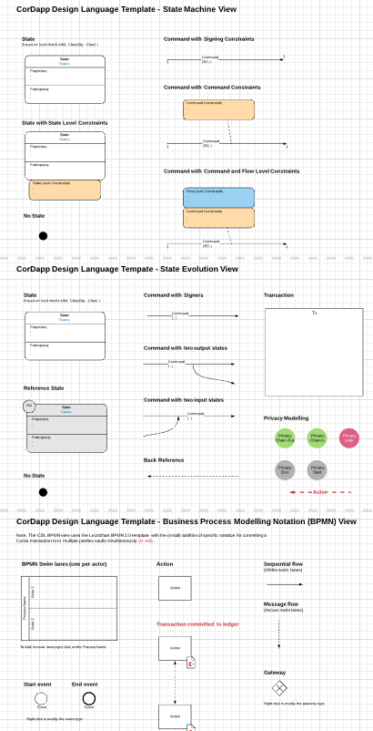
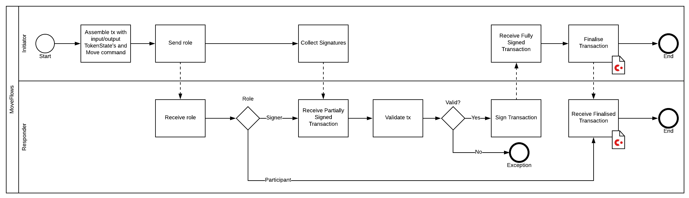
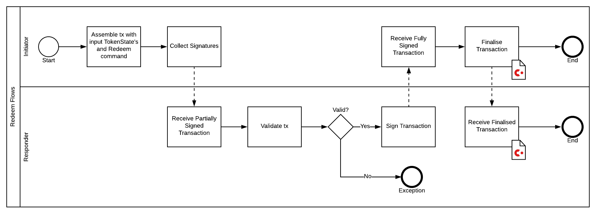

A CorDapp has many interacting parts and architectural levels. For example, there are States, Contracts, Flows, Transactions, APIs, Participants and Signers. At a high level, one can think of the Ledger Layer and the Orchestration Layer. Distributed Ledger platforms confront design teams with new design paradigms and Corda is unique among DLTs.

This is all a lot to reason about and a challenge identified by R3 members and partners is communicating and documenting Corda designs. This is where Corda Design Language can help.

Most readers will be familiar with modeling languages such as Unified Modeling Language (UML) and the advantages of working with such abstractions over the system development lifecycle. But Corda is a unique platform with unique concerns that are not easily described with existing modeling languages, so R3 has developed a "bespoke" modeling language for Corda, Corda Design Language (CDL).

CDL addresses important high-level concerns:

- Existing modeling languages don't capture all aspects of CorDapp design.
- CorDapps must operate in an environment where Byzantine actors are present.

CDL enables communication and reasoning about key aspects of CorDapp designs, including:

- Shared data and state
- Shared processing logic
- Permissioning (via digital signatures)
- Privacy (Visibility of data to different participants)
- Security

Privacy is a much-touted feature of Corda but it is still possible to leak information by design oversight. Therefore, it is valuable to use a common language to describe all aspects of a design, which may be quite complex, so that all stakeholders can reach a common understanding of what is happening and reason about the implications.

The best place to start learning about CDL is the [Corda Design Language Documentation](https://solutions.corda.net/corda-modelling-notation/overview/overview-overview.html). Here you find a modeling language for expressing designs at the Ledger and Orchestration Layers, including:

- State Machine (Ledger)
- State Evolution (Ledger)
- Business Process Modeling (Orchestration)
- High Level Process and Network Architecture

As a preview of what you will find, here is a State Machine (Ledger) diagram with descriptions of States, Commands and constraints:

- SLC: State Level Constraint
- SC: Signing Constraint
- TLC: Transaction Level Constraint
- VC: Visibility Constraint
- BNO: Business Network Operator

## Design Template

R3 has prepared a useful symbol template you can use to simplify the process of creating CDL views with [Lucidchart](https://www.lucidchart.com). Open this [invitation](https://www.lucidchart.com/invitations/accept/d56d7806-3007-456e-b770-d6ed135def5d), choose the first file and open it, then `File -> Make a copy` to make a project you can edit in your own [Lucidchart](https://www.lucidchart.com) workspace.

<!-- TODO: Publish the actual URL when available -->

## You design

By now, you must have noticed how we surreptitiously inserted CDL diagrams in the previous "solution" chapters, namely:

1. The state:

    
2. The state machine / transitions:

    
3. The Issue flows:

    
4. The Move flows:

    
5. The Redeem flows:

    

Now it is **your turn**, create the different designs for the state(s), contract(s) and flows you coded earlier.

## Suggested Reading

- [Corda Design Language Documentation](https://solutions.corda.net/corda-modelling-notation/overview/overview-overview.html)
