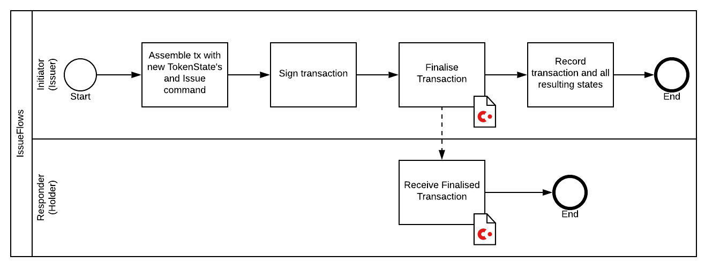
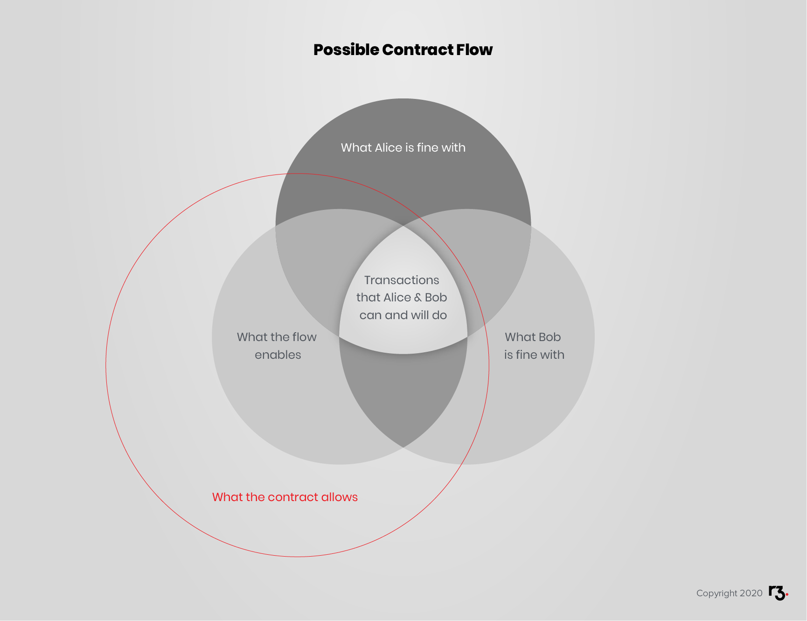

import HighlightBox from "../../src/HighlightBox"
import {
  ExpansionPanel,
  ExpansionPanelList,
  ExpansionPanelListItem
} from 'gatsby-theme-apollo-docs';

In the same way you proceeded with state and contract, you have done your exercise, you have your own `IssueFlow`, `MoveFlow` and `RedeemFlow`, and perhaps more than that. Now, compare what you did to this example observing some best practices. As always, there is no single truth as to implementation but the hope is that you will reflect on your first attempt given the remarks here. Let's go.

Once again, this chapter links only to Java code and lets you discover the equivalent Kotlin code on your own. They both achieve the same result with the steps in the same order for better comprehension.

## [`Constants`](https://github.com/corda/corda-training-code/blob/master/020-first-token/workflows/src/main/java/com/template/flows/Constants.java)

Strange, it declares its:

```java
String desiredNotaryName = "O=Notary, L=London, C=GB";
CordaX500Name desiredNotary = CordaX500Name.parse(desiredNotaryName);
```
Of course it needs a notary to proceed, but why does it pick a preferred one? After all, many code examples just roll with the first in the list:

```java
final Party notary = getServiceHub().getNetworkMapCache().getNotaryIdentities().get(0);
```
Choosing a notary is a decision in itself, so declaring a preference is R3's recommended practice. Consider:

* What performance, availability, or even discretion do you expect from it?
* Do you want a validating notary?
* The notary you picked randomly, is it a for-profit notary that wants to be paid per transaction batch or with a subscription?
* Why would your consortium app use the notary of another consortium?

The downside of having it hard-coded is that, should it change, you would have to redeploy your Jars. So, as part of a proper deployment, you would put this information into a configuration file, as you will see later. Here and now, for simplicity's sake, it is declared as a hard-coded `static` member.

## [`IssueFlows`](https://github.com/corda/corda-training-code/blob/master/020-first-token/workflows/src/main/java/com/template/flows/IssueFlows.java)

First, let's have a diagram that sums up this flow:



What the issue **initiator** flow does in a nutshell is:

1. Collect the required information.
2. Generate the transaction.
3. Verify it.
4. Sign the transaction.
5. Send it over to the holders.

And all the issue **responder** flow does is:

1. Accept the transaction.

The following design decisions were taken:

* Initiating and responder flows are encapsulated inside an `interface`. This provides a way to clearly identify them, by `new IssueFlows.Initiator()`, considering that we do not need to instantiate the encapsulating `IssueFlows`.
* The preferred notary is used, instead of letting the flow creator decide.
* It can issue as many `TokenState` instances, with whichever `holder` and `quantity` as wanted. Not necessarily 1 instance per holder which sounds unreasonably restrictive.
* It is the issuer that initiates the flow.
* This flow handles a single issuer. Yes, yes, previously you were asked to try your hand at an issue flow that handles more than 1 issuer, but this is in fact too risky to do before you have seen more advanced topics. Indeed, the initiating issuer would request signatures from other issuers **automatically**, so these other issuers would have no oversight on whether this is the right business decision. So the "atomically issue for multiple issuers" idea altogether was dropped.
* The issuer keeps a record of the states. Why this has to be a design decision will become clearer later on. For now, let's just say that the issuer wants to be able to know the current total supply with a simple local query.

### `Initiator`

#### The class declaration

```java
@InitiatingFlow
@StartableByRPC
class Initiator extends FlowLogic<SignedTransaction> {
```
* It has to extend `FlowLogic` to be considered as a flow.
* It makes sense to call it `Initiator` as it is indeed an `@InitiatingFlow` one.
* It can be resonably expected to be started from another part of the system, like the node shell, so it is annotated with `@StartableByRPC`.
* The primary purpose of this flow is to create an `Issue` transaction, so it is natural to expect it to return a `SignedTransaction`.

<HighlightBox type="info">

> Does a flow always return a `SignedTransaction`?

No, a flow can return any type of data, [including `Void`](https://github.com/corda/samples-java/blob/a61e2cc9910d7d5de83122bf7d36fd071796a7c3/Basic/flow-database-access/workflows-java/src/main/java/net/corda/samples/flowdb/AddTokenValueFlow.java#L17). If you create a flow that piggybacks on the Corda network only to do instant messaging, then your flow would return a [message type](https://github.com/cordacademy/cordacademy-ping/blob/0d7dbf514def1ea7c35864abb3c32f9d80d70732/cordacademy-ping-workflow/src/main/kotlin/io/cordacademy/ping/workflow/PingFlow.kt#L27). Your flow could also encapsulate a complex [vault query](https://github.com/corda/samples/blob/e0052bfc491b9133110618a3f6046498a6f25cbb/flow-db/src/main/kotlin/com/flowdb/Flows.kt#L52-L60) or calls to [third-party APIs](https://github.com/corda/samples/blob/f6d9e6a5e8f9d38e597be9f661725610020dd666/flow-http/workflows-java/src/main/java/com/flowhttp/HttpCallFlow.java#L27-L28), and return the data type fetched.

> Will my transaction be finalised if the flow does not return it?

If you called `FinalityFlow` in your flow, then your transaction is finalised. The return type of your flow has no relevance to finality.

</HighlightBox>

#### The fields

To be able to run its operations, the flow needs some parameters, the _required information_ mentioned earlier. These are passed in the constructor. Since the party that runs the initiating flow is the issuer, the other pieces of information it needs to create a `TokenState` is `Party holder` and `long quantity`. This pair of information can be expressed in the tuple named `Pair<Party, Long>`. A single `Pair` instance is enough information for use to instantiate a single `TokenState`. It was decided to instantiate any number of `TokenState`, so it needs a `List` of such `Pair`s. This explains the field:

```java
@NotNull
private final List<Pair<Party, Long>> heldQuantities;
```
A held quantity, here, means the pair of a holder and the quantity.

* Nothing in this list structure prevents you from having duplicates, or the same holder multiple times, which was the intention.
* It would not have been appropriate to expect a list of fully-formed `TokenState`s as it would force the flow to either discard the mentioned `issuer`, or verify that they all have the expected party for issuer. Instead of having a data structure that forces you to make assumptions, or discard information, better choose one that makes requirements explicit.
* The eager OOP developer would create a dedicated `HeldQuantity` tuple class to make explicit the fact that the `Party` is the `holder`, not the issuer.
* If you chose a `Map<Party, Long>`, that is not a bad choice although a bit restrictive as you don't allow duplicates. Or, perhaps you decided you absolutely wanted no duplicate holder, in which case this was the right data structure. If you chose it without thinking about the implications, or you thought that allowing duplicate holders would break something, that would be less desirable.

The other field is:

```java
@NotNull
private final ProgressTracker progressTracker;
```
You saw earlier that a `ProgressTracker` is handy when tracking progress in the node shell at the very least. Here, you want to define your own set of steps, and, to simplify this first flow, it did not make the assumption that another flow would care to pass in a different tracker at instantiation.

#### The constructors

This explains the main constructor:

```java
public Initiator(@NotNull final List<Pair<Party, Long>> heldQuantities) {
    //noinspection ConstantConditions
    if (heldQuantities == null) throw new NullPointerException("heldQuantities cannot be null");
    if (heldQuantities.isEmpty()) throw new IllegalArgumentException("heldQuantities cannot be empty");
    final boolean noneZero = heldQuantities.stream().noneMatch(heldQuantity -> heldQuantity.getValue() <= 0);
    if (!noneZero) throw new IllegalArgumentException("heldQuantities must all be above 0");
    this.heldQuantities = ImmutableList.copyOf(heldQuantities);
    this.progressTracker = tracker();
}
```
You should recognise that the same decisions were taken here as with the contract, with regards to `final`, `@NotNull`, `NPE`, and `ImmutableList`. It was also decided to fail early when it is known that the values passed will be rejected at the contract level.

Why would it not create the list of `TokenState`s here right away, by collecting the identity of the node and saving it in the `issuer`? Well, the identity of the node is not known at construction. An instantiated flow is not much more than a plain Java object. Sure it can run on a node, but this is a separate step. Those 2 separate steps were run sequentially with the single shell command `flow start ExampleFlow$Initiator iouValue: 20, otherParty: "O=PartyC, L=Paris, C=FR"`, which might give the wrong impression. On the other hand, in the tests, `a.startFlow(flow)` makes clear that the flow is first instantiated, then the node is picked to run it.

The constructor also defines the `progressTracker` as the static default `tracker()`:

```java
@NotNull
public static ProgressTracker tracker() {
    return new ProgressTracker(
            GENERATING_TRANSACTION,
            VERIFYING_TRANSACTION,
            SIGNING_TRANSACTION,
            FINALISING_TRANSACTION);
}
```
... which neatly lists the steps mentioned above. Again, this time no choice is left to the caller of this constructor. In the rest of this chapter, the places where each step is called are omitted as this is self-explanatory by looking at the code.

To assist you in testing the flow from the node shell, there is a simple constructor that takes only 2 parameters:

```java
public Initiator(@NotNull final Party holder, final long quantity) {
    this(Collections.singletonList(new Pair<>(holder, quantity)));
}
```
Here, as well, you should be familiar with the decision to use `Collections.singletonList`.

With this preparation done, it is time to move on to the `call` function, which is called when the node has been selected and the flow starts.

#### `call`

```java
@Suspendable
@Override
public SignedTransaction call() throws FlowException {
```
Not much to say about it, other than to draw your attention once more on the `@Suspendable` annotation picked up by Quasar's agent.

From there, the flow makes it clear that _the node running it_ is the `issuer`:

```java
final Party issuer = getOurIdentity();
```
And with this, it is time to create the output tokens:

```java
final List<TokenState> outputTokens = heldQuantities
    .stream()
    .map(it -> new TokenState(issuer, it.getKey(), it.getValue()))
    .collect(Collectors.toList());
```
In this stream, this pipe if you want, each pair is transformed, with `.map`, into a token. That is a part of the future transaction. Let's continue. It needs a notary, and as mentioned above, it will use the preferred one:

```java
final Party notary = getServiceHub().getNetworkMapCache().getNotary(Constants.desiredNotary);
if (notary == null) {
    throw new FlowException("The desired notary is not known: " + Constants.desiredNotary.toString());
}
```
Here, the hope is that the preferred notary in fact exists in the network map. It is nonetheless prepared to fail fast if that is not the case, instead of trying to repair the situation by picking a notary randomly. Again, for emphasis, selecting a notary is a decision in itself.

#### Generating the transaction

The transaction to assemble is not very complex. You know what the contract will check, and that it expects a command, so here goes:

```java
final Command<Issue> txCommand = new Command<>(new Issue(), issuer.getOwningKey());
```
This is where you show your knowledge of the contract's expectation that the issuer needs to sign the transaction. With this, it creates a builder:

```java
final TransactionBuilder txBuilder = new TransactionBuilder(notary)
        .addCommand(txCommand);
```
This should look familiar already. All that is missing are the outputs:

```java
outputTokens.forEach(it -> txBuilder.addOutputState(it, TokenContract.TOKEN_CONTRACT_ID));
```
Again, it associates each `TokenState` with its contract.

After the right data structures have been selected, and the auxiliary decisions made, generating the transaction is pure mechanics.

#### Next steps

With the transaction ready, it checks whether it is valid:

```java
txBuilder.verify(getServiceHub());
```
You will notice that the verification is done on the transaction builder. This builder does not store any signature, by design. A signature signs a finished transaction, so you would need the builder to first create the transaction before being able to sign it. You will recall that the contract verifies the presence of required signers, not the presence of signatures. That's why the verification passes even before the transaction was generated and signed. Which it does right after that:

```java
final SignedTransaction fullySignedTx = getServiceHub().signInitialTransaction(txBuilder);
```
This convenience method generates and signs the transaction in one go. The transaction was named `fullySignedTx` because it does not require any additional signature.

#### Finalisation

With this, you now need to inform all concerned parties: the **holders** of the tokens. Remember there may be many, plus they may appear multiple times, so you have to make sure you keep **distinct** ones. The issuer may also be a holder, there is nothing preventing it. No need to inform the issuer again, so you need to inform all holders **minus the issuer**:

```java
final List<FlowSession> holderFlows = outputTokens.stream()
        .map(TokenState::getHolder)
        .distinct()
        .filter(it -> !it.equals(issuer))
        .map(this::initiateFlow)
        .collect(Collectors.toList());
```
You will recall that `FlowSession` is a one-to-one link between this node's flow **session** and one remote node's flow session. So, as you saw previously, the way to send the transaction over the wire is with:

```java
final SignedTransaction notarised = subFlow(new FinalityFlow(
        fullySignedTx,
        holderFlows,
        FINALISING_TRANSACTION.childProgressTracker()));
```
This is the end of the initiating flow, it is time to move to the responder flow, which needs to dance to the initiator's tune. Notice how here too it instantiated `FinalityFlow`, and then asked it to run on the node with `subFlow`. Two steps again.

After having informed all holders, it is time to inform the issuing node. Is it not already informed about this transaction? Yes, it is, yes, the transaction was saved as a blob in the vault. But this node is also the issuer, and the issuer is not in the participants list. From Corda's point of view, these new states are not [_relevant_](https://github.com/corda/corda/blob/68bb7a0e7bb900117c2ed0d9174fea36d3d4aedc/core/src/main/kotlin/net/corda/core/node/ServiceHub.kt#L232) to the issuer. Therefore, the `TokenState`s will not be recorded, by default, as unconsumed states in the issuer's vault. But as mentioned earlier, the issuer wants to be able to know the total supply of its own issued tokens. So the flow has to record the transaction explicitly:

```java
getServiceHub().recordTransactions(StatesToRecord.ALL_VISIBLE, ImmutableList.of(notarised));
```
With this, the issuer has a record of all states. Not to forget to return:

```java
return notarised;
```

### `Responder`

This will be thankfully be short as it does not do much. Because of its brevity, it was decided to not include a `ProgressTracker`.

#### The class declaration

```java
@InitiatedBy(Initiator.class)
class Responder extends FlowLogic<SignedTransaction> {
```
Nothing that should surprise you at this stage.

#### The field

```java
@NotNull
private final FlowSession counterpartySession;
```
It only needs to know who has initiated the flow.

#### The constructor

```java
public Responder(@NotNull final FlowSession counterpartySession) {
    this.counterpartySession = counterpartySession;
}
```
You have to avoid being creative with the constructor as instantiation happens automatically on the responding node.

#### The step

```java
return subFlow(new ReceiveFinalityFlow(counterpartySession));
```
That's right.

* First, there is only 1 communication arriving from the initiator, `FinalityFlow`, so you need to dance to that tune and sub-flow its counterpart `ReceiveFinalityFlow`.
* Second, the holders receive the tokens without much ado. The tokens are understood as assets without side-effects so it assumes the holders are all too happy to receive them.

When you look into `ReceiveFinalityFlow`, you will see that each holder will only store [states relevant](https://github.com/corda/corda/blob/68bb7a0e7bb900117c2ed0d9174fea36d3d4aedc/core/src/main/kotlin/net/corda/core/flows/FinalityFlow.kt#L274) to it, as in, if they are in the participants list. So even though multiple holders may receive the transaction, not all holders will store all token states separately.

### Tests

You will see that the tests are pretty run of the mill. They check that:

* The transaction created is as expected, which includes:
    * Signatures.
    * Outputs.
* The transaction has been recorded in vaults.
* States have been recorded, or not, in vaults.

### `IssueFlows` conclusion

You saw that the contract allows, at the ledger level, an issue transaction with multiple issuers. But because of the realities of a simple flow implementation, this issue flow only allows an issue transaction with a single issuer.

Keep in mind that although holder nodes will pick and choose which states they will save, all nodes have knowledge of all the states of the transaction because they received the transaction in the first place. So a determined holder can sift through their own node's transactions in order to rebuild the states that other holders owned as part of the transactions it was a part of. This is another way of saying that "what you care to keep in a convenient format" is a subset of "what was irreversibly disclosed".

So, the user of this flow will also have to think about what is desirable for all parties involved. Perhaps the issuer wants to issue to Alice and Bob but Alice does not want her issued states to be known by Bob. In this case, the issuer will have to make the decision to call this simple issue flow twice, once for Alice and once for Bob. On the other hand, if Alice and Bob are both ok with the other knowing their holdings, the issuer can go with a single transaction.

<HighlightBox type="tip">

What a contract allows is greater than what a flow enables, which may be larger than what participants will accept.

</HighlightBox>


