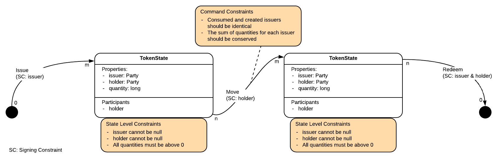

import HighlightBox from "../../src/HighlightBox"
import {
  ExpansionPanel,
  ExpansionPanelList,
  ExpansionPanelListItem
} from 'gatsby-theme-apollo-docs';

Let's dive right away into the exercise. We will start with something simple, and, dare we say, universal: a token.

## The goal

Your goal is to create the state and contract, and eventually flows that implement a token. By token, we mean a fungible token. Fungibility is a property of a commodity whose individual units are indistinguishable from others. Pure gold is fungible because an ounce of it is materially indistinguishable from any other. Fungibility is an important property of money, currency, many securities and commodities because it implies that quantity alone is a sufficient description. If someone says "USD $100," we know what that means because US Dollars are fungible. We would not ask "Which dollars?"

For this exercise, we will avoid some of the regulatory concerns. Instead of creating a general-purpose currency, we will modestly assume that the airlines of the world have decided to come together to create a shared system that will record their digital mileage rewards. The immediate exercise is to establish the basics correctly so that, with these basics in place, airlines and passengers may eventually enable secondary facilities such as trading.

So yes, an air-mile will be a token. It stands to reason to assume that each airline wants to control the supply of their own air-miles. If any airline could issue universally-valid air-miles, nothing would prevent a rogue airline from offering excessive air-miles and burdening competitors with liabilities. We already know that, even on their own, airlines offer too many air-miles. An airline also wants to control redemption because, after all, if you want to redeem your air-miles with a trip, there needs to be an available seat in the first place. In the spirit of decentralisation, and with a view to enabling future secondary markets, we will make it such that a token is truly owned by the bearer, and not just in a symbolic sense, as they are nowadays. The bearer, or holder, will have full control except for issuance and redemption.

## More details

With this in mind, you will begin to see the outlines of the design.

* The actions:
    * Issue tokens, a.k.a. mint, create.
    * Move tokens, a.k.a. transfer, pay.
    * Redeem tokens, a.k.a. destroy, burn.
* The actors:
    * Airlines, a.k.a. issuer, minter, redeemer(??)
    * Passengers, a.k.a. holder, bearer, owner

For now, focus on the state and contract. You will focus on flows when those issues are well-solved.

<HighlightBox type="tip">

Why not code the flows as well, and attempt it in one sweep?

1. When deploying your CorDapp, it is a good practice to distribute the state&nbsp;+ contract JAR together and distribute a separate JAR with the flows. So let's conceptually separate the two now.
2. It is a devastating rookie mistake to leave the contract overly permissive and enforce restrictions at the flow level. By focusing exclusively on the contract first, you will form the habit of observing this best practice.
3. You have enough on your plate already just with the state, the contract and tests. Yes, you do.

</HighlightBox>

## Write code

Your best starting point at this stage is to either use the [Java template](https://github.com/corda/cordapp-template-java) or the [Kotlin template](https://github.com/corda/cordapp-template-kotlin) and create your classes as necessary. Don't hesitate to peek back at the previous chapter where we walked you though the CordDapp example. If you still feel uncomfortable with an empty template, you can use the [CorDapp example](https://github.com/corda/samples-java/tree/master/Basic/cordapp-example) as a starting point and modify it as necessary.

<ExpansionPanel title="If you prefer to work from the Web IDE">

* If you want to start off from the empty project we prepared for you, head to http://ide.corda.net/?folder=%2Fhome%2Fcoder%2Fcorda-training-code%2F010-empty-project
* Or from Corda's Java template, head to https://ide.corda.net/?folder=%2Fhome%2Fcoder%2Fcordapp-template-java
* Or start off by modifying the `cordapp-example`, head to https://ide.corda.net/?folder=%2Fhome%2Fcoder%2Fsamples-java%2FBasic%2Fcordapp-example

This Web IDE is good if you want to see around and dabble. On the other hand, if your plan is to code for Corda seriously, you owe it to yourself to follow the IntelliJ route.

</ExpansionPanel>

Add unit tests that cover all actions and situations. Yes, tests! You are not going to release untested state and contracts in the wild. Try to think creatively and adversarially, whereby an airline or a passenger would try to game the system to gain an unfair advantage. Your code should prevent such possibilities and your tests should prove that your defenses are effective.

Keep the code generic. In particular when naming entities, you want your code to be reusable at a later stage when, say, another consortium decides to tokenise something else.

We have some hints rolled up below. Think on your own before you unroll them. In the next chapter we reveal an example implementation. Again, for your benefit, resist the urge to peek unless you are utterly stuck.

<ExpansionPanel title="Some hints, a.k.a. spoilers, think on your own first">
<ExpansionPanelList>
<ExpansionPanelListItem number="0a">

### Are you stuck?

</ExpansionPanelListItem>
<ExpansionPanelListItem number="0b">

### Really stuck?

</ExpansionPanelListItem>
<ExpansionPanelListItem number="1">

### Ok, the state:

* What would be an appropriate, generalised name for the state?
    * `TokenState`
* Should it keep a quantity?
    * Yes
* Should it identify its holder?
    * Yes
* Should it identify its issuer?
    * Yes
* What are the sensible constraints for this class?
    * quantity strictly positive; do this here or in the contract?
* Who are the participants?
    * only the holder, unless you want to burden other entities with extra traffic

Something that would look like:

</ExpansionPanelListItem>
<ExpansionPanelListItem number="2">

### The contract:

* What should you name it to be generic enough?
    * `TokenContract`
* What are the commands that will make intent explicit?
    * `Issue`, `Move` and `Redeem`
* What are the transaction shape constraints to impose on each action, without preventing mixing  with other unrelated states and contracts?
    * inputs count, outputs count
* What are the states constraints to impose on each action?
    * sum conserved on `Move`
* What are the signatures constraints to impose on each action?
    * signed by issuer or holder or both
* Other constraints?

Something that would look like:

</ExpansionPanelListItem>
</ExpansionPanelList>
</ExpansionPanel>

<HighlightBox type="support">

Get 3 months access to the authors and experts who created this training.

* Expert instructors will review your code and help you to refine it.
* One-on-one support and mentoring from expert instructors.
* Collaboration with fellow students in a dedicated Training Slack channel.

<a href="/in-closing/get-paid-support/" class="cta-button">Learn More</a>

</HighlightBox>
