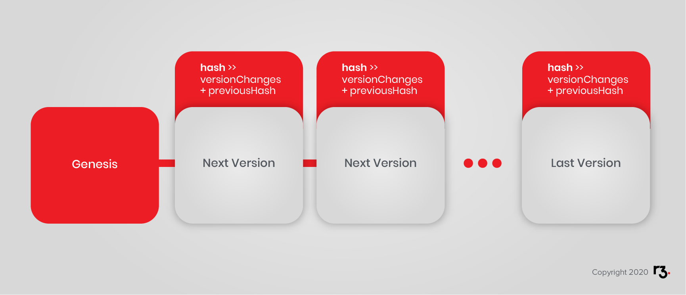

To understand Corda's unique implementation of a distributed ledger, this section starts at the beginning - with the discovery of the blockchain.

In this section, you will learn:

- What blockchain is.
- The problems blockchain solves - like double-spending.
- The basics of how blockchain works.

## What is blockchain?

Satoshi Nakamoto (whose identity remains shrouded in mystery) published his seminal white paper in October, 2008. His paper presented a solution to the "double-spending" problem for digital currency. In so doing, he revealed the underlying technology known as blockchain and an example of blockchain's possible application in the form of a simple implementation called "Bitcoin".

"Bitcoin" has gained widespread attention since that time. The underlying mechanism, blockchain, has also gained recognition and has found applications in diverse contexts. Indeed, the world has discovered that the principles of blockchain are useful in many contexts, and many variations of the original implementation are possible.

## What Does Blockchain Solve?

You are probably already familiar with digital artifacts, e.g. files, and the ease with which they can be copied. These present obvious problems when one considers using such things to represent assets such as money. What prevents someone from making copies and spending the same money twice? This is known as the "double-spending problem." Traditionally, double-spending is resolved by using a third party as a trusted ledger keeper, which will be the system of record. Examples include banks, charge card companies and payment services. They all keep digital ledgers to address the double-spending problem.

Consequently, it is not generally possible for two parties to exchange value online without also involving a trusted third party in the settlement process. That is, it was not possible before Bitcoin demonstrated a new method of addressing the double-spending problem.

At a high level, Bitcoin solves the problem by replacing the trusted central ledger-keeper with a network of ledger-keepers. Each ledger-keeper has a replica of the ledger, knows the rules of the protocol and observes proposed changes. They reach consensus about new ledger states. No one can make a change to the ledger without first achieving network consensus about the change. It is as though each transaction is observed by a large crowd of witnesses who form a consensus of everything that has occurred, including rejecting events that should not occur. Events that should not occur include spending non-existent funds and double-spending.

Bitcoin convincingly demonstrates that a network of nodes that do not necessarily trust each other can form a consensus about transaction validation, transaction history and the resulting state. This is interesting because simple ledgers of account balances and a simple protocol for moving funds is far from the only use-case for reliable processes and shared consensus about data.

## How Does it Work?

Imagine you want to retain and monitor changes to a file, for example a transaction log. Further, imagine you want to verify an unbroken history of all changes ever made to the file. How do you go about it?

A well-understood solution to verifying a file uses cryptographic [hash functions](https://en.wikipedia.org/wiki/Cryptographic_hash_function).

The concept can be summarised like this:

> The ideal cryptographic hash function has five main properties:
>
- It is deterministic so the same message always results in the same hash
- It is quick to compute the hash value for any given message
- It is infeasible to generate a message from its hash value except by trying all possible messages
- A small change to a message should change the hash value so extensively that the new hash value appears uncorrelated with the old hash value
- It is infeasible to find two different messages with the same hash value

You can see hashing in action to get the feel for it here: [<http://onlinemd5.com/>](<http://onlinemd5.com/>). Notice that there are different hashing algorithms that aim for similar results as described above. Also notice that as you type in the *text* box, the hash updates and even a miniscule change to the input creates a completely different hash. Finally, notice that each algorithm consistently produces hashes of the same size regardless of the size of the input.

A hash can be used to prove an input exactly matches the original, but the original cannot be reconstructed from a hash.

This simple process is sometimes used to confirm the integrity of a large file such as a software update. A hash of the legitimate file will be presented by an authoritative source such as a publisher's website. With that hash, users can confirm a file received exactly matches the original content. They simply hash the file they have, themselves, and compare the result to the expected result.

Now, how can you extend this idea to confirm an unbroken transaction history?

You can start with the first version of a file and record a hash of the file contents. This can be as simple as an empty log with no transactions because nothing has happened yet. You can further suppose that you will have a rule: You can only append new entries to the end of the file. That is to say, the transaction history will be an append-only structure. Accountants have known the advantages of append-only ledgers for centuries.

> The following examples are written in pseudocode:

```javascript
version1Hash = hash(version1)
```

In this example, `version1` is the empty, initialised log.

How can you append new transactions and show an unbroken history of changes?

You can make a rule that states that in addition to the new content, the previous hash will also be an input to the next hash.

Like this:

```javascript
version2Hash = hash(version2Changes + version1Hash)
```

This way, you can examine *candidate* changes and confirm that the previous file is correct, and the subsequent changes are accurately disclosed. This process repeats for all subsequent versions.

For example:

```javascript
version3hash = hash(version3Changes + version2Hash)
```

In case it is not clear, the `version3Hash` is dependent on the `version2Hash` and the `version1Hash`. Thus, if two parties separately compute identical `version2Hash`es then they will know they share identical transaction logs all the way back to the beginning.

If two nodes agree on the `version2Hash` and admit the same set of proposed transactions in `version3`, then they will definitely compute the same `version3Hash`.

Any version of the file contents can be shown to be part of an unbroken chain of changes, all the way back to the file inception. This is pure mathematics. Any departure from the system, such as a hash that does not compute as expected, proves a break in the history and is therefore invalid.



Interestingly, since knowledge of the current hash of the latest valid version is an input to the next version's hash function, it is not possible to generate a new valid version without knowledge of the valid version that precedes it. This process forces changes to be appended to a previous valid version.

Blockchain functions in a similar manner. Blocks of transactions are appended using hashes of previous blocks as inputs into hashes of subsequent blocks. Any participant can quickly verify an unbroken chain of blocks (in the correct order).

Transaction blocks are logical units that wrap up a set of transactions in a specific order. While the implementation details are somewhat more subtle, for now, let us think of this as the set of transactions that occurred during a time interval, in a specific order.

Transaction ordering is surprisingly challenging in a blockchain system due to design goals and constraints. Consider the example of Bitcoin and its novel solution to understand the issues and how this can be addressed.

- As a distributed network, everyone has a little bit of authority. For example, all nodes can generate transactions and then announce that information to other nodes.
- In a truly distributed network, no one's clock is considered more authoritative than anyone else's clock. Therefore, the network needs a transaction ordering solution that does not involve timestamps or network time.
- Anyone can, theoretically, listen to transaction proposals and organise a valid block containing an *opinion* about the correct order of events.
- Because of physics and network latency, everyone on the network will learn about transaction proposals in a slightly different order. How then can the *correct* order of transactions be determined?

Even if you assume that all members of the network mean well and participate honestly, they will surely arrive at somewhat different opinions about the correct ordering of transactions and there is no obvious way to settle the matter. Transaction order must be resolved because processing transactions out of order produces non-trivial differences in outcomes. Without agreement about transaction order, there can be no agreement about results.

## Bitcoin and Proof-of-Work

Bitcoin uses a process called Proof-of-Work which can be (simplistically) thought of as a lottery. The lucky winner wins the privilege of being authoritative for one block of transactions. The winning lottery ticket, called the nonce, is used as another input for the hash function. This is easily verified by other participants. The lottery winner's opinion about the order of transactions within the block becomes the network's de facto official result.

In case the foregoing is not clear: A valid block is a well ordered set of transactions, contains the hash of the previous block, and contains a "winning lottery ticket" (nonce). Other participants recognise this unlikely combination (unlikely because of the winning lottery ticket) and accept the block as a de facto correct opinion about the order of transactions. This process disambiguates the order of the transactions even though well-meaning nodes independently arrive at slightly different opinions about the matter. The process does so without reliance on an authoritative time source.

A well ordered set of blocks of well-ordered transactions is a well-ordered set of all transactions.

Cryptographic hash functions are instrumental in that they empower all participants to satisfy themselves that they possess an undistorted history of everything. Since all nodes can verify the chain independently, they can proceed on the assumption that all other nodes will eventually come into agreement about the history of everything. This is known as eventual consensus.

A blockchain starts with a known state. This is a simple matter of an initialised universe in which nothing has happened. A blockchain proceeds by constructing a verifiable and widely agreed history of everything that has ever happened. Nodes independently construct a present state of the universe by reviewing the ordered history of every change (the transactions) that has ever occurred. The history of everything that has ever occurred moves forward in time as "lottery winners" announce new transaction blocks and these are accepted as valid by a consensus of network participants.

## Public Networks and Mining

Bitcoin is a Public blockchain, also sometimes called a permissionless network. The Proof-of-Work process shows that a network of nodes that do not know or necessarily trust each other can arrive at a convincingly robust consensus. This brief description would be incomplete without a word about mining and mining rewards.

Blockchain networks that rely on Proof-of-Work employ financial incentives as an approximate substitute for accountability. A lottery has been mentioned. This in an apt description of a guessing game. Participants, called miners, guess at a number that when included in with a block of transactions and the previous hash will produce a hash that meets a certain criteria. Since hash functions are one-way functions there is no more efficient approach to discovering a winning ticket (a number called the nonce) than brute force trial and error. The "certain criteria" relates to the odds of a random guess that produces a desired result.

For example, consider this contrived transaction log that records Alice sending 10 to Bob and then Bob sending 5 to Carol, in that order.

```javascript
{
  "transactions": [
    { "from": "Alice", "to": "Bob", "amount": 10 },
    { "from": "Bob", "to": "Carol", "amount": 5 }
  ]
}
```

You can plug that in at [<http://onlinemd5.com/>](<http://onlinemd5.com/>), select SHA256 which Bitcoin uses and it will generate `0901F8FCF7C4B88D9041C3A008D862AB798D89002540469DD047E16CCD75933C`. Don't panic if your result differs because whitespace is important. The point is that any input produces a hash that is unpredictable.

Now, the lottery that miners compete in involves adding another element, the nonce, so that the hash will turn out a certain way.

```javascript
{
  "transactions": [
    { "from": "Alice", "to": "Bob", "amount": 10 },
    { "from": "Bob", "to": "Carol", "amount": 5 }
  ],
  "nonce": 0
}
```

Miners try nonce possibilities using brute force until a "winning" nonce is found. For example, play with the online MD5 until you find a nonce that generates a hash that starts with `0`.

This contrived example would be incomplete without the previous hash. It might look something like this:

```javascript
{
  "previous": "13D6029E991041CF589C56DEFFBE8D4531AF0B419F44C904AEC9A0F1DA3E51FD",
  "transactions": [
    { "from": "Alice", "to": "Bob", "amount": 10 },
    { "from": "Bob", "to": "Carol", "amount": 5 }
  ],
  "nonce": 0
}
```

The nonce is a meaningless number so any input is acceptable, but to win the lottery, the resulting hash must start with a certain number of zeros. This is known as "network difficulty", and the protocol adjusts it automatically. Difficulty increases as more miners join the network so that the moving average of block discovery intervals will match a target pace (10 minutes, for Bitcoin).

In proof-of-Work blockchains like Bitcoin, reliability, not performance, scales with processing power. The idea is to make it prohibitively expensive to obtain and maintain the privilege of defining blocks for a period of time that would be necessary to attack the network. At the time of writing, the Bitcoin "hash rate" was 136 million Tera hashes per second. The difficulty (leading zeros in the block hashes) is such that in all that guesswork, only one of all the miners finds ("discovers") a block once every ten minutes, on average.

Why make it so difficult? Recall that this is a network of anonymous participants that don't know or necessarily trust each other. This lottery-like process prevents an attacker from gaining an outsized degree of control. The main privilege gained by the lottery winner is some latitude about transaction inclusion and ordering over a short time interval. In this way, uncertainty due to network latency is resolved without resorting to privileged or authoritative nodes.

This process implies a considerable commitment of computing resources to race for the privilege of setting the canonical order of transactions that are already known to most of the network. Why would a rational actor participate in such a process?

An interesting trade takes place. The network needs considerable participation in this lottery process to thwart various forms of attack. The network therefore needs a way to reward those who contribute. This is the inception of cryptocurrency. The network needed a way to pay so it rewards the successful miner, the lottery winner, with Bitcoins. This is the only process by which Bitcoins are issued, or minted, into existence. In order words, every Bitcoin originated with a miner that discovered a block.

Public networks that rely on anonymous nodes to help secure the network generally rely on a crypto-currency to reward desirable behaviour. They also create financial penalties for incorrect behaviour. The idea is to repel various forms of attack by making such attacks financially infeasible.

## Shared Facts and Reliable Processes

Proof-of-Work and blockchain demonstrates that a set of nodes that do not know or necessarily trust each other can form a consensus about a set of facts. Bitcoin's simple processes, i.e. business logic, reliably execute on a distributed platform because consensus disregards inputs from attacking or malfunctioning nodes.

Reliable shared history, shared state and robust processes without the need for a centralised ledger-keeper has inspired fresh thinking about how to construct systems for the regulated financial services industry. But, as you will see, the environment is very different from the public network target for which Bitcoin is optimised.

## Private Networks and Consensus

Corda networks are private. In this context, "private" means that access is limited to members and members are always known to each other. Participants are known to one another and they have decided to form a Corda network together. Accountability exists between participants, and it is required of any system.

There is also a possibility of some nodes having different roles or privileges. The participants can work out a mutually agreeable topology that does not give any participant in particular an unfair advantage. This re-introduction of accountability negates the need for proof-of-work, mining or a native currency to reward good behaviour. Instead, private networks like Corda can use specially appointed nodes to perform certain tasks.

As you get into the details, you will see that Corda uses shared states and cryptographic proofs to detect and repel improper behaviour. It does so in a way uniquely adapted to the environments for which it is intended.

Corda was originally designed for regulated financial institutions and has found applicability elsewhere where networks of organisations that do know one another and do possess a degree of pre-existing trust and find benefit in shared sets of facts and a common history of the facts.

In private network settings such as Corda networks, participants cooperate in the formation of a network while they compete in other planes.

## Links

- Double-spending: [https://en.wikipedia.org/wiki/Double-spending](https://en.wikipedia.org/wiki/Double-spending)
