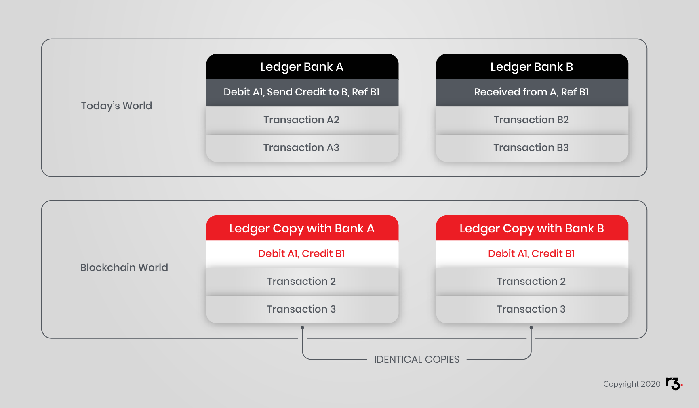
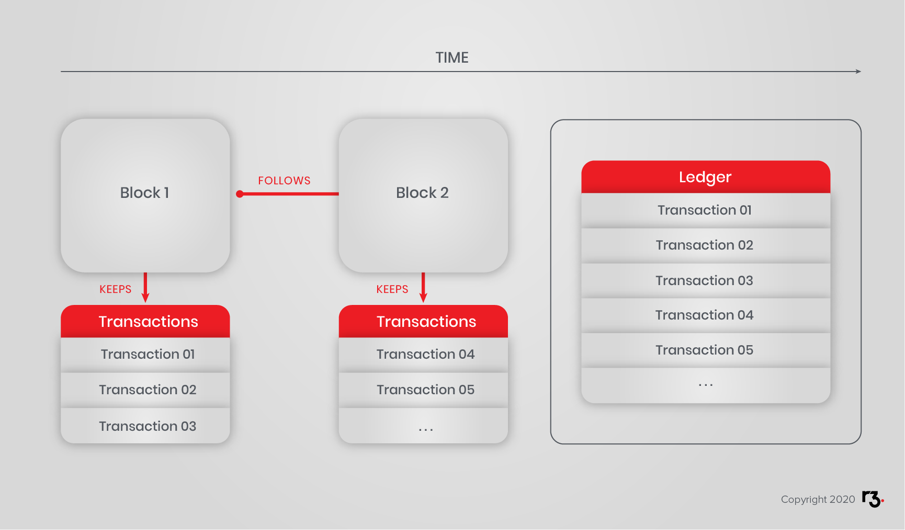
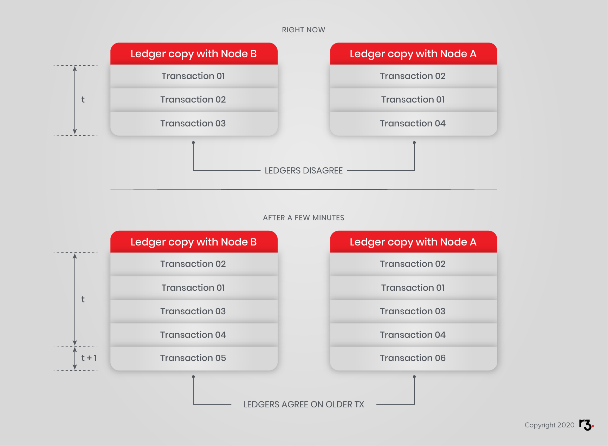
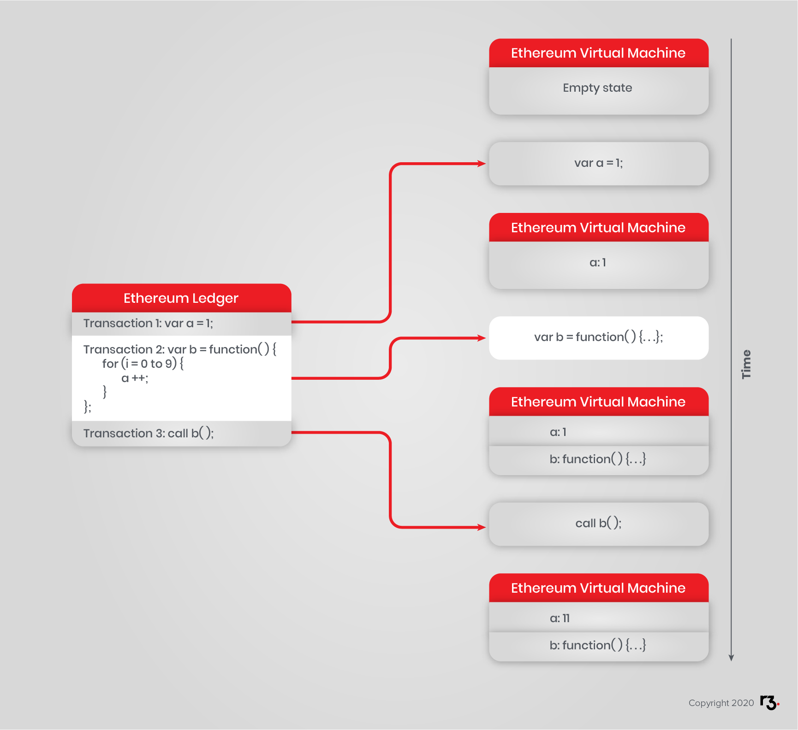
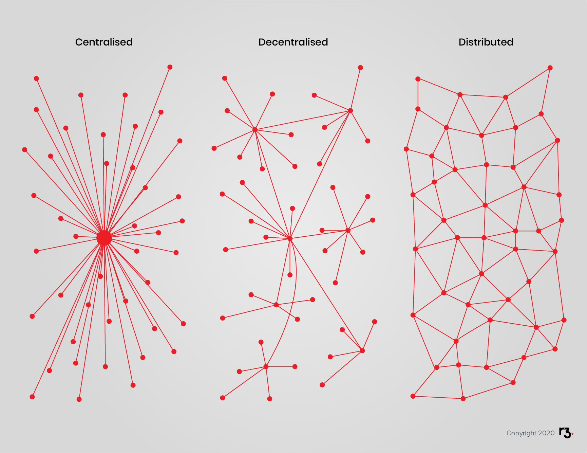

import HighlightBox from "../../src/HighlightBox"

In this section, you will learn about the current definitions of blockchain. In the few years since the technology was conceived, there has been a rapid flourishing of new terms and concepts. Now that you have studied the background to all this, these definitions should start to make sense.

You will learn:

- How to live with the multiple, simultaneous interpretations of blockchain.
- Transactions and how they are defined.
- Blockchain as a distributed ledger.
- Blockchain as a data structure.
- Blockchain as a decentralized consensus network.
- Blockchain as a digital common.
- Blockchain as a new computing paradigm.
- Blockchain as a merge of data storage and network.
- Distributed vs. Decentralized interpretations.

The topics covered here are useful to see where Corda stands in the landscape of blockchain technologies, and where your implementation of Corda fits within the wider world of blockchain definitions.

## Interpretations of blockchain

Blockchain is a complex and rapidly evolving technology. It took many bright minds many years of development, plus a combination of advances in cryptography, distributed computing and economics to arrive at the current technology. So, expect grasping blockchain to require serious effort.

There are many different ways to look at blockchain technology. In order to thoroughly understand and adopt a complete viewpoint, consider multiple interpretations. In the OSI network model fashion, the technology can be broken down like this:

## Defining Transactions

A transaction is an atomic event - an event whose parts make no sense in isolation. Every step in an atomic transaction must execute or the entire transaction must not execute.

If the word _transaction_ conjures up a financial transaction in your mind, this is indeed appropriate. For instance, a single transaction may be described as follows:

* Reduce account A by $10.
* Increase account B by $9.
* Increase account C by $1.

You immediately understand this transaction as a payment. If you were told only part of that, for example "reduce account A by \$10," you would rightfully ask where did those \$10 go? This is what it means to be atomic.

If the word _transaction_ conjures up a SQL transaction in your mind, this too is appropriate. For example, technology permitting a single transaction may be described as follows:

* Charge customer \$10.
* Ship 1 widget.
* Add 1 en-route shipment for customer.
* Reduce widget stock by 1.

In the context of blockchain, a transaction is any atomic event that is allowed by the underlying protocol.

## Blockchain as a distributed ledger

In this definition:

* A transaction is an atomic event.
* The blockchain is the ordered list of all transactions since inception.

Banks, especially, are prone to identify blockchain as a distributed ledger as it indeed dovetails with their world models.

In this view, instead of each bank relying exclusively on their own table of accounts in their own siloed databases, the blockchain offers the possibility of consolidating the accounts of many banks in a shared system of record. At the moment, this is done through netting and then settlement via central bank or corresponding accounts, which turns out to be expensive and time-consuming.

That is one reason why transactions between banks, especially if in different countries, take so long.

The blockchain's elegant solution is to use a single transaction to update separate tables of accounts for the whole network, i.e. all participating banks. Banks view this technology, at the very least, as an opportunity to reduce operational costs by using a common, distributed ledger with their peers.

(cf. R3 Distributed Ledger Group)

## Blockchain as a data structure

As the name suggests, a blockchain is a chain of blocks (cf. Nakamoto).

In this view:

* A transaction is, as ever, an atomic event.
* A block is a list of transactions in a set sequence.
* A blockchain is a well-ordered set of blocks (cf. Blockstream).

## Blockchain as a decentralized consensus network

A blockchain is a well-ordered set of data, on which all peers *eventually* agree.
What all participants agree upon is construed as the single truth.
This single truth is the single true state of the distributed ledger.

## Blockchain as a digital common

There is much talk about tech giants leveraging their positions and monetizing data generated by platform users. Because they are ultimately in control of their platforms, they can erect barriers, censor and seek rents.

The blockchain, as a distributed system, is, in a way, in charge of itself. To participate may not be free (as in _free beer_), but is nonetheless governed by rules defined in the protocol and enforced by all participants, and as such can be seen as free (as in _free speech_). However small, an honest participant contributes to the enforcement of the protocol rules.

Experimentation in on-chain governance suggests approaches to managing the evolution of reward structures and even the rules of governance themselves, while constraining the system's evolution and avoiding big changes unless most users agree.

In this, and other, regard, blockchain can be seen as a digital common. Or any number of digital commons.

## Blockchain as a new computing paradigm

Considering a computer, how do you describe how it works? It takes commands then executes them in an ordered and deterministic fashion. The sequence of execution determines the state the computer is in.

Ethereum is a blockchain that implements Turing-complete Smart Contracts. Hyperledger Fabric is similar in this regard. Each transaction is in effect a command, and the "execution" of all these commands results in the virtual computer's next state. Ethereum defines a distributed state machine, a world computer, the state of which is agreed upon by all nodes.

With this introduction, a smart contract is a program on the world computer, a distributed application (or DApp) is one too, as is a coordinated collection of smart contracts.

This type of computer is not well-suited to replace traditional servers for a number of performance and capacity reasons but it is especially good at securing critical checkpoints concerned with crucial information.

## Blockchain as a merge of data storage and network

In the history of computing, data storage and network have long been kept separate, essentially because the former was adopted long before the latter.

Storage was then *connected* to the network.

Blockchain merges these two concepts into one by combining elements of databases with a P2P network.
Data in a blockchain is present wherever there is connectivity. Combined with smart contracts, this enables the creation of stateful protocols.

Blockchain also describes a network topology, since it relies on P2P networking.

This has immense implications on the techno-social systems building on top of the technological layer.

See Vinay Gupta elaborate on the [significance of blockchains](https://vimeo.com/161183966).

## Distributed vs. Decentralized interpretations

The degree of decentralization has vast implications on the functioning of a network.

There is great debate as to what properly constitutes distributed as opposed to decentralized systems. In addition, systems can in fact be a mix of both.

In 1964, before major discoveries and developments such as public key crypto systems and P2P networking, Paul Baron published a paper [*On Distributed Communications*](https://www.rand.org/content/dam/rand/pubs/research_memoranda/2006/RM3420.pdf).
In it, he attempted to differentiate between diverse degrees of decentralization.
Networks could be either centralized, decentralized or distributed.

In Baran’s conceptualization of the degree of centralization, he identified a spectrum of network topologies - centralization and decentralization were attributes introduced long before to describe political systems and power structures.

The main point of differentiation is the number of so-called points of failure.

Centralized networks have a single point of failure. Reducing points of failure reduces centralization and leading to a fully distributed network.

A point of failure can be understood as a node or part of a system, respectively a network, which upon failing leads to the whole system/network shutting down and/or no longer being able to perform the intended operations.

After Baran’s topology and accompanied by developments in regard to networks, databases, computing and cryptography, a more detailed continuum of typologies was proposed.
Among other aspects, the importance of resource and power control was emphasized.

But as [Greg Slepak](https://www.youtube.com/watch?v=7S1IqaSLrq8) points out, differentiating  distributed and decentralized networks by the location and control of resources does still include a linear spectrum notion of centralization in networks.

<HighlightBox type="tip">

Please watch <a href="https://www.youtube.com/watch?v=7S1IqaSLrq8">Greg Slepak</a> explain the concept of decentralization in 5 minutes.

</HighlightBox>

Before one line of code is written, centralized, decentralized and distributed topologies imbue networks and their applications with advantages and disadvantages, strengths and limitations. Expect to take care weighing options and considering the implications of network topology and application design.

Given a topology and design, what factors are immutable and what factors are subject to future revision? Upon what assumptions does the long-term viability of the system rest? How is authority and control distributed and is that structure likely to be acceptable to participants who compete with each other in other realms?

What does the design ask the participants to trust? In the case of an immutable system with software that is not easily revisable, it might be the correctness of the contracts and the long-term stability of the platform. In the case of systems that are more flexibly open to revision, it will often lead to consideration of governance. Who or what decides about future revisions, and how do they or it decide it? What is open to revision and what is invariant? How do participants know the invariants cannot be violated?
