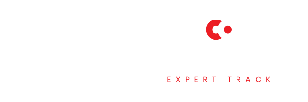

 &nbsp; 

This training leads you through plenty of exercises and code examples. Join the Expert Track for reassurance, support, code review and more.

For 3 months you will have access to expert instructors to help you with tricky bugs in your projects and point you in the right direction through One-on-One support & code review. The Expert Track does not provide additional content. Expert instructors will guide you through all sections and help you succeed through all stages of this training.

Get 3 months access to the authors and experts who created this training
* Support from expert instructors for 3 months 
* Code review to help you progress from novice to expert with a sound understanding of best practices
* Timely feedback to help you keep moving forward
* Access to the community of learners and experts - exchanging experiences, asking questions & getting answers, discussing the most technical questions
* Weekly live sessions

You can join the Expert Track whenever you wish, there are no fix start dates. This Expert Track is provided by B9lab

<a href="https://corda.b9lab.com" class="cta-button">Join Now</a>

