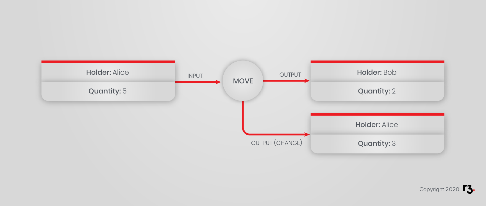

import HighlightBox from "../../src/HighlightBox"

import {
  ExpansionPanel,
  ExpansionPanelList,
  ExpansionPanelListItem
} from 'gatsby-theme-apollo-docs';

<ExpansionPanel title="Code">

You may start this exercise by working from: https://github.com/corda/corda-training-code/tree/master/030-tokens-sdk

</ExpansionPanel>

In the previous chapter, you learned about the Accounts Library, and you followed along with the associated learning unit tests, or created your own. In this chapter, you are going to:

* Learn how to integrate Tokens and Accounts.
* Describe how you can modify your project to make use of the accounts feature.

The project is still about a car token being issued and passed around. You also created an `AtomicSale` flow, which, keep in mind, has one serious unresolved issue: how to ensure that the buyer has properly expressed their intent to buy.

Let's see what the interaction between Tokens and Accounts means.

## Using Tokens SDK With Accounts Library

As it turns out, the holder of a token is already of type `AbstractParty`, meaning it can be a `Party`, i.e. a node, or an `AnonymousParty`, i.e. a node without the identifying X500 name, or the given key of an account. In effect, tokens are ready to be used with accounts. That is not the case of the issuer. On the other hand, knowing the issuer is welcome.

Are the workflows safe, though?

If you decide that your flows are account-aware, don’t mix non-accounts with accounts, i.e. don’t mix assigning tokens to nodes with assigning tokens to accounts. We mentioned in the previous chapter that, as per the official documentation of the Accounts library, this could lead to unpredictable results when querying the vault for tokens. Instead, you could create a default account for each node in your network.

When it comes to vault queries, you may want your queries to be account aware. For instance, to calculate the balance of a certain account, use the approach below:

```java
// Query vault for balance.
final QueryCriteria heldByAccount = new QueryCriteria.VaultQueryCriteria()
        .withExternalIds(Collections.singletonList(accountInfo.getIdentifier().getId()));
final QueryCriteria queryCriteria = QueryUtilitiesKt
        // Specify token type and issuer.
        .tokenAmountWithIssuerCriteria(shokenTypePointer, issuer)
        // Specify account.
        .and(heldByAccount)
        // Group by token type and aggregate.
        .and(QueryUtilitiesKt.sumTokenCriteria());

final Vault.Page<FungibleToken> results = proxy.vaultQueryByCriteria(
        queryCriteria, FungibleToken.class);
final Amount<TokenType> totalBalance = QueryUtilitiesKt.rowsToAmount(
        shokenTypePointer, results);
```
Similarly, when you transfer or redeem tokens from a certain account, make sure that you supply a value for `queryCriteria`, which is an input parameter in both flows, otherwise the flows will consume any tokens of the requested token type. Meaning you will consume tokens that belong to other accounts. To fetch tokens that belong to a certain account:

```java
final QueryCriteria heldByAccount = new QueryCriteria.VaultQueryCriteria()
        .withExternalIds(Collections.singletonList(accountInfo.getIdentifier().getId()));
```
You will recall that Corda uses a UTXO (Unspent Transaction Output) model. So a state can either be fully consumed or not consumed at all. It cannot be consumed in part. With tokens, that translates to:

> You must consume the full quantity of a token.

So, if Alice has only one token with quantity of 5 and wants to send Bob a quantity of 2, her token must be fully consumed as an input, and the transaction ought to have 2 outputs. One output token held by Bob with quantity 2, and one output token held by Alice with quantity 3, a.k.a. the remaining change.



You will also recall that both transfer and redeem flows have a `changeHolder` input parameter. If you leave it empty, it will default to the initiating node, which becomes a problem if you’re using accounts. Common sense would dictate that the change is given to the original holder. Because of this default behavior, you are advised to never use the default, and instead make the `changeHolder` explicit.

If you want, have a look at official [integration tests](https://github.com/corda/accounts/tree/900fe9c2ebf4ad8ecda1f494c03f747ef1579746/examples/tokens-integration-test/src/integrationTest/kotlin/com/r3/corda/lib/accounts/examples/tokensTest) between accounts and tokens.

## Exercise

The object of the exercise is to make your states and flows, _account-able_, _account-safe_ and _account-aware_. These are different concerns.

The fungible and non-fungible tokens impose the issuer to be a `Party`, so there is no choice here. Likewise, `EvolvableTokenType.maintainers` are all `Party`.

Your tasks are as follows:

* Update your states and contracts if applicable.
* Update your high-level issue, move and redeem flows to be account-safe.
* Create a version of your atomic sale that is _account safe_, and that does not care about accounts.
* Create another version of your atomic sale that is _account aware_, in the sense that, the seller, the buyer or both are identified as `AccountInfo` or as `UUID`.
* Unit tests!

## Solution

In the next chapter you will be presented with example solutions. No peeking.

<HighlightBox type="support">

Get 3 months access to the authors and experts who created this training.

* Expert instructors will review your code and help you to refine it.
* One-on-one support and mentoring from expert instructors.
* Collaboration with fellow students in a dedicated Training Slack channel.

<div class="cta-wrapper">
<a href="/in-closing/get-paid-support/" class="cta-button">Learn More</a>
</div>

</HighlightBox>
