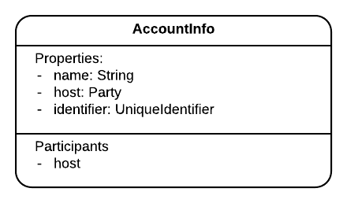

import HighlightBox from "../../src/HighlightBox"

import {
  ExpansionPanel,
  ExpansionPanelList,
  ExpansionPanelListItem
} from 'gatsby-theme-apollo-docs';

Prior to Corda 4.3, the only available data type for state participants was `AbstractParty`, i.e. `Party` or  `AnonymousParty`. This meant that for each participant to store a state or sign a transaction they had to run their own node, which, as you can imagine translated to high operating costs.

The Accounts Library solves that problem and provides a means of splitting the vault into logical sub-sets where each sub-set belongs to a certain account.

## Design

At the heart of the library is a new state called [`AccountInfo`](https://github.com/corda/accounts/blob/release/1.0/contracts/src/main/kotlin/com/r3/corda/lib/accounts/contracts/states/AccountInfo.kt) which has the following attributes:

* `Party host`: The node that hosts the account.
* `String name`: Think of it as a username. The library guarantees that `AccountInfo.name` is unique at the **host** level.
* `UniqueIdentifier identifier`: The library guarantees that `AccountInfo.identifier` is unique at the **network** level.



Additionally:

* An **account** is a collection of **public keys** that tie to the same `UniqueIdentifier` of the `AccountInfo` state.
* The node that hosts the account owns the **private keys** that correlate to the public keys of that account, and uses them to sign **on behalf** of the account when needed. At the network level, transactions will resolve to the legal identity of the host node.
* The library will not physically divide your node’s vault. The node operator can see all states, regardless of which account they belong to. Which leads to the next point…
* Data access restrictions, i.e. restricting users to interact only with states that they own, is the **CorDapp** developer's **responsibility** as implementing them is outside of Corda’s scope.
* `AccountInfo`s are states hosted on nodes, and they are shared like any other state on a need-to-know basis. The library provides several flows to achieve that, namely: `RequestAccountInfo`, `ShareAccountInfo`, and `ShareStateAndSyncAccounts`.
* Even though `AccountInfo` is of type `LinearState`, it has only one command: `Create`.
* Unlike nodes, accounts don’t come with a default public key. More on that later.
* The public keys associated to an account rely on the [confidential identities](https://docs.corda.net/docs/corda-os/4.3/api-identity.html#confidential-identities) library.

## Using the Library

Here, you are going to see in sequence:

* How to prepare your dependencies.
* How to prepare your states.
* How to create an account.
* How to request a new public key for it.
* What are the considerations behind this key.
* How to proceed when signing transactions on behalf of an account.
* How to finalise transactions.
* How to search for states in the vault in an account-aware manner.
* How you can proceed to make your CorDapp aware of accounts, or safe for them.
* How to pass public keys around, on a need-to-know basis.

### Include the SDK in your project

To able to work, you need both libraries: confidential identities and accounts.

1. Add the release group and version inside your project's root `build.gradle` under `buildscript.ext`:

    ```groovy
    accounts_release_version = '1.0'
    accounts_release_group = 'com.r3.corda.lib.accounts'
    confidential_id_release_group = "com.r3.corda.lib.ci"
    confidential_id_release_version = "1.0"
    ```
2. Add to the `repositories` inside the root `build.gradle`:

    ```groovy
    repositories {
        maven { url 'http://ci-artifactory.corda.r3cev.com/artifactory/corda-lib-dev' }
        maven { url 'http://ci-artifactory.corda.r3cev.com/artifactory/corda-lib' }
    }
    ```
3. Add the dependencies in the respective modules' `build.gradle` files:

    ```groovy
    // For the "contracts" module.
    cordapp "$accounts_release_group:accounts-contracts:$accounts_release_version"

    // For the "workflows" module.
    cordapp "$confidential_id_release_group:ci-workflows:$confidential_id_release_version"
    cordapp "$accounts_release_group:accounts-workflows:$accounts_release_version"
    ```
    * Inside `contracts`: `accounts-contracts`.
    * Inside `workflows`: `accounts-workflows` and `ci-workflows`.

<!--
For your information only, at the moment, see that [`KeyManagementBackedAccountService`](https://github.com/corda/accounts/blob/900fe9c2ebf4ad8ecda1f494c03f747ef1579746/workflows/src/main/kotlin/com/r3/corda/lib/accounts/workflows/services/KeyManagementBackedAccountService.kt) comes with a set of useful functions, so keep that Swiss Army knife in your pocket.
-->
### Prepare your state

Your state should be _account-enabled_. Which means that if your state has an attribute, say `owningAccount` or `holder`, that you want to make accessible to accounts, its data type needs to be one 1 of the following 2 options:

* `PublicKey`, which can be seen in action in the [gold-trading](https://github.com/corda/accounts/tree/900fe9c2ebf4ad8ecda1f494c03f747ef1579746/examples/gold-trading) example that comes with the library:

    ```java
    @BelongsToContract(LoanBookContract::class)
    data class LoanBook(val dealId: UUID, val valueInUSD: Long,
                        val owningAccount: PublicKey? = null) : ContractState {
        override val participants: List<AbstractParty>
            get() = listOfNotNull(owningAccount).map { AnonymousParty(it) }
    }
    ```
* `AbstractParty`, which can be seen in action in the [FungibleToken](https://github.com/corda/token-sdk/blob/master/contracts/src/main/kotlin/com/r3/corda/lib/tokens/contracts/states/FungibleToken.kt) state we saw in the Tokens SDK:

    ```java
    @BelongsToContract(FungibleTokenContract::class)
    open class FungibleToken(
            override val amount: Amount<IssuedTokenType>,
            override val holder: AbstractParty,
            override val tokenTypeJarHash: SecureHash? = amount.token.tokenType.getAttachmentIdForGenericParam()
    ) : FungibleState<IssuedTokenType>, AbstractToken, QueryableState {
    ```
    You will remember that [`AbstractParty`](https://github.com/corda/corda/blob/68bb7a0e7bb900117c2ed0d9174fea36d3d4aedc/core/src/main/kotlin/net/corda/core/identity/AbstractParty.kt#L16) keeps a `PublicKey`.

If you don't know which to choose just yet, no problem, you will get a better understanding of each option as you progress through the chapter.

### Create accounts

Now that you’re ready to use an account in our project state, create your first `AccountInfo` by calling the [`CreateAccount`](https://github.com/corda/accounts/blob/release/1.0/workflows/src/main/kotlin/com/r3/corda/lib/accounts/workflows/flows/CreateAccount.kt) flow:

```java
// From inside your flow.
final StateAndRef<AccountInfo> accountStateRef = (StateAndRef<AccountInfo>) subFlow(new CreateAccount("account-name"));
```
<ExpansionPanel title="A word on the cast">

Yes, as strange as this looks, you do indeed need to cast the result. If you didn't, you would have to use the `StateAndRef<? extends AccountInfo>` data type. The reason is that `StateAndRef<T>` is defined in Kotlin with the [`out`](https://github.com/corda/corda/blob/68bb7a0e7bb900117c2ed0d9174fea36d3d4aedc/core/src/main/kotlin/net/corda/core/contracts/Structures.kt#L170) keyword. This conveniently indicates that the `StateAndRef` only _produces_ instances of `T`, it does not _consume_ any. If you are working with Kotlin and want the long explanation, head to the discussion about [variance](https://kotlinlang.org/docs/reference/generics.html#variance).

</ExpansionPanel>

This flow runs locally on the node, and simply assigns itself as the `.host`. At this stage, no public key has been created. It's as if you had just added a row in the "Accounts" table. See it in action in [`canCreateAccount`](https://github.com/corda/corda-training-code/blob/master/040-accounts-lib/workflows/src/test/java/com/template/account/AccountCourseExercise.java#L76).

### Request keys

Accounts **don’t** come with a default public key. Instead, before you can transact with, or on behalf of, an account, you need to do something akin to _asking the account_ with which public key it prefers to be identified. Thereafter, it is up to you to stick with this key or request additional keys. Choosing the keys to use and when to use them (the policy), is a design decision that you make when dealing with accounts.

What’s behind this _no-default-public-key_ design decision?

1. Accounts may become deactivated by their hosting node, so it is better to avoid continuing to assign states to deactivated accounts.
2. Accounts are hosted on nodes that sign on their behalf. In practice, this means that the node owns the account's private&nbsp;/ public key pair and is responsible for its accounts' actions.
3. As you know, the private key is necessary to sign transactions, and the presence of signers and signatures is verified by contracts and the Corda system.
4. Accounts can also move and change hosts. What would happen to the default key after the account had moved to a new host? The new host doesn’t own the private&nbsp;/ public key pair, so it cannot transact on behalf of the account. One could perhaps rely on the previous host transferring the pair over to the new host. But, that would be **highly inadvisable**. Would one trust the previous host with deleting the private key after the transfer? One would not be able to confirm, with certainty, which nodes signed future transactions, opening the door to mischief.
5. So, in short, every time you want to use an account, you must already have or request a new public key from the host node:
6. Additionally, users may appreciate the added anonymity and obfuscation that comes with requesting a new key every time.

```java
// Request a new key.
final AnonymousParty accountAnonParty = subFlow(new RequestKeyForAccount(
        accountStateRef.getState().getData()));
final PublicKey accountKey = accountAnonParty.getOwningKey();
```
See it in action in [`canRequestANewKeyAppearsAsAlice`](https://github.com/corda/corda-training-code/blob/master/040-accounts-lib/workflows/src/test/java/com/template/account/AccountCourseExercise.java#L90). It is not self-evident, so note that this `RequestKeyForAccount` flow can be launched from any node, and will take care of contacting the [account's host](https://github.com/corda/accounts/blob/900fe9c2ebf4ad8ecda1f494c03f747ef1579746/workflows/src/main/kotlin/com/r3/corda/lib/accounts/workflows/flows/RequestKeyForAccountFlows.kt#L92-L93). See it in action in [`canRequestANewKeyFromNonHost`](https://github.com/corda/corda-training-code/blob/master/040-accounts-lib/workflows/src/test/java/com/template/account/AccountCourseExercise.java#L117).

Notice how `RequestKeyForAccount` returns an `AnonymousParty`. Why is that? It's all in the difference between `Party` and `AnonymousParty`:

1. [`Party`](https://github.com/corda/corda/blob/68bb7a0e7bb900117c2ed0d9174fea36d3d4aedc/core/src/main/kotlin/net/corda/core/identity/Party.kt#L38) is the pair of a `CordaX500Name` and a public key. In essence, it represents a well-identified node of the network.
2. On the other hand, [`AnonymousParty`](https://github.com/corda/corda/blob/68bb7a0e7bb900117c2ed0d9174fea36d3d4aedc/core/src/main/kotlin/net/corda/core/identity/AnonymousParty.kt#L21) only carries a public key. It doesn’t have any X500 name. Therefore it may represent a node, the account that’s tied to that public key, or even be the brand-new public key created by a node willing to operate discreetly.

By using `AbstractParty` or `PublicKey` for your data type, you can represent nodes, well-known parties, anonymised nodes or accounts.

### Who is behind this key?

For the Corda network, a public key is owned by a node, and this node is known by its X500 name, or its well-known party. So, when a public key has been issued to an account, for the unaware CorDapp, it really is yet another public key of the node.

```java
// Corda-only -> Not the account
final Party theNodeReally = getServiceHub()
    .getIdentityService()
    .wellKnownPartyFromAnonymous(accountAnonParty);
final Party yesTheNode = getServicesHub()
    .getIdentityService()
    .partyFromKey(accountKey);
```

For these reasons, if some of your CorDapp workflows are Account-aware, while others aren't, you may face problems. And vault-querying is **unaware** of accounts, for instance. See the vault header below.

Do you remember the ready-made move and redeem flows of the Tokens SDK, for example? They are not aware of accounts, and they do not give you control on what states are being selected from the vault. This is just one example of unpredictable results.

<HighlightBox type="warn">

The [official documentation](https://github.com/corda/accounts/blob/900fe9c2ebf4ad8ecda1f494c03f747ef1579746/docs.md#how-do-we-mix-workflows-with-accounts-and-non-accounts) warns about mixing account and non-account workflows. Using `AbstractParty` to represent the owner in your state will allow your flows to issue, move, etc. this state between accounts and non-accounts; which might lead to unpredictable results when querying the vault.

> Currently, if accounts and non-accounts workflows are mixed on the same node then you need to be careful with state selection. When selecting states for non-accounts workflows, the state selection code will currently pick states which could be assigned to accounts.

</HighlightBox>

Your flow does not need, given a public key, to always track back to the account it represents, but it is possible to do so. That's where you use the [`AccountService`](https://github.com/corda/accounts/blob/900fe9c2ebf4ad8ecda1f494c03f747ef1579746/workflows/src/main/kotlin/com/r3/corda/lib/accounts/workflows/services/AccountService.kt):

```java
// Since it is a library, you need to instantiate it.
final AccountService accountService = UtilitiesKt.getAccountService(this);
final UUID accountFound = accountService.accountIdForKey(accountAnonParty.getOwningKey());
final StateAndRef<AccountInfo> accountStateRefAgain = accountService
        .accountInfo(accountAnonParty.getOwningKey());
```

It is possible that your flows will work correctly if you take care of necessities and stop there. On the other hand, if your flow needs to manipulate the `AccountInfo` data, then you could create a default account for your node, possibly reusing your node's X500 name as the `AccountInfo.name`. Doing so will ensure that your states are always assigned to `AccountInfo` types, and not a mix of `AccountInfo` and `Party`. This subject is touched on again lower down.

### Signing time

Accounts are primarily here to provide the ability to sign on behalf of others. It is worth repeating that only the hosting node can sign, as it is the only entity with the private keys. So how does it look?

1. When affixing the first _account_ signature locally, via the transaction builder, it is a simple call to `signInitialTransaction`, with the proper key:

    ```java
    // accountKey is reused or is brand new.
    final SignedTransaction partSignedTx = getServiceHub().signInitialTransaction(
            txBuilder,
            Collections.singletonList(accountKey));
    ```
2. Let's suppose you need to also collect a signature from a `remoteAccountKey`. When requesting further signatures from accounts hosted elsewhere, it is, as expected, a call to `CollectSignatureFlow`, with a few extra niceties. You cannot initiate a session with an account, so the flow session has to be initiated with the hosting node:

    ```java
    // We want remoteAccountKey to sign too.
    // Either you already have the hosting Party or
    final Party host = getServiceHub().getIdentityService()
            . partyFromKey(remoteAccountKey);
    final FlowSession remoteAccountSession = initiateFlow(host);
    ```
    Note that for `partyFromKey` or `requireWellKnownPartyFromAnonymous` to succeed, the current node needs to have been informed separately about `remoteAccountKey`'s existence, or it just happens to have requested this key from the remote host itself. Either way, knowledge of which node hosts which key is on a need-to-know basis. From there, the sub-flow call is:

    ```java
    final SignedTransaction fullySignedTx = subFlow(new CollectSignaturesFlow(
            partSignedTx,
            Collections.singletonList(remoteAccountSession),
            // We tell we already signed with our own or rather our account's key.
            Collections.singleton(accountKey)));
    ```
3. When responding to the `CollectSignatureFlow`, the responder has [received the keys to use](https://github.com/corda/corda/blob/68bb7a0e7bb900117c2ed0d9174fea36d3d4aedc/core/src/main/kotlin/net/corda/core/flows/CollectSignaturesFlow.kt#L210), so it is simply a call to:

    ```java
    subFlow(new SignTransactionFlow(counterpartySession) {
         // Override checkTransaction as usual
    });
    ```

### Finalisation

Similar to the `CollectSignatureFlow`, you need to have access to the hosting node, and session, then proceed as usual:

```java
return subFlow(new FinalityFlow(
    fullySignedTx,
    Collections.singletonList(remoteAccountSession)));
```

### A mention about the vault

If the vault is not account-aware, how do you query the vault by account? Thankfully, Corda 4.3 added the possibility to [map any public key](https://docs.corda.net/docs/corda-os/4.3/api-vault-query.html#mapping-owning-keys-to-external-ids) to an [external id](https://github.com/corda/corda/blob/68bb7a0e7bb900117c2ed0d9174fea36d3d4aedc/node/src/main/kotlin/net/corda/node/services/keys/BasicHSMKeyManagementService.kt#L113) of type `UUID`. The Accounts library judiciously uses this feature to map an account's [key to the account's id](https://github.com/corda/accounts/blob/900fe9c2ebf4ad8ecda1f494c03f747ef1579746/workflows/src/main/kotlin/com/r3/corda/lib/accounts/workflows/internal/flows/ConfidentialIdentityUtils.kt#L17).

This _external ids_ facility can be used when querying. A caveat is that, because it works across the whole system, for all contract states, it works only on public-key-based properties shared by all contract states, namely, the **participants**. Yes, that's a limitation. If your account is mentioned in the participants, then you can retrieve your _account's states_. If not, then you will have to retrieve your account's states by means other than this `.withExternalIds`:

```java
final QueryCriteria participatingAccountCriteria = new QueryCriteria.VaultQueryCriteria()
        .withExternalIds(Collections.singletonList(
                accountInfo.getIdentifier().getId()));
```
See it in action in the course unit test [`AccountVaultCourseExercise`](https://github.com/corda/corda-training-code/blob/master/040-accounts-lib/workflows/src/test/java/com/template/account/AccountVaultCourseExercise.java):

* When a node hosts an account and has a state in which the account participates, then it can retrieve it from the vault by id, see [`canFetchStateOfSeenWhenKnowsAccount`](https://github.com/corda/corda-training-code/blob/master/040-accounts-lib/workflows/src/test/java/com/template/account/AccountVaultCourseExercise.java#L78).
* When a node hosts an account and has a state in which the account does not participate, then it cannot retrieve it from the vault by id, see [`cannotFetchStateOfLostWhenKnowsAccount`](https://github.com/corda/corda-training-code/blob/master/040-accounts-lib/workflows/src/test/java/com/template/account/AccountVaultCourseExercise.java#L153).
* When a remote node does not host an account, but has a state in which the account participates:
    1. If the remote node has no information or only information about the account, it cannot retrieve the state from the vault by id.
    2. If the remote node has information about the account **and** associated public key, it can retrieve the state from the vault by id, see [`observerCanFetchStateOfSeenOnlyWhenKnowsAboutAccount`](https://github.com/corda/corda-training-code/blob/master/040-accounts-lib/workflows/src/test/java/com/template/account/AccountVaultCourseExercise.java#L98).

<HighlightBox type="tip">

If your account appears in the participants, it is easy to retrieve _its_ states.

</HighlightBox>

With this added knowledge, the benefit that giving a default account to your node brings should become clear. Should you decide to blandly create a new public key for your node for anonymity purposes, this key would lack an external id mapping, i.e. it would have no _creation context_. Whereas, if you created the key through the account, thereby benefiting from the external id mapping, this new key would be linked to its context.

### Levels of Account-ability

Using the Accounts library is optional. In fact, you may never have to use accounts. However, knowing of their existence can inform you and assist you in making better design decisions. Let's break those into 3 scopes.

1. Account enabled: You can say that your states and contracts enable accounts if you judiciously use `AbstractParty` or `PublicKey` instead of `Party`. The same can be said of flows, although for flows, the next 2 points are more important.
2. Safe for accounts: You can say that your states, contracts and flows are safe for accounts to use if, although they do not deal with accounts per se, they are coded carefully enough such that should someone decide to pass values pertaining to accounts, it will not cause problems.
3. Account aware: You can say that your CorDapp is aware of accounts if it deals directly with them, understands their linear ids, is able to request for keys and so on.

It is advisable to at least satisfy scopes 1. and 2. In particular, the `AtomicSale` mentioned earlier is not enabled for accounts:

* The `AtomicSale.CarSeller` flow expects the buyer to be a `Party`.
* It assumes that the seller is `getOurIdentity()`, i.e. the node itself.
* The `AtomicSale.CarBuyer` flow expects the buyer to be `getOurIdentity()` too...

Ouch! This is the subject of the exercise in the next chapter.

### Passing keys around

This chapter mentioned that account's public keys are exchanged between nodes on a need-to-know basis. This concept of `AnonymousParty` exchanges is mainly handled in the `confidential-id` library. The Accounts library piggybacks partly on its flows.

In particular, a low-level flow that can be interesting for your account-safe flows is [`SyncKeyMappingInitiator`](https://github.com/corda/confidential-identities/blob/001d4470117ee9024257dbabf2593769d25fa588/workflows/src/main/kotlin/com/r3/corda/lib/ci/workflows/InitiatingFlows.kt#L114). It directly discloses public keys to a remote peer, conveniently omitting their purpose and origin. So yes, your account-safe flows can make use of it.

On the other hand, this `SyncKeyMappingInitiator` drops the external id reference of private keys.

The same `confidential-id` library, also provides a [`RequestKey`](https://github.com/corda/confidential-identities/blob/001d4470117ee9024257dbabf2593769d25fa588/workflows/src/main/kotlin/com/r3/corda/lib/ci/workflows/InitiatingFlows.kt#L85) flow that achieves something similar to `RequestKeyForAccount` in that it [preserves the external id reference](https://github.com/corda/confidential-identities/blob/001d4470117ee9024257dbabf2593769d25fa588/workflows/src/main/kotlin/com/r3/corda/lib/ci/workflows/RequestKeyFlow.kt#L111) in the requester's vault, and, as you know, the external id can just be the account id. As a matter of fact, that's what `RequestKeyForAccountFlow` [uses](https://github.com/corda/accounts/blob/bc43a2f45513ef1d895eac7632cf5d9fb8c26879/workflows/src/main/kotlin/com/r3/corda/lib/accounts/workflows/flows/RequestKeyForAccountFlows.kt#L46) anyway.

## Conclusion

You have just learned about the Accounts library, how to use it, how to pass accounts around, how it can be dangerous for the unaware developer and what needs to be done to fetch from the vault. There are a bunch of unit tests to familiarise yourself with the actions surrounding accounts [here](https://github.com/corda/corda-training-code/tree/master/040-accounts-lib/workflows/src/test/java/com/template/account).

In the next chapter you are going to use the Accounts library to adjust the project.

<ExpansionPanel title="Useful Links">

* [Accounts Library official docs](https://github.com/corda/accounts/blob/900fe9c2ebf4ad8ecda1f494c03f747ef1579746/docs.md)
* [IOU example with accounts](https://github.com/opticyclic/corda-accounts-demo)
* [Library examples](https://github.com/corda/accounts/tree/900fe9c2ebf4ad8ecda1f494c03f747ef1579746/examples): focus on gold-trading example and tokens integration tests.
* [Roger Willis explaining the Accounts library](https://www.youtube.com/watch?v=nHljbpe3NDY)

</ExpansionPanel>
