Here, you are going to explore the concepts introduced in the Tokens SDK. In the next chapter, you will learn how to use it in practice.

As a broad concept, a token can be one of 2 things:

- **A depository receipt:** meaning it's a representation on-ledger of something that exists off-ledger. It's a promise from the **issuer** of the token to the **holder** of the token to deliver a **quantity** of what exists off-ledger when the holder redeems that quantity on-ledger.
- **A native token** meaning the value actually exists on the ledger and you cannot redeem it for something off-ledger, because that thing doesn't even exist outside of the ledger. For example you can create your own CryptoKitties game, where you breed, i.e. issue, a kitten as a token; this token is unique and different from other kittens issued by other players. On the other hand, you would not be able to redeem it for something off-ledger.

The Tokens SDK was introduced in Corda 4.3, but that doesn’t mean that you weren’t able to create tokens before that. And indeed, you did just that in the previous exercise. At the end of the day, a token is one or a combination of `ContractState`, `LinearState`, `OwnableState`, or `FungibleAsset` with 3 commands: `Issue`, `Move`, and `Redeem`. So R3 took all that and built a comprehensive SDK with new states, contracts, flows, services, utility classes, and lots of examples.

## Design

The SDK introduced a lot of new components, so you'll start with a high level overview of the design, then dig deeper into each separate component.

The below diagram is a simple flow to help you choose the building frame of your token. An explanation of the referenced classes follows:

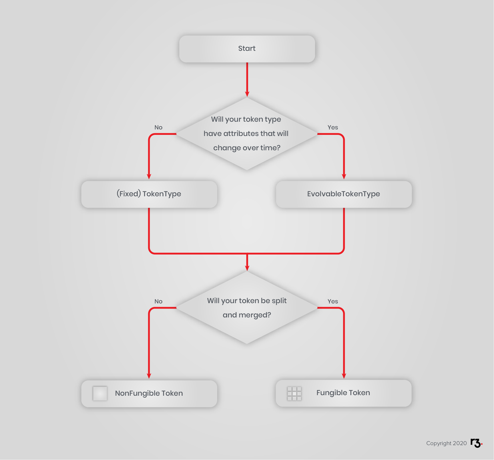

### `TokenType`

`TokenType` is your fixed unit; you **issue** tokens of that unit. It only requires an identifier, e.g. USD, and the number of fraction digits, which essentially defines the smallest denomination of your token.

For example, the USD token-type has 2 fraction digits, that’s because the smallest denomination is one cent where 1 cent = 0.01 USD. Similarly, the XRP (Ripple) token-type has 6 fraction digits, because the smallest XRP denomination, called a _drop_, is such that 1 drop = 0.000,001 XRP, i.e. 1 XRP = 1,000,000 drops.

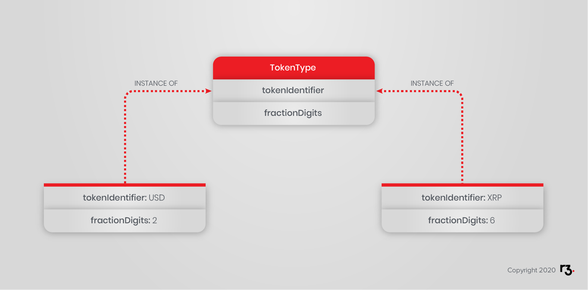

By the way, you can extend `TokenType` and add your own custom attributes. Be careful though, as those attributes may never change their values! For instance a `CryptoKitten` token-type would look like this:

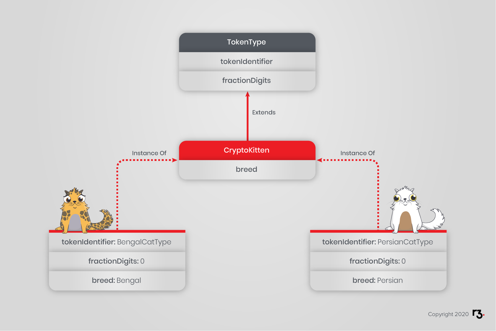

You would not expect a BengalCatType token-type to suddenly change to a Persian breed.

### `EvolvableTokenType`

Unlike a `TokenType` instance, which never changes, an `EvolvableTokenType` instance is a `LinearState` instance that (shocker!) evolves over time. Like any state, they can only be created and updated according to rules, in this case when signatures, i.e. approvals, are gathered from a list of `maintainers` identified in that state. Additionally, flows are provided to facilitate this transition.

Let us consider using `EvolvableTokenType` to represent a car, for example. A car has immutable properties as well as changeable properties that evolve over its lifecycle. Its make (brand), model and VIN (vehicle identification number) are unchangeable, but its mileage and price change over time.

To create your evolvable unit, you need to extend `EvolvableTokenType` and add your custom attributes. For the example, you can represent a car unit as a `CarTokenType`. Remember, you first need to define a unit. Only then can you issue tokens of that unit. The token type will have updateable attributes, price and mileage, and fixed attributes, make and VIN number.

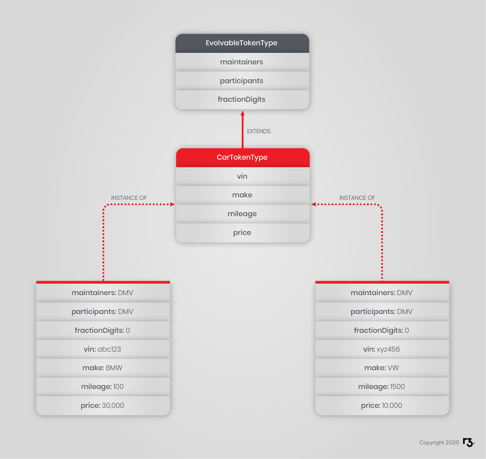

Where DMV is the Department of Motor Vehicles, beloved by Americans.

Inside your evolvable token type contract, you can control which attributes are allowed to change and which are not, among other business rules:

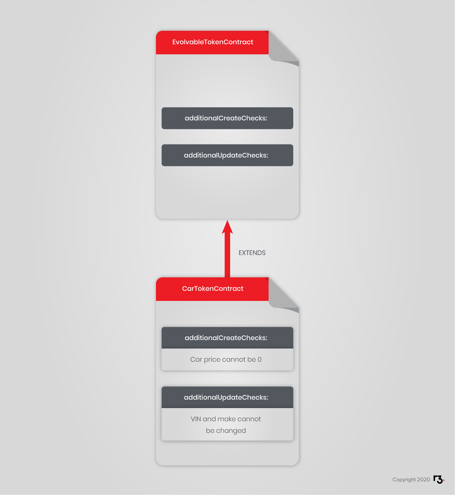

In the example, the DMV (Department of Motor Vehicles) is the `maintainer` of this evolvable token type, meaning, when a new car gets registered in the department, it will create an instance of the `CarTokenType`. When the car passes the yearly inspection, a DMV agent will update the mileage of the car.

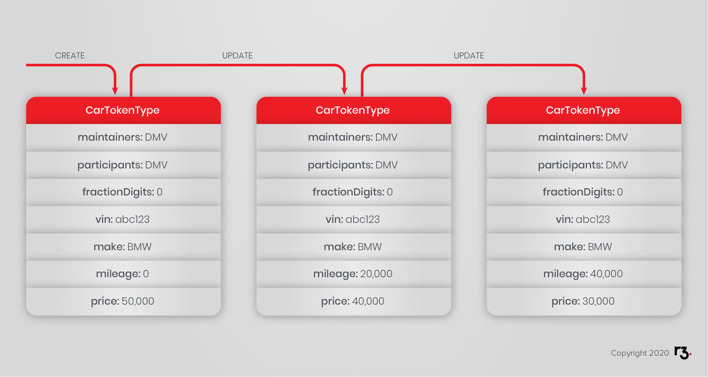

**Reminder:** A state in Corda is final; it cannot be updated, so how does one achieve the same effect? That's where [`LinearState`](https://docs.corda.net/api-states.html#linearstate)s come to the rescue. In order to update a `LinearState`, you consume the old version and create a new one which has the updated values **but** the same `UniqueIdentifier linearId`. So, in order to view all of the versions of a certain `LinearState`, you can simply query the vault by that state class and its `linearId`.

To avert a possible misunderstanding, the `EvolvableTokenType` class **does not** inherit from the `TokenType` class. You will see the mechanism shortly.

### `FungibleToken`

Fungibility is a property of a commodity whose individual units are indistinguishable from others. Pure gold is fungible because an ounce of it is materially indistinguishable from any other. Fungibility is an important property of money, currency, many securities and commodities because it implies that quantity alone is a sufficient description. If someone says "USD &#36;100," everyone knows what that means because US Dollars are fungible. One would not ask "Which dollars?"

`FungibleToken` is the state that assembles the relationship between the issuer, the holder and the quantity. It achieves it by nested composition:

* `FungibleToken` has a `holder` and an `amount` of type `Amount`.
* `Amount` has a `quantity` and a `token` of type `IssuedTokenType`.
* `IssuedTokenType` has an `issuer` and a `tokenType` of type, wait for it, `TokenType `.

So graphically, that's:

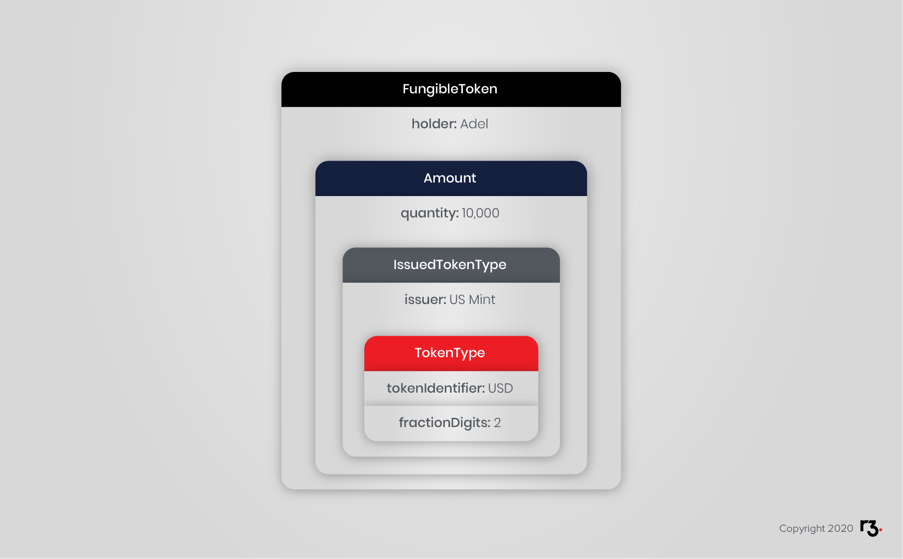

Please note that tokens with the same token type but different issuers are considered different, and cannot be mixed. To illustrate the point, you already know that a USD token issued by the US Mint is not the same as a USD token issued by Monopoly.

Being fungible, fungible tokens can be split and merged, meaning their quantity can be split to produce multiple tokens or merged to produce one or multiple tokens:

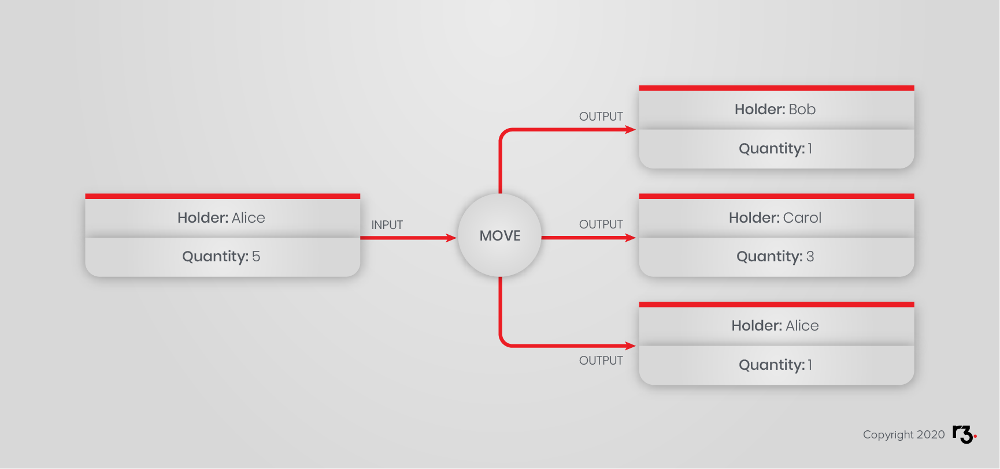

Here, Alice has one token state with a quantity of 5, which she spends to cover the required quantity of 4 (1 for Bob and 3 for Carol), and gets a quantity of 1 as change.

<!-- TODO
Fix name and quantities on image.
-->

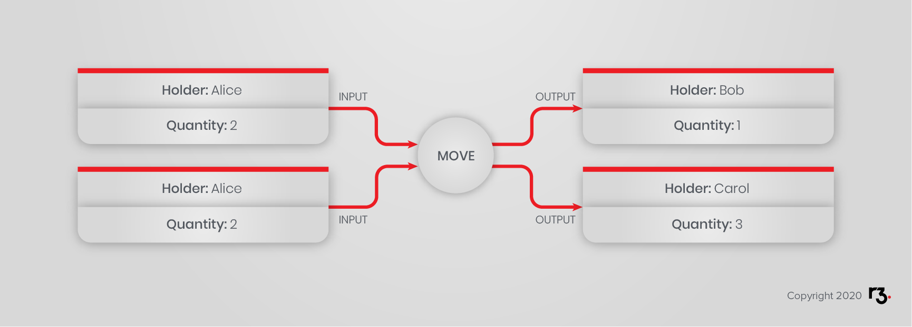

Here Alice spends 2 tokens, each with a quantity of 2, to cover the required output quantity of 4, split between as 1 for Bob and 3 for Carol.

### `NonFungibleToken`

A non-fungible token (a.k.a. NFT), also defines the relationship between the issuer and the holder, but, it cannot be split or merged, it doesn’t have a quantity; or rather it always has a quantity of exactly 1. It is unique. It is, in fact, the responsibility of the developer to ensure that no two instances of an NFT refer to the same off-chain or on-chain object, if applicable, which would defeat the purpose of a representative token.

A house is a good example of a non-fungible token. Each is a unique property. They are not exchangeable without careful scrutiny. This unicity is expressed with meta information. For example, giving each house a unique lot ID and street address. The property developer will take great care to avoid issuing two house token instances for the same house, possibly in the creation flow. Well, they could, *technically*, assign the same address twice, but that would probably be a defect that opens a can of worms.

Returning to the evolvable `CarTokenType` example, a car is another example of a non-fungible token. They are also not mergable since, sadly, one cannot make a luxury sports car from two economy sedans.

Here too, the relationship is achieved by nested composition:

* `NonFungibleToken` has a `holder` and an `issuedTokenType` of type `IssuedTokenType`.
* as you have seen, `IssuedTokenType` has an `issuer` and a `tokenType` of type `TokenType`.

So graphically, that's:

Notice in the above example how the `issuer` and `maintainers` are different entities declared in different classes. Let's suggest a series of steps that could take place in the car example:

* When a car is delivered to the dealership, it is registered with the DMV.
* The DMV is the `maintainers`, which in turn creates a `CarTokenType` instance for the individual car.
* When the dealership sells the car, it creates a `NonFungibleToken` instance for that car's `CarTokenType` instance, and `Issue` it to the new owner as the `holder` of the token.
* When the car goes through the yearly inspection, the DMV evolves the `CarTokenType` instance with the newly relevant information.
* When the owner of the car sells it, the owner replaces its instance with a new `NonFungibleToken` instance with the new owner as the `holder`.

**Food For Thought:** Just because something is non-fungible in real life doesn't mean you have to treat it as a `NonFungibleToken` on the ledger. It all depends on your business case, and that's where the design decision of having a token-type and a fungible&nbsp;/ non-fungible token of that token-type came from. For instance, a house is something non-fungible, you can't physically split a house. But let's say you have a CorDapp where several people can invest and buy one property. Then they rent it out and get a return on their investment. For this, you can create a token-type `House` and issue several `FungibleToken` instances of the same `House`, where the quantity of each token is different and represents the ownership share of the `holder` in that house. This way anyone can sell their share to multiple buyers or buy from multiple sellers, which, in Corda, would be splitting and merging the `FungibleToken` of the `House` token-type.

### `EvolvableTokenType` Again

An important concept has been deferred until now. The `EvolvableTokenType` instance evolves independently from its `NonFungibleToken` instance. In the example, the mileage and price of the car, attributes in `CarTokenType`, change independently from the car owner, i.e. the token `holder`, which is an attribute in `NonFungibleTokenType`.

Additionally, the `EvolvableTokenType` is not a child class of `TokenType`. In fact, it [implements `LinearState`](https://github.com/corda/token-sdk/blob/b9a1ee76434defd0b234df05c972202c7f1a2a5c/contracts/src/main/kotlin/com/r3/corda/lib/tokens/contracts/states/EvolvableTokenType.kt#L20), which you already encountered in `IOUState`. So all the `NonFungibleToken` instance needs to do is remember the [`UniqueIdentifier linearId`](https://github.com/corda/corda/blob/68bb7a0e7bb900117c2ed0d9174fea36d3d4aedc/core/src/main/kotlin/net/corda/core/contracts/Structures.kt#L134) of the `EvolvableTokenType` instance. Not to be confused with the `NonFungibleToken`'s [own `linearId`](https://github.com/corda/token-sdk/blob/b9a1ee76434defd0b234df05c972202c7f1a2a5c/contracts/src/main/kotlin/com/r3/corda/lib/tokens/contracts/states/NonFungibleToken.kt#L43-L45). So how can the `NonFungibleToken` instance track a `LinearState` in its (issued) [`TokenType`](https://github.com/corda/token-sdk/blob/b9a1ee76434defd0b234df05c972202c7f1a2a5c/contracts/src/main/kotlin/com/r3/corda/lib/tokens/contracts/states/NonFungibleToken.kt#L49)?

Let's first introduce the [`LinearPointer`](https://github.com/corda/corda/blob/68bb7a0e7bb900117c2ed0d9174fea36d3d4aedc/core/src/main/kotlin/net/corda/core/contracts/StatePointer.kt#L152-L156) class, which, while not a `LinearState`, still points to one. If used in a standard `ContractState`, a `LinearPointer` can be used to loosely couple the two states. This `LinearPointer` does more than hold a `linearId`. It also assists you in retrieving, or [`resolve`](https://github.com/corda/corda/blob/68bb7a0e7bb900117c2ed0d9174fea36d3d4aedc/core/src/main/kotlin/net/corda/core/contracts/StatePointer.kt#L175)ing, the state it is pointing to. And yes, it resolves to the latest version it has in the vault. It is as if the pointer was following the state around as it changes. So, you understand that the `EvolvableTokenType` instance can be pointed to by an instance of a `LinearPointer`.

Ok, now the [`TokenPointer`](https://github.com/corda/token-sdk/blob/b9a1ee76434defd0b234df05c972202c7f1a2a5c/contracts/src/main/kotlin/com/r3/corda/lib/tokens/contracts/types/TokenPointer.kt#L19-L22) class. This class:

* is a `TokenType`
* stores a `LinearPointer`

So there you have it. To access the underlying `EvolvableTokenType` instance of your `NonFungibleToken` instance, you need to:

1. Get the `TokenType` instance of your `NonFungibleToken` instance
2. Confirm [it is a `TokenPointer`](https://github.com/corda/token-sdk/blob/b9a1ee76434defd0b234df05c972202c7f1a2a5c/contracts/src/main/kotlin/com/r3/corda/lib/tokens/contracts/types/TokenType.kt#L60) itself
3. If yes, then you cast it as a `TokenPointer`
4. With the `TokenPointer` instance in hand, you get [its `LinearPointer`](https://github.com/corda/token-sdk/blob/b9a1ee76434defd0b234df05c972202c7f1a2a5c/contracts/src/main/kotlin/com/r3/corda/lib/tokens/contracts/types/TokenPointer.kt#L20) instance
5. With the `LinearPointer` instance in hand, you [`resolve`](https://github.com/corda/corda/blob/68bb7a0e7bb900117c2ed0d9174fea36d3d4aedc/core/src/main/kotlin/net/corda/core/contracts/StatePointer.kt#L175) it to your `EvolvableTokenType` instance. Yes, that's a round-trip to the vault.

You may have to do some aggressive casting do get the desired sub-class. Also note that your _latest_ resolved `EvolvableTokenType` instance is as good as your vault knows. If your vault was not informed of changes, then your vault is still on an older version, without your knowledge.

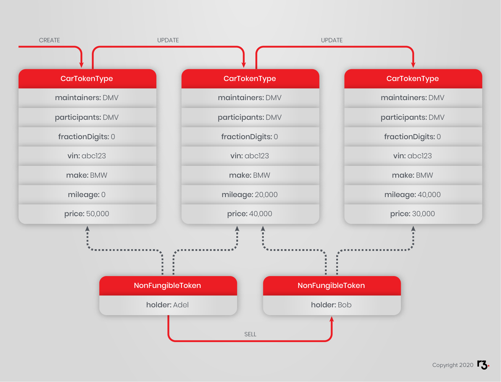

Recall from the previous `FungibleToken` and `NonFungibleToken` diagrams. Both classes rely on `IssuedTokenType` to uniquely identify the token. So, it's worth mentioning that when your token type is an `EvolvableTokenType` instance, the `IssuedTokenType` instance is the combination of the `issuer` and the `TokenPointer` instance.

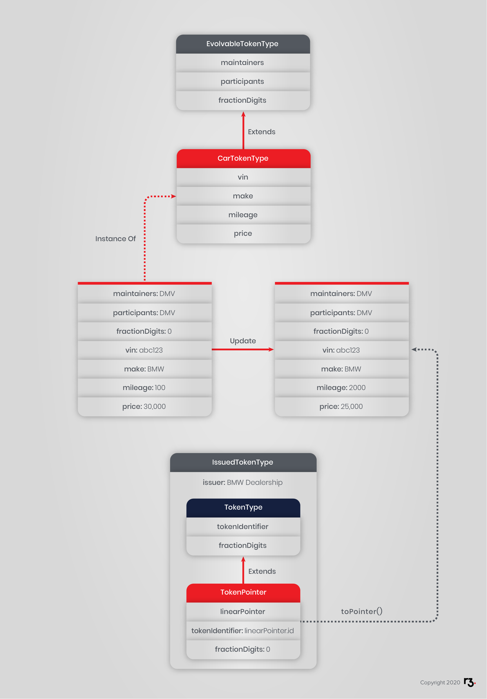

One last bit about `EvolvableTokenType`, once created an instance can only be updated, never destroyed. It is a linear state that lives on forever since it has no [_destroy_ command](https://github.com/corda/token-sdk/blob/b9a1ee76434defd0b234df05c972202c7f1a2a5c/contracts/src/main/kotlin/com/r3/corda/lib/tokens/contracts/commands/EvolvableTokenTypeCommand.kt#L16-L22). Why?

Well, there is a logical dependency from the tokens that represent ownership to the `EvolvableTokenType` instance. Absent an enforcement mechanism that provides assurance, the tokens ought to be all redeemed before the token type itself be destroyed, at the goodwill of participants. This is not very DLT-like...

## Useful Links

- [SDK design](https://github.com/corda/token-sdk/blob/master/design/design.md)
- [How to do stuff](https://github.com/corda/token-sdk/blob/master/docs/IWantTo.md)
- [Samples repository has many Tokens SDK examples](https://github.com/corda/samples-java/tree/master/Tokens)
- [Delivery Vs. Payment tutorial](https://github.com/corda/samples-java/tree/master/Tokens/dollartohousetoken): This tutorial is very important, because it shows you how to skip using the SDK flows (e.g. `MoveFungibleTokens`) and instead use the SDK utility functions (e.g. `MoveTokensUtilitiesKt.addMoveNonFungibleTokens`). This is important when your transaction does several actions (e.g. swap money tokens for a house token) and you want all of those actions to be atomic (meaning everything passes or everything fails). You will find an exercise on this topic in later chapters.
- [In-memory token selection](https://github.com/corda/token-sdk/blob/master/docs/InMemoryTokenSelection.md)
- [More about state pointers](https://docs.corda.net/docs/corda-os/4.3/api-states.html#state-pointers)
