import HighlightBox from "../../src/HighlightBox"

import {
  ExpansionPanel,
  ExpansionPanelList,
  ExpansionPanelListItem
} from 'gatsby-theme-apollo-docs';

In this chapter you step aside from code and focus on tooling. Specifically, Microsoft's free Visual Studio Code (VSC) and a bespoke Corda plugin.

So far in the course, when you wanted to manually test your flows, like we did with the IOU CorDapp, you had to do all the hard labour of building your nodes, deploying them, and starting them. That's a lot of mechanical actions. So R3 built a plugin for the Visual Studio Code IDE that elevates those tasks to simple one-click commands.

What you are going to do is:

* Get set up.
* Use the cordapp-example.
* Deploy nodes.
* Run nodes.

## Get set up

First, download VSC from https://code.visualstudio.com/, then open it.

Second, you need to install the plugin. So:

* Click on the <kbd>Extensions</kbd> icon to the left.
* Search for "corda" when prompted.
* Click on the green <kbd>Install</kbd> button:

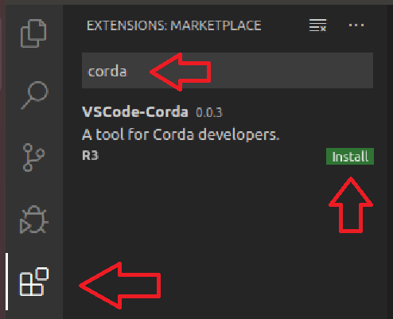

Have a read through its <kbd>README</kbd> file as the extension is being installed. You will explore each command one by one, while running them against the [cordapp-example](https://github.com/corda/samples-java/tree/master/Basic/cordapp-example) project.

That's all with regard to setup.

## Use it on a project

If you have not done so yet, clone the [samples](https://github.com/corda/samples-java) repository in your preferred location. The samples repository has a sub-folder named `cordapp-example`. This is the project to use in this exercise. Click on <kbd>File -> Open Folder</kbd> and choose `cordapp-example`.

Wait until Gradle is done downloading all dependencies and building your project, if that’s the first time you open this project.

The plugin will identify this project as a Corda project and display this finding in the status bar:

VSC's [command palette](https://code.visualstudio.com/docs/getstarted/userinterface#_command-palette) is where you can find all available actions, not limited to the _hard-coded_ ones you can find in the menus. At any time, you can open the command palette with <kbd>Ctrl + Shift + P</kbd> or <kbd>Cmd + Shift + P</kbd>. So open it now and start typing <kbd>corda</kbd> to see all the available commands related to Corda:

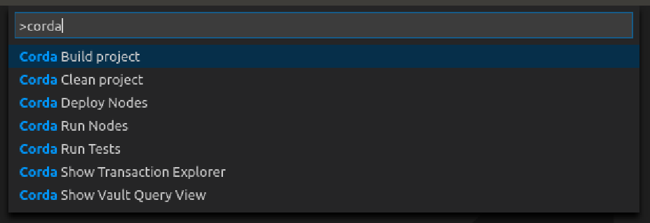

Give the tests a spin. Select <kbd>Corda Run Tests</kbd>:

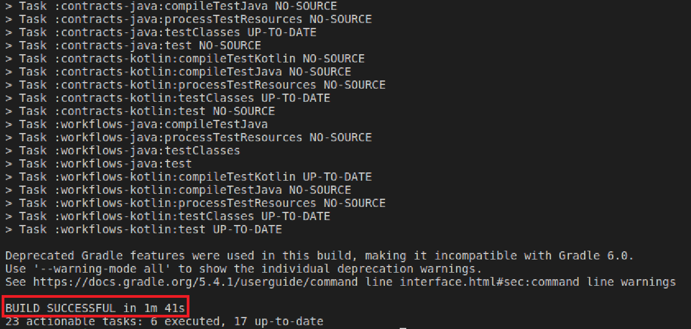

## Deploy nodes

With the tests done, deploy the nodes. This action will create a separate folder for each node that has been defined inside the `deployNodes` task of `build.gradle` file under `workflows-java` and `workflows-kotlin` modules.

By the way, `cordapp-example` is a special case in that it has the modules written in both Java and Kotlin for demonstration purposes. You do _not_ need to code your project in both languages. That's why you'll notice in the terminal that the command is building both versions.

From the command palette, pick <kbd>Corda DeployNodes</kbd>:

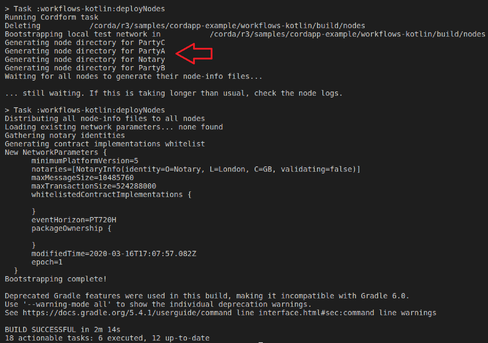

## Run nodes

With the nodes deployed, run them. Pick <kbd>Corda Run Nodes</kbd> and wait for all the nodes to start. Notice how you have a dropdown list that shows all of your nodes. This is much more pleasant than with the multiple terminal windows we saw in a previous module!

<HighlightBox type="tip">

Don't forget to stop your nodes, including the notary, properly by typing `bye` inside each terminal. Otherwise your nodes might fail to start in subsequent attempts

</HighlightBox>

But, for now, keep them running so as to try the rest of the plugin's commands.

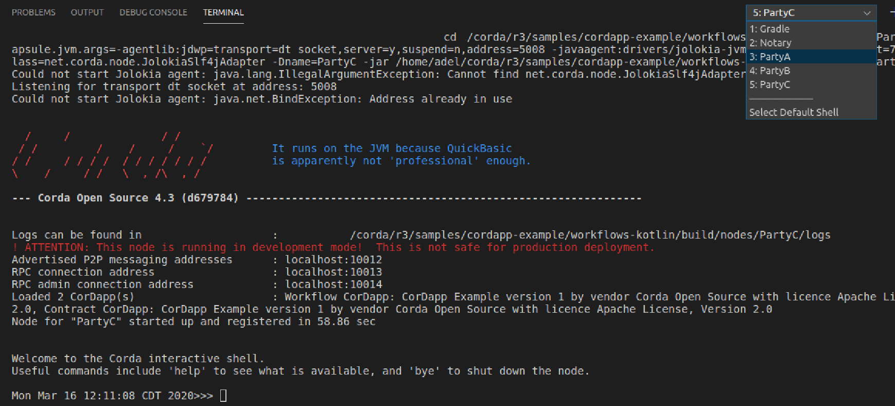

## Interact with a flow

With the nodes running, it is time to start one of the flows. Before you do, do you remember how you used `>>> run vaultTrack` on a node to see a new transaction being saved in real time? The Corda plugin has the same concept here, just more pleasant.

From the command palette, choose <kbd>Corda Show Transaction Explorer</kbd>. It takes a bit of time to start. When it's ready, select <kbd>PartyA</kbd> from the dropdown list and you’ll see some details about your node, plus another dropdown that lists the flows that the node can run:

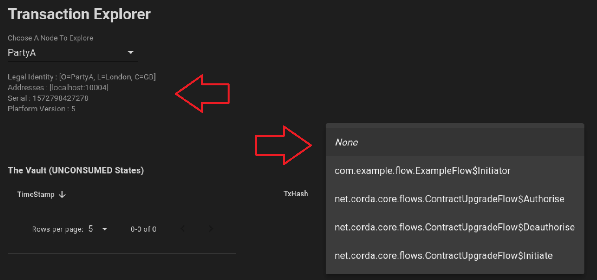

Choose the first flow <kbd>com.example.flow.ExampleFlow&#36;Initiator</kbd>. Notice how it lets you choose a specific constructor if your flow has more than one constructor. The window now displays the required input parameters, and not only that, it also provides autocompletion on values.

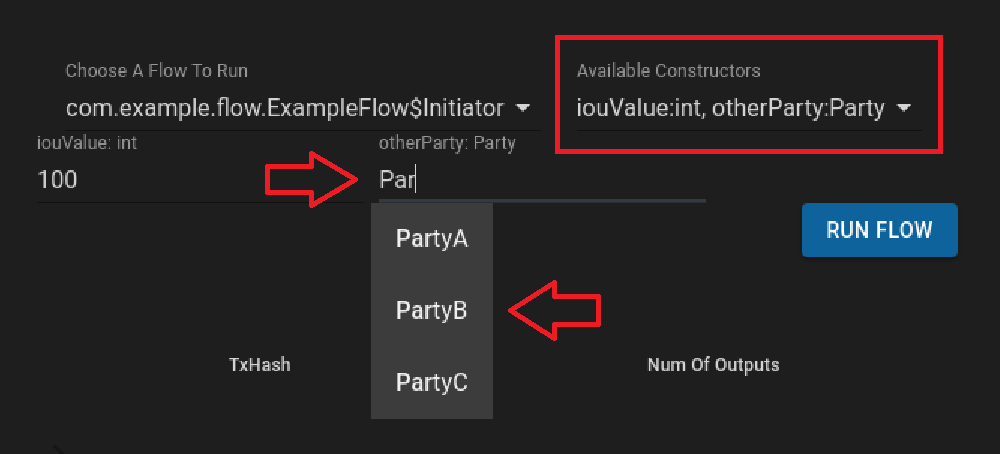

Input an <kbd>iouValue</kbd> and select <kbd>PartyB</kbd>. Time to run the flow. Click on <kbd>RUN FLOW</kbd>. You should receive 2 pop-up notifications: "flow started", and "flow finished".

<ExpansionPanel title="Troubleshooting">

If you have an error message saying that it expects a value of `int`, and you made no mistake, select another flow, then come back to <kbd>com.example.flow.ExampleFlow$Initiator</kbd>. It should fix it.

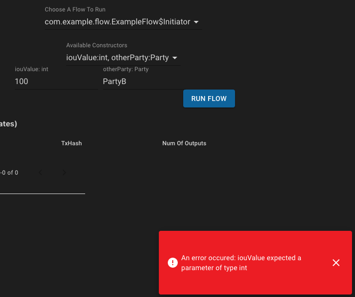

</ExpansionPanel>

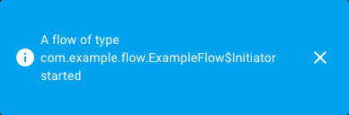

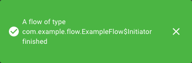

When done, the transaction explorer window shows the resulting transaction. Click on its arrow to expand its details:

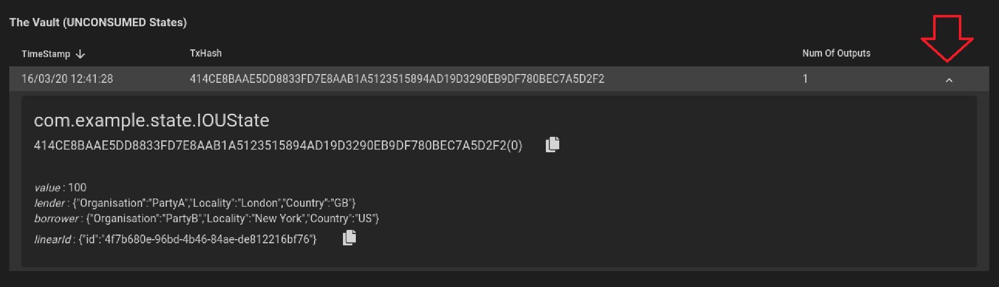

Open <kbd>PartyB</kbd> in the transaction explorer and see the same transaction. Indeed, both `borrower` and `lender` are the participants of the IOU state:

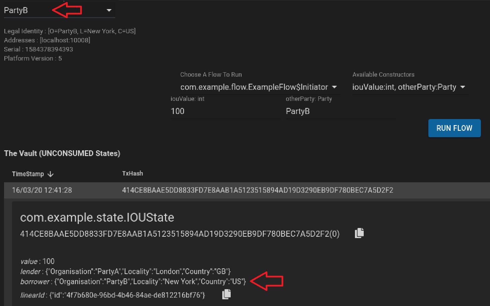

Now let’s run the same flow again but issue an IOU from <kbd>PartyA</kbd> to <kbd>PartyC</kbd>. Select <kbd>PartyA</kbd> again:

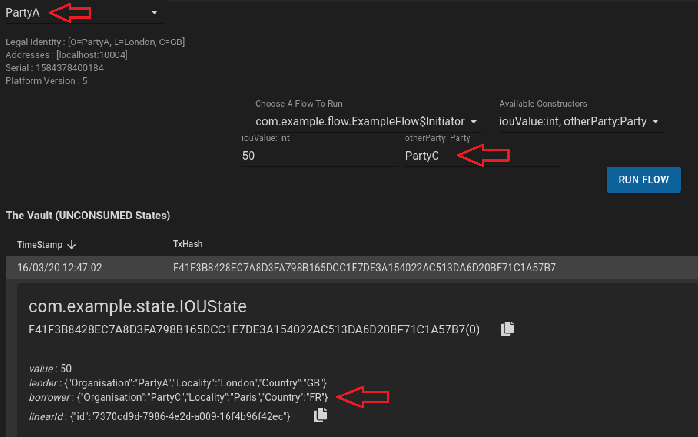

You can also confirm that <kbd>PartyC</kbd> only knows of the second transaction.

## Query the vault

Time to explore another feature of the plugin. In the command palette, choose <kbd>Corda Show Vault Query View</kbd>. Notice how the <kbd>Query Builder</kbd> gives you many options to filter your result set. Of note, it also provides you with auto complete on the <kbd>StateRef</kbd> field!

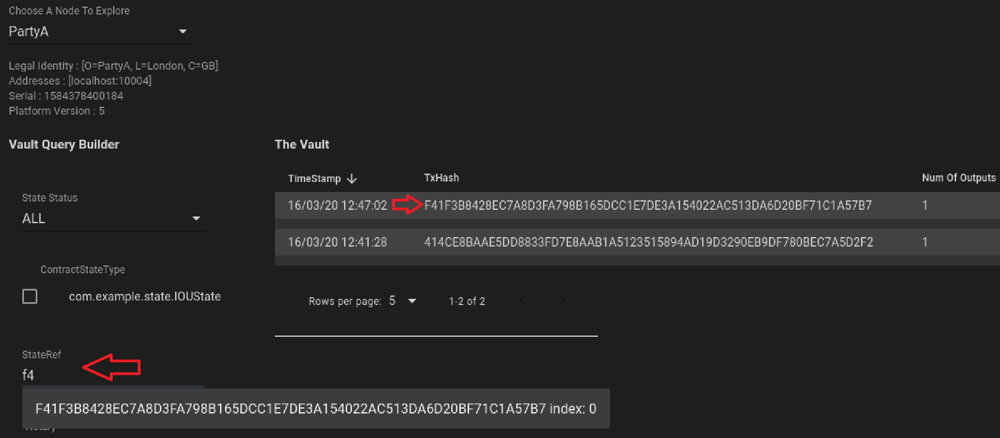

## Conclusion

As you can see, the Visual Studio Code Corda plugin makes it easier to spin your nodes quickly. As well as being useful for you, the developer, it can be very useful for the QA team. They may not necessarily know how to start nodes and run commands from the terminal. The GUIs of the Transaction Explorer and Vault Query View make the process very simple.

In the following modules, you will test your flows by hand too using this plugin, and not just with unit tests.
