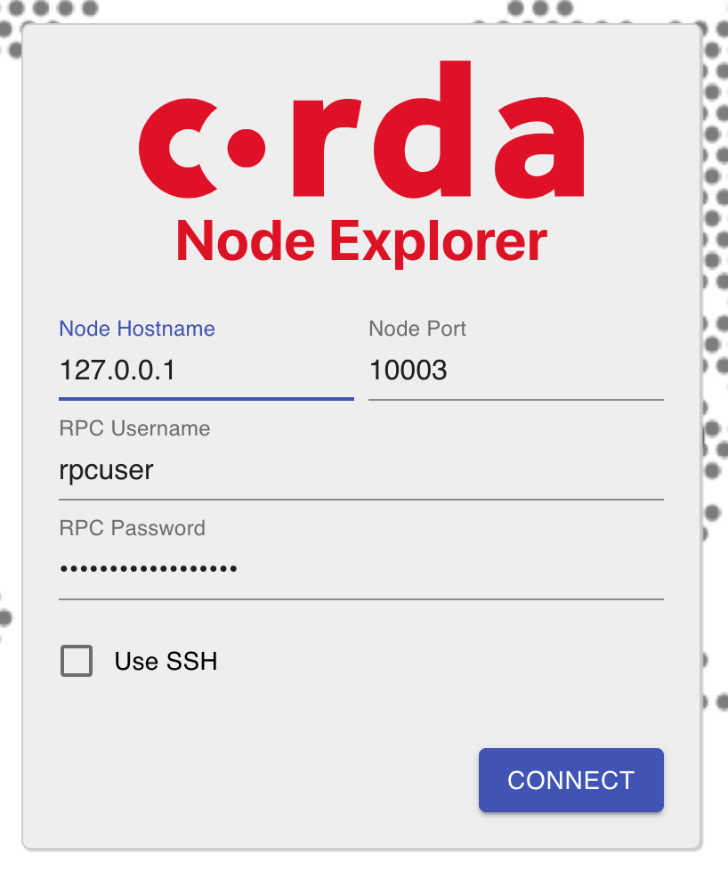
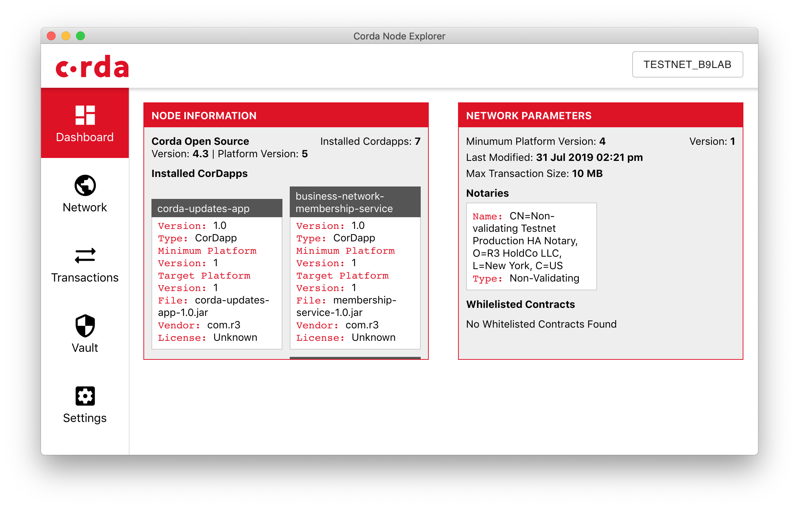

import HighlightBox from "../../src/HighlightBox"

import {
  ExpansionPanel,
  ExpansionPanelList,
  ExpansionPanelListItem
} from 'gatsby-theme-apollo-docs';

You have the `install.sh` one-liner script to run on your Corda node. Now what?

## Setting up your Corda node on the cloud

Depending on your preferred cloud provider, you can follow the steps declared [here](https://docs.corda.net/docs/corda-os/4.3/deploy-to-testnet-index.html) to create a node on which to run the script:

* [Azure steps](https://docs.corda.net/docs/corda-os/4.3/azure-vm-explore.html)
* [AWS steps](https://docs.corda.net/docs/corda-os/4.3/aws-vm-explore.html)
* [GCP steps](https://docs.corda.net/docs/corda-os/4.3/gcp-vm.html)

Of note during the setup is that you are asked to set a fixed IP address and to open specific TCP ports in the firewall:

* `10002`: for the P2P connections.
* `10003`: for the RPC calls you will make to your node.

You can. But, instead, you may want to keep the `10002` port open and keep the `10003` port closed, so that only you and authorized personel can do anything with it via RPC. For instance, look at doing `ssh -L 10003:127.0.0.1:10003` so that your local computer's TCP port at `10003` is [tunneled](https://linux.die.net/man/1/ssh) to the VM's `10003`.

What the [`install.sh`](https://onboarder.prod.ws.r3.com/api/user/node/TESTNET/install.sh) script will do, among other things, is:

* Install Java if necessary.
* Create a `corda` user.
* Download Corda and install it in `/opt/corda`.
* As part of the download, private keys and signed certificates are downloaded.
* Start Corda.

<HighlightBox type="info">

It downloads your private key. That's right, but that's only for the test net. In a production network, it would be:

* Create a private key and certificate.
* Ask the doorman to sign the certificate.

</HighlightBox>

That's a lot and you can customize the actions. Indeed, beside the `ONE_TIME_DOWNLOAD_KEY` parameter, you can do:

* `USEORACLEJDK=true` if you want it to install the Oracle version of Java SDK. If you used `javafx.util.Pair`, for instance, this is necessary.
* `WEBSERVER=true` if you want also to install the web server, which responds on TCP port `8080`.
* `O=MyCompany` and `OU=SalesDepartment` if you want to customize the node party with organization and organization unit. Alas, if you want to replace locality and country, you will have to download the `install.sh` script and modify it by hand.

When it's all done, you have a running node with the basics and the finance CorDapp example. At this point, check your memory usage, and perhaps adjust down to reduce costs because 2 GB of RAM is possibly enough.

<ExpansionPanel title="Troubleshooting">
<ExpansionPanelList>
<ExpansionPanelListItem number="1">

If the `install.sh` installation failed at any point, you may have to manually skip some steps. Let's say you get:

```
cp: cannot stat '/opt/corda/corda.service': No such file or directory
```
To understand what happens, you first need to download `install.sh`:

```shell
$ curl -L https://onboarder.prod.ws.r3.com/api/user/node/TESTNET/install.sh
```
Then look into `install.sh`, and you see that this happens at the `installSystemdConfiguration` step. This means that you cannot use Corda as a service, and will instead have to rely on starting it manually. Comment out `installSystemdConfiguration` with a `#` in front, near line 293, and start again.

By start again, it means that:

* You need to not redo the previous steps (remember the one-time download?), so also comment out the lines 280-292.
* Then you need to launch from the modified `./install.sh`:

    ```shell
    $ sudo ONE_TIME_DOWNLOAD_KEY=a1b2c3d4-a1b2-a1b2-a1b2-a1b2c3d4e5f6 bash -c ./install.sh
    ```
    With whichever other parameters you chose to add.

</ExpansionPanelListItem>
</ExpansionPanelList>
</ExpansionPanel>

## Start and stop Corda

* If Corda was successfully installed as a service, you can:
    * Start it with `sudo systemctl start corda`.
    * Stop it with `sudo systemctl stop corda`.
* If it was not installed as a service, you can:
    * Start it with `sudo /opt/corda/run-corda.sh`.
    * Access the running executable with `screen -x corda-node`. See [`screen` tutorial](https://www.rackaid.com/blog/linux-screen-tutorial-and-how-to/) for what it is. When you disconnect from your screen, the executable keeps running. Even if you close the SSH session.
    * Stop it, in `screen`, with <kbd>CTRL-C</kbd>.

## Standalone shell

With your Corda node running, how about you connect to it? Do you remember how you used the node shell when in development mode? Let's do the same but to connect to your remote VM with the [standalone node shell](https://docs.corda.net/docs/corda-os/4.3/shell.html#starting-the-standalone-shell).

 Let's install it. [Here](https://ci-artifactory.corda.r3cev.com/artifactory/webapp/#/artifacts/browse/tree/General/corda-releases/net/corda/corda-tools-shell-cli/4.3/corda-tools-shell-cli-4.3-all.jar), click the Download link to get it. Then as per [the guide](https://docs.corda.net/docs/corda-os/4.3/cli-application-shell-extensions.html#installing-shell-extensions), run on your local computer:

```shell
$ java -jar /where/is/corda-tools-shell-cli-4.3-all.jar install-shell-extensions
```
With the shell installed on your computer, since you closed the `10003` RPC port on your remote VM, first SSH-tunnel to the VM:

```shell
$ ssh -i /YOUR/SSH/PRI/KEY -L 10003:127.0.0.1:10003 REMOTE_IP
#                                             ^ That's the port on the VM, keep it.
#                                   ^ That's localhost relative to the remote VM, not to your local computer.
#                             ^ Your local port. Choose another one if you want.
```
Next, find the RPC username and password in `/opt/corda/node.conf`. At some later point, you ought to change this password and restart Corda.

Then, in a **new** shell on your local computer, remember to add a space to skip the history log, and do:

```shell
$ corda-shell --host=127.0.0.1 --port=10003 --user=rpcuser --password=password
#                                                                     ^ Put the right one.
#                    ^ That's localhost relative to your local computer.
```

<ExpansionPanel title="Troubleshooting">
<ExpansionPanelList>
<ExpansionPanelListItem number="1">

If you get an error like:

```
WARNING: sun.reflect.Reflection.getCallerClass is not supported. This will impact performance.
Warning: Nashorn engine is planned to be removed from a future JDK release
Warning: Nashorn engine is planned to be removed from a future JDK release
Warning: Nashorn engine is planned to be removed from a future JDK release
Warning: Nashorn engine is planned to be removed from a future JDK release
Warning: Nashorn engine is planned to be removed from a future JDK release
Warning: Nashorn engine is planned to be removed from a future JDK release
WARNING: An illegal reflective access operation has occurred
WARNING: Illegal reflective access by org.codehaus.groovy.reflection.CachedClass$3$1 (file:corda-tools-shell-cli-4.3-all.jar) to method java.lang.Object.finalize()
WARNING: Please consider reporting this to the maintainers of org.codehaus.groovy.reflection.CachedClass$3$1
WARNING: Use --illegal-access=warn to enable warnings of further illegal reflective access operations
WARNING: All illegal access operations will be denied in a future release
```
It is because of a Java version issue. So, in keeping with what you learned when _preparing your computer_, you need to specify which Java DK to use, for instance:

```shell
$ JAVA_HOME=/Library/Java/JavaVirtualMachines/jdk1.8.0_191.jdk/Contents/Home corda-shell --host=127.0.0.1 --port=10003 --user=rpcuser --password=password
```

</ExpansionPanelListItem>
<ExpansionPanelListItem number="2">

If you get an error like:

```
Cannot login to 127.0.0.1:10003, reason: "AMQ119031: Unable to validate user from /127.0.0.1:47938. Username: rpcuser; SSL certificate subject DN: unavailable"
```
It is because of this [unresolved issue](https://github.com/corda/corda/issues/5955). So disable SSL for RPC in `node.conf`, like so:

```json
    "rpcSettings" : {
        "useSsl" : false,
        "address" : "0.0.0.0:10003",
        "adminAddress" : "0.0.0.0:10004"
    },
```

</ExpansionPanelListItem>
</ExpansionPanelList>
</ExpansionPanel>

## Node Explorer

With your Corda node running, how about you connect to it? The Node Explorer is a very useful tool that allows you to see all sorts of information about your node, for instance installed CorDapps and finalized transactions, and to start `@StartableByRPC` flows whose constructor parameter types are compatible. You can see a video about its capabilities [here](https://www.youtube.com/watch?v=cn2lhS8pjRs).

[Download it]((https://docs.corda.net/docs/corda-os/4.4/node-explorer.html#access-your-node-with-node-explorer)) now.

Since you closed the `10003` RPC port on your remote VM, first SSH-tunnel to it:

```shell
$ ssh -i /YOUR/SSH/PRI/KEY -L 10003:127.0.0.1:10003 REMOTE_IP
#                                             ^ That's the port on the VM, keep it.
#                                   ^ That's localhost relative to the remote VM, not to your local computer.
#                             ^ Your local port. Choose another one if you want.
```
Next, find the RPC username and password in `/opt/corda/node.conf`. Later change it and restart Corda. Then on the Node Explorer, connect with these parameters:



The beauty of tuneling is that you tell it that the node is local: `127.0.0.1` here is relative to your local computer. It should show the expected parameters:



In the settings tab, enter the `/opt/corda/cordapps` path of your remote VM, and you are all set. The rest of the GUI is self-explanatory.

## Securing

When you have confirmed that things are working, try securing [more with SSL](https://blog.b9lab.com/enabling-corda-security-with-nodes-configuration-file-412ce6a4371c).

## The bootstrapper

For the audacious, you may consider creating a test network from scratch. This is in effect what you did _in one click_ when running `deployNodes` on your local machine. Now, with the bootstrapper you can accomplish the same and then distribute the created files to separate machines, i.e. VM's.

Have a look at [the documentation](https://docs.corda.net/docs/corda-os/4.4/network-bootstrapper.html) about how to generate the required network map files. Once you have all of the files, you can follow [these instructions](https://docs.corda.net/docs/corda-os/4.4/tutorial-cordapp.html#running-nodes-across-machines) to copy your nodes to separate VM's.

Whichever data center you choose to install your node, as always, you will need the following:

* A computer running Linux and capacious enough.
* A static IP address.

<!--

TODO `/opt/corda/node.zip` is repeated.
TODO `deleteLockfileIfCertsExist` seems wrongly named
TODO line 156, it is already done below
TODO What: If you restart your VM you will need to restart Corda

Note that it will download your node certificate from one of Corda's server. Even though you can download it only once, and presumably the server deletes it once it has been downloaded, you should consider this certificate unsafely _disclosed_ and not use it for anything other than the test net

-->

## Docker

R3 provides an official Docker image for Corda. You can find detailed instructions about running Corda with Docker [here](https://docs.corda.net/docs/corda-os/4.4/docker-image.html).
You can also watch an [instructional video](https://www.youtube.com/watch?v=ITMOiMzkX4I).

## Conclusion

With a node finally running, albeit with the standard CorDapps, it is time to install your own. That's the subject of the next chapter.
