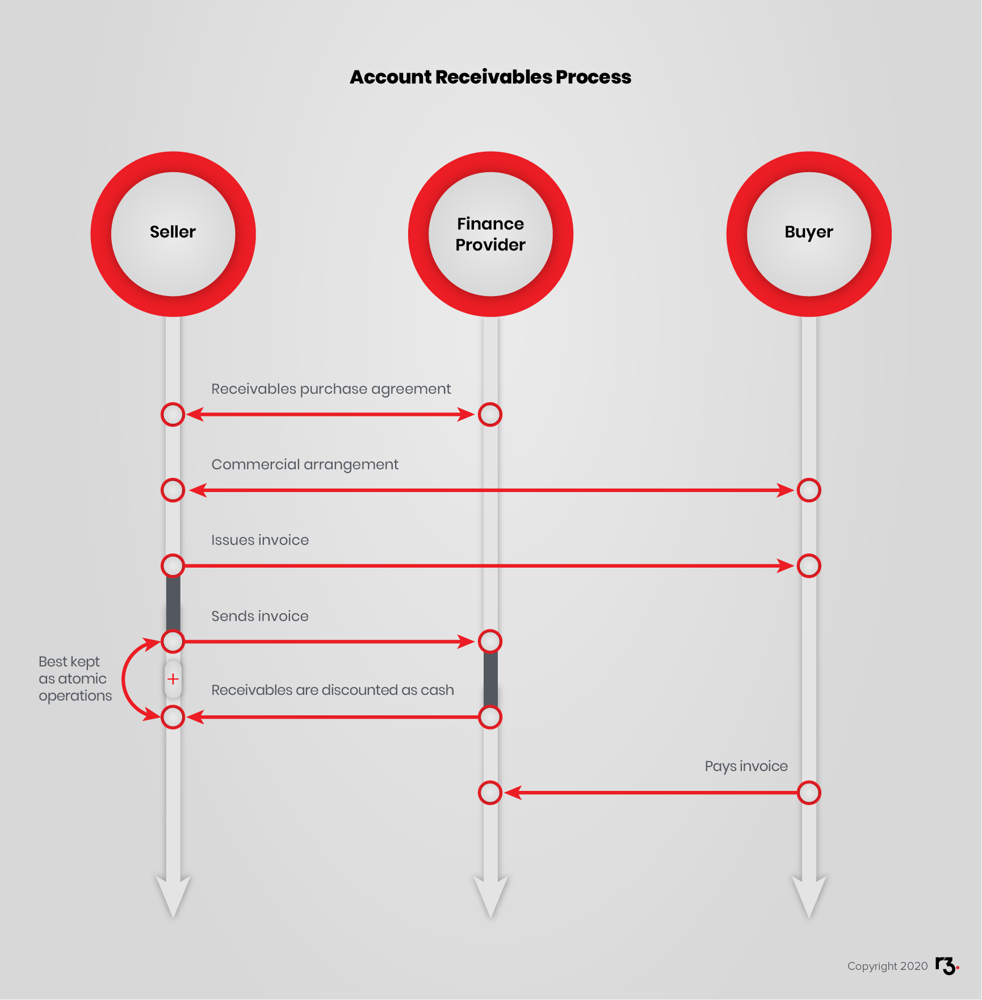
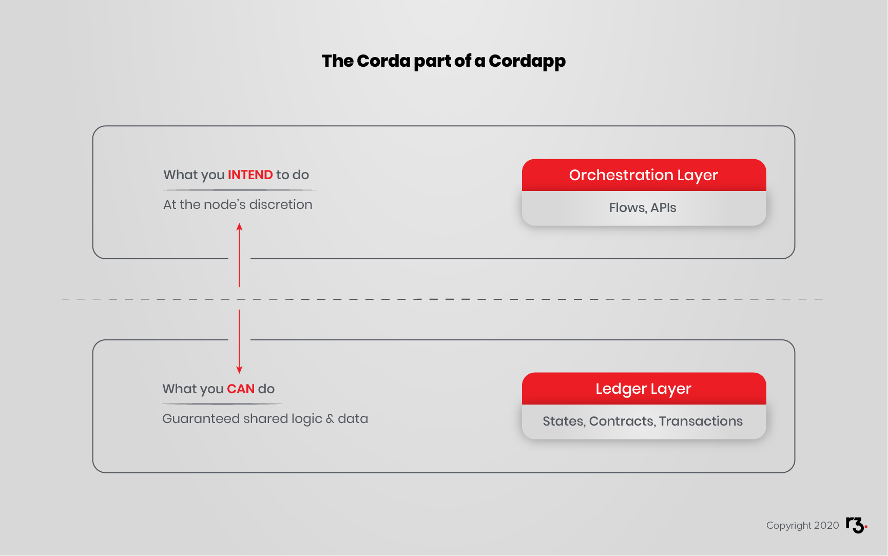

<!-- Look at Corda Design Language -->

Corda is designed to help enterprises achieve consensus about shared facts. The facts are generally related to contracts that closely model legal contracts, and transactions that explain the evolving states of the contracts. Therefore, a good starting point in your design process will be identifying who the parties are, and the contracts and assets (states) about which the parties need to reach agreement.

Closely related to contracts are the transactions. Consider how the contract states will evolve over time. Design contracts so that only these kinds of transactions are allowed.

Also, consider the sequence of transactions as step-by-step process that will be coordinated by Corda using Flows.

In this section, you will do the following:

- Explore Corda design concepts.
- From a designer's perspective, look more closely at:

  * Parties.
  * Scenarios.
  * States.
  * Transactions.
  * Contracts.
- Consider network design considerations.
- Logically consider the design of layers in your ledger.

<!-- API and Testing may not need their own sections here. -->

Learning to think about design on Corda is a key step in progressing towards becoming a Corda developer. It will help you to understand how Corda might help you create solutions for your business, and give practical context to your learning so far.

## Exploring Design Concepts

Let us consider a scenario originally conceived by the R3 team to introduce Corda design patterns in a slightly more complex scenario. You will consider a CorDapp that will model the end-to-end process of an accounts receivable (AR) Purchase.

For clarity, AR Purchase is not about the everyday purchase of a product or service on a “pay later” basis. An AR Purchase refers to an arrangement between the seller of such things and their bank. The bank will purchase the AR from the seller, giving the seller liquidity (cash) immediately instead of waiting for the purchaser(s) to pay. The purchaser will pay the bank to settle the debt.

## Purpose

## The Parties

Our example includes

1. A buyer who is a debtor to the seller (related to external commercial activity)
2. A seller who has accounts receivable
3. A bank who will buy the accounts receivable (at a discount).

In other scenarios, the parties could be brokers, central banks, traders, trusts, regulators and so on.

## The Scenarios

Our example includes a buyer, a seller and a bank who will trade cash for an AR. The AR is represented as an invoice. That’s because the AR is payable for the buyer who purchased something from the seller.

The general flow is:

1. The buyer and seller enter in a commercial arrangement.
2. The seller issues an invoice with payment instructions.
3. The seller sends the invoice to the bank under the pre-existing AR purchase agreement.
4. The bank discounts the invoice per the pre-existing AR purchase agreement.
5. The bank deposits cash in the seller’s account.
6. The buyer sends the bank the amount of the invoice on the due date.

For the sake of simplicity, you will assume the invoice discounting/AR purchasing agreement is already in place between the seller and the bank. Begin at the point where the seller invoices the buyer and assume that the invoice is assignable, meaning, the seller has the right to appoint the bank as the new receiver.

## The States

What are the specific states represented here? This is about the data that you need to track.
Consider two categories of states:

- Contracts: represent agreements. These would be things like the invoice. Other examples include options, bonds and other kinds of debt instruments.
- Assets: represent tangibles. These would be things like property and cash. These things are ownable.

In the example there are two agreements:

- The AR agreement between the seller and the bank, which are set aside for simplicity. Let us just say it exists so that what you intend to do is permissible.
- The invoice. The invoice represents a commercial transaction for goods or services. Many invoice details lie outside the scope of concerns. The buyer, net amount and due date will be important.

There is one asset:

- Cash

Remember, cash is most likely represented as an account within the bank, so in Corda, it’s a contract with a state.

## Transactions

Once you have identified the states your CorDapp will work with, it’s time to consider how those states will evolve. This is a modestly simple example with a linear step-by-step process.

1. The buyer and seller enter in a commercial arrangement. For simplicity, let us say that this activity is outside of the system.
2. The seller issues an invoice with payment instructions. Again, for simplicity, let us say the invoice is correct and the buyer will sign it leaving no doubt about the accuracy and acceptability of the invoice.
3. The seller sends the invoice to the bank under the pre-existing AR purchase agreement. In effect, the seller is asking the bank to purchase the AR.
4. The bank discounts the invoice per the pre-existing AR purchase agreement. This is how the bank makes money providing the financial service of immediate payment while carrying the accounts receivable.
5. The seller informs the buyer that the AR has been assigned to the bank and therefore the buyer should pay the bank.
6. The bank deposits cash in the seller’s account. The seller’s offer to sell the invoice was contingent on the bank agreeing to deposit funds in the seller’s account.
7. The buyer sends the bank the amount of the invoice on the due date.

We begin to see a series of transactions and who is involved.

1. Create (Issue) Invoice: Buyers and seller agree the assignable invoice exists.
2. Sell AR: The seller offers the invoice to bank in return for discounted cash.
3. Pay AR: The buyer pays the invoice.

Consider transactions as evolutions of states. Consider the steps involved, the states they work with, and the parties who should sign or observe the evolving states.

## Contracts

Without a contract, a state is nearly meaningless. Consider a state 100. 100 what? Is that 100 points, 100 miles, 100 kilograms, or something else? Perhaps it is $100. The US Dollar contract gives the numerator 100 meaning.

For readers who are familiar with cryptocurrencies, this concept may seem strange. Remember, Corda emerges from the field of regulated financial institutions. The design recognizes that there is, in fact, no cash or treasure in a vault somewhere that corresponds to the funds represented in accounts. Instead, there are agreements. Indeed, all US Dollar cash-like instruments are not created equal. It depends on the source, terms, risk and other factors.

## Network Design Considerations for Corda

As well as the CorDapp design you will design the networks themselves.

* **Notary Service:** One or more nodes will be a designated Notary Service. This is generally implemented as a fault-tolerant service that all parties agree is trustworthy and will not abuse the special privileges reserved for the Notary Service.
* **Network Map Service:** The Network Map Service helps nodes discover the network topology. While it should be a highly available service, the network will continue uninterrupted if the Network Map Service becomes unavailable for some reason, with the temporary effect that nodes will not be able to move or join. This, because nodes will continue with their last known map of the network until the Network Map Service returns to service.

## Orchestration and Ledger Layers

When thinking about the logic of your CorDapp, separate concerns into two logical layers. You will see this in more detail later on. For now, a brief introduction to this important concept to help you begin thinking the Corda way.

A CorDapp has two distinct layers, the Ledger Layer and the Orchestration Layer. Of course, a complete implementation has a UI, integrations, non-ledger storage etc., but set those concerns aside and think about two families of concerns you will address with Corda itself.

- **The Ledger Layer** (States, Contracts and Transactions) provides the Distributed Ledger guarantees over the common data and common processing logic.
- **The Orchestration Layer** (Flows and APIs) coordinates communication between parties, builds proposed transactions and the Corda Contracts which govern the evolutions of those States via Transactions which update the ledger.

There is a very important distinction between the two layers:

> Only the Ledger Layer provides guarantees about shared States and execution logic.

Flows and APIs *may* be distributed as part of the CorDapp, and they *may* express the *intended* (expected) use of the CorDapp but any party can modify or extend the Flows and APIs. For example, they may rewrite the Flows so that their interactions with the CorDapp precisely align with their internal procedures.

To say this another way, Flows and APIs *suggest* processes that parties should probably *want to do* while the Ledger Layer defines what they *can do* and *must do*.

## API

User Interfaces usually communicate with CorDapps via APIs. API design and constructors are covered later in the course.

## Testing

Tests for Corda contracts and transactions are covered later in this course.
