import HighlightBox from "../../src/HighlightBox"

import {MultiCodeBlock} from 'gatsby-theme-apollo-docs';

import {
  ExpansionPanel,
  ExpansionPanelList,
  ExpansionPanelListItem
} from 'gatsby-theme-apollo-docs';

A Corda project can become a big beast with many moving parts. Before you learn how to build a project from scratch, you can explore a functional one prepared for you by the Corda team.

In this section, you will do the following:

* Load an example project into IntelliJ.
* Walk through the code.
* Pick up tips on how to use IntelliJ on a Java project.

## The example project - IOUs

This section is all about IOUs. That's what the [cordapp-example](https://github.com/corda/samples-java/tree/master/Basic/cordapp-example) does. It creates IOUs. That's all. This may sound limited but there is plenty to get acquainted with and it is best to avoid the mental overhead of a complex application.

You will use this project and follow its guidelines, and get pointers on what's happening in the code. In order to keep your experience synchronised with this documentation, you will rely on a specific commit.

```git
commit: a61e2cc9910d7d5de83122bf7d36fd071796a7c3
```

## Prepare the Project

This section is inspired by the tutorial found on docs.corda.net [here](https://docs.corda.net/tutorial-cordapp.html#downloading-the-example-cordapp).

It's time to download your CorDapp example. Go into your workspace directory, or wherever you want to clone the repository:

```bash
$ cd Workspace
$ git clone https://github.com/corda/samples-java.git
```
This samples repository contains a lot of example projects, however you will focus only on `cordapp-example`. To ensure your version matches this training, you need to add an extra step:

```bash
$ cd samples-java/cordapp-example
$ git checkout a61e2cc9910d7d5de83122bf7d36fd071796a7c3
```

You have now cloned the project to your local storage and then changed to the version that was used for the production of this training. This eliminates the possibility that late-breaking changes could lead to confusion as you work through this exercise.

Now you are ready to start working with the code in IntelliJ.

## Open the Project

The Java Integrated Development Environment (IDE) named IntelliJ will assist you in navigating the code with simple clicks and hints. This is much easier than navigating code on Github. Links are still provided to the code on Github to help you identify where the code is located. This is because it's not possible to  link to code inside IntelliJ.

The easiest way to open the project with IntelliJ is:

1. Open IntelliJ.
2. Click on the menu <kbd>File</kbd> -> <kbd>Open</kbd>.
3. Navigate to the `cordapp-example` folder.
4. Select the root `build.gradle` project file.
    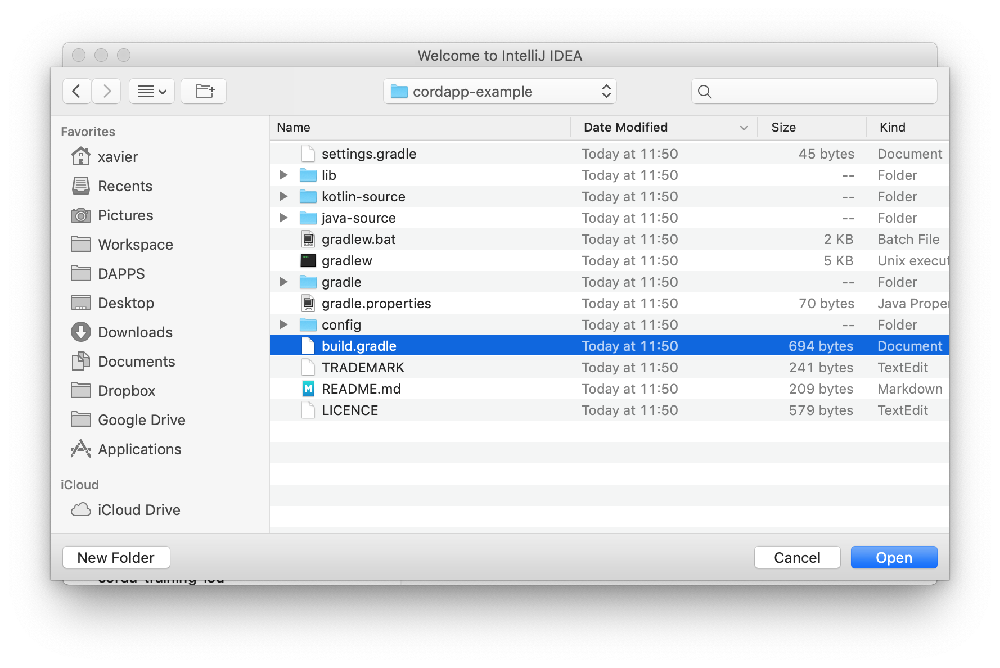
5. Click <kbd>Open</kbd>.
    A popup appears.
6.  In the popup, click <kbd>Open as Project</kbd>.
    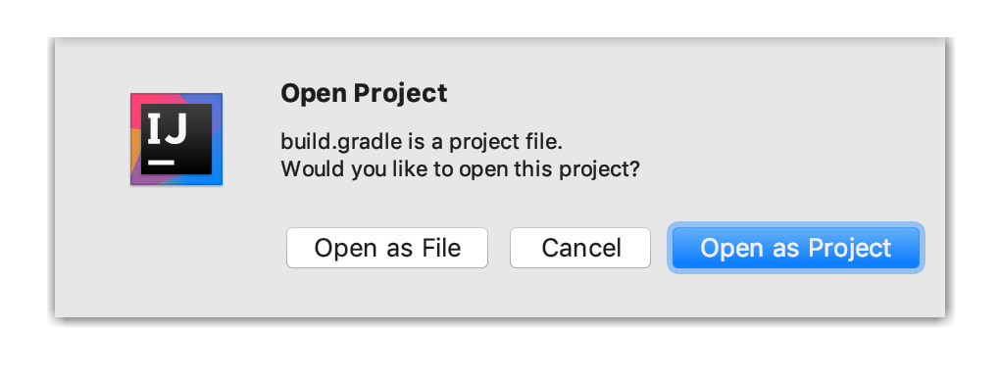
    As the project is loading, a pop-up menu appears in the lower right corner:

    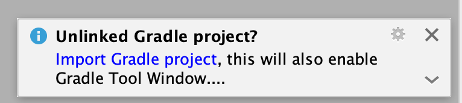

7. Click on <kbd>Import Gradle project</kbd> and let it finish, and that's it!

<ExpansionPanel title="Troubleshooting">

If you overlooked the transient <kbd>Import Gradle Project</kbd> seen above and you are faced with a bland looking project, despair not. Simply:

1. Find that top `build.gradle` file.
2. Right-click it and choose <kbd>Import Gradle Project</kbd> again:
    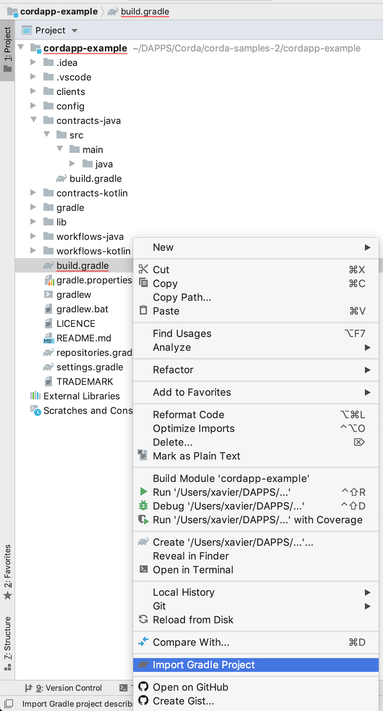
3. If for some reason you had already opened it previously and you did those import steps again, you need to accept to overwrite the existing configuration. The buttons to click are circled in blue:
    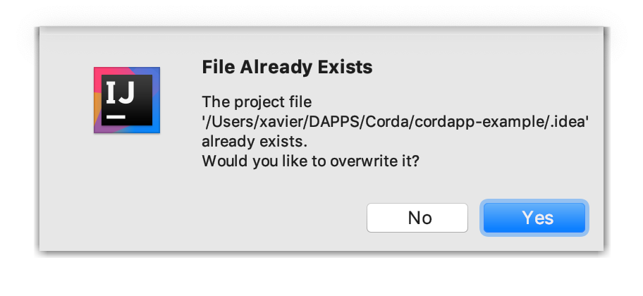
    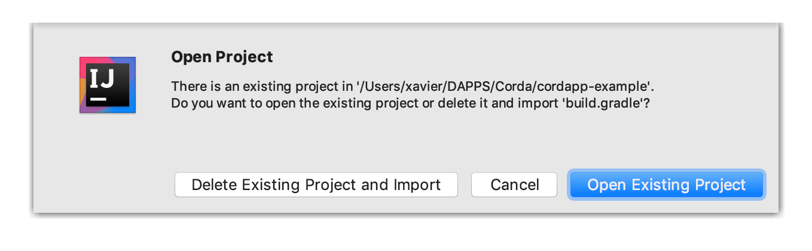

</ExpansionPanel>

Be patient as it may take a couple minutes for IntelliJ as it is:

* Downloading the project's dependencies.
* Indexing the code so as to help you with navigating it.

<HighlightBox type="tip">

**Gradle** is a versatile project management tool, which of course includes dependency management. Admittedly, there may be as few as 3 people in the whole world who fully understand how it works and what it is doing but it works for our purpose. Regrettably, there is no auto-completion for Gradle commands.

You group your Gradle commands into 1 or more `build.gradle` files, which can call other `build.gradle` files. What you did earlier is select the root Gradle file.

IntelliJ knows how to interact with Gradle, thanks to a plugin, so when you clicked on `build.gradle`, you told IntelliJ to delegate the project management to Gradle. Which it did.

</HighlightBox>

<ExpansionPanel title="A word on the set of Gradle files">
<ExpansionPanelList>
<ExpansionPanelListItem number="1">

The `cordapp-example` project contains 6 `build.gradle` files in total:

* `build.gradle`
* `clients/build.gradle`
* `contracts-java/build.gradle`
* `workflows-java/build.gradle`
* `contracts-kotlin/build.gradle`
* `workflows-kotlin/build.gradle`

`build.gradle` is called the root file. All 5 other `build.gradle` files incorporate what is done in this root `build.gradle`. For instance, `contracts-java/build.gradle` knows about the root `build.gradle`. In fact, a given `build.gradle` automatically incorporates what other `build.gradle` files did up in the folder structure. You can see an example of that [here](), where `corda_release_group` is defined up in the root, [there](https://github.com/corda/samples-java/blob/a61e2cc9910d7d5de83122bf7d36fd071796a7c3/Basic/cordapp-example/build.gradle#L6).

Not down the tree. Not sideways either. For instance, `contracts-kotlin/build.gradle` does not incorporate what was done in `contracts-java/build.gradle`.

</ExpansionPanelListItem>
<ExpansionPanelListItem number="2">

The 5 folders:

* `clients`
* `contracts-java`
* `workflows-java`
* `contracts-kotlin`
* `workflows-kotlin`

Are called Gradle modules. They each encapsulate a piece of logic of the whole project. Not just any old folder can become a module. You need to direct Gradle to them in [`settings.gradle`](https://github.com/corda/samples-java/blob/a61e2cc9910d7d5de83122bf7d36fd071796a7c3/Basic/cordapp-example/settings.gradle).

</ExpansionPanelListItem>
<ExpansionPanelListItem number="3">

A module _can_ reuse logic from another, which has to be made explicitly. Which is why, as expected:

* `workflows-java` [depends on](https://github.com/corda/samples-java/blob/a61e2cc9910d7d5de83122bf7d36fd071796a7c3/Basic/cordapp-example/workflows-java/build.gradle#L62) `contracts-java`.
* `workflows-kotlin` [depends on](https://github.com/corda/samples-java/blob/a61e2cc9910d7d5de83122bf7d36fd071796a7c3/Basic/cordapp-example/workflows-kotlin/build.gradle#L54) `contracts-kotlin`.

</ExpansionPanelListItem>
</ExpansionPanelList>
</ExpansionPanel>

<!--

It is possible to open the project directly by using the fact that its Gradle configuration is already set up. The buttons to click are circled in blue:

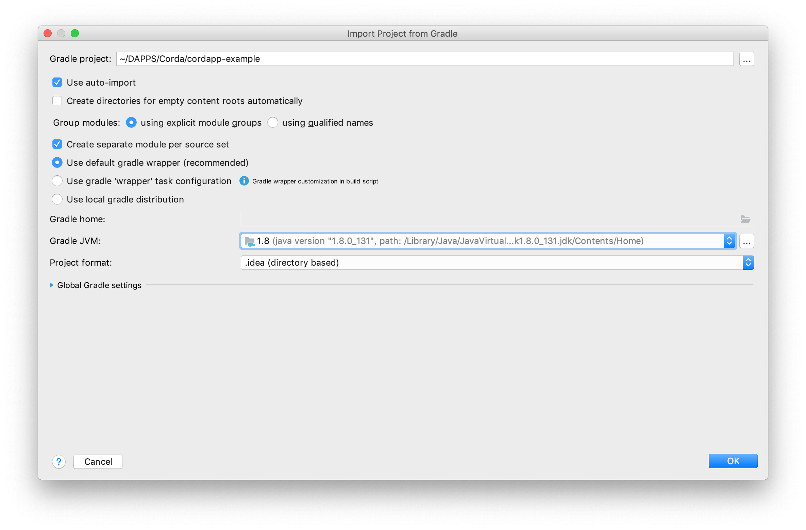

-->

As you quickly look around notice how there are sources folders for:

* The contracts in both [Java](https://github.com/corda/samples-java/tree/a61e2cc9910d7d5de83122bf7d36fd071796a7c3/Basic/cordapp-example/contracts-java) and [Kotlin](https://github.com/corda/samples-java/tree/a61e2cc9910d7d5de83122bf7d36fd071796a7c3/Basic/cordapp-example/contracts-kotlin).
* The flows in [Java](https://github.com/corda/samples-java/tree/a61e2cc9910d7d5de83122bf7d36fd071796a7c3/Basic/cordapp-example/workflows-java) and [Kotlin](https://github.com/corda/samples-java/tree/a61e2cc9910d7d5de83122bf7d36fd071796a7c3/Basic/cordapp-example/workflows-kotlin).

These 4 different source folders actually code roughly the same thing. They are here to show you how you would accomplish the same tasks in either language. Obviously, when you do your own project, you need not create 2 versions of the same thing. You only need to create projects once in the language of your choice.

In fact, in this example app, it is as if we had 2 independent examples in 1 folder. You can confirm this by looking at:

1. `workflows-java`'s `build.gradle`'s [dependency](https://github.com/corda/samples-java/blob/a61e2cc9910d7d5de83122bf7d36fd071796a7c3/Basic/cordapp-example/workflows-java/build.gradle#L62): `cordapp project(":contracts-java")`
2. `workflows-kotlin`'s `build.gradle`'s [dependency](https://github.com/corda/samples-java/blob/a61e2cc9910d7d5de83122bf7d36fd071796a7c3/Basic/cordapp-example/workflows-kotlin/build.gradle#L54): `cordapp project(":contracts-kotlin")`

Watch a short demonstration of this process:

`video: https://www.youtube.com/watch?v=uqWOLovpYK8`

Ok, enough about loading and configuration. Let's dive in:

## The Corda objects

Let us look at the data structures we learned about in a previous chapter.

### State

The project defines an IOUState in [Java](https://github.com/corda/samples-java/blob/a61e2cc9910d7d5de83122bf7d36fd071796a7c3/Basic/cordapp-example/contracts-java/src/main/java/com/example/state/IOUState.java#L23-L27) and [Kotlin](https://github.com/corda/samples-java/blob/a61e2cc9910d7d5de83122bf7d36fd071796a7c3/Basic/cordapp-example/contracts-kotlin/src/main/kotlin/com/example/state/IOUState.kt#L25-L29):

<MultiCodeBlock>

```java
public class IOUState implements LinearState, QueryableState {
    private final Integer value;
    private final Party lender;
    private final Party borrower;
    private final UniqueIdentifier linearId;
```

```kotlin
data class IOUState(val value: Int,
                    val lender: Party,
                    val borrower: Party,
                    override val linearId: UniqueIdentifier = UniqueIdentifier()):
        LinearState, QueryableState {
```

</MultiCodeBlock>

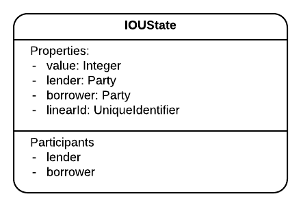

In case it is not clear, IOU is short for "I owe you (money)". The IOUs in this example have four properties:

* 2 parties: `lender` and `borrower`,
* 1 `value`,
* and 1 `id`.

#### The Parties

Let us take a quick look at the parties.

* `Party`: Both `lender` and `borrower` are of type `Party`. If you look at `Party`'s definition, it starts to get a bit cryptic, with its [default constructor](https://github.com/corda/corda/blob/68bb7a0e7bb900117c2ed0d9174fea36d3d4aedc/core/src/main/kotlin/net/corda/core/identity/Party.kt#L38). In essence, it is a pair made of:
    1. a `CordaX500Name`, a.k.a. a name,
    2. and a `PublicKey` interface.

    ```kotlin
    class Party(val name: CordaX500Name, owningKey: PublicKey) : Destination, AbstractParty(owningKey) {`
    ```
* `CordaX500Name `: If you follow again inside `CordaX500Name`, you will see [here](https://github.com/corda/corda/blob/68bb7a0e7bb900117c2ed0d9174fea36d3d4aedc/core/src/main/kotlin/net/corda/core/identity/CordaX500Name.kt#L31) that it identifies the legal name of an entity (e.g `"CN=Alice Corp,O=Alice Corp,L=London,C=GB"`). For now, let's not dig any further.

    ```kotlin
    data class CordaX500Name(val commonName: String?,
                             val organisationUnit: String?,
                             val organisation: String,
                             val locality: String,
                             val state: String?,
                             val country: String) {
    ```
* `AbstractParty`: That is `Party`'s parent class and it is interesting to notice its `@CordaSerializable` [annotation](https://github.com/corda/corda/blob/68bb7a0e7bb900117c2ed0d9174fea36d3d4aedc/core/src/main/kotlin/net/corda/core/identity/AbstractParty.kt#L14), which makes sense because this is information that will be exchanged between nodes.

    ```java
    @CordaSerializable
    ```

#### Value

Back to `IOUState`.

Little is said about `value` other than it is an `Integer`. What is not said is noteworthy. It is not limited to positive values. This constraint will be found elsewhere. This was a design decision on the part of the Corda team, in order to organise constraints in one place rather than having them scattered across various constructors.

#### Linear Id

For `IOUState` to be usable as a state on the ledger, it would have sufficed for it to implement [`ContractState`](https://github.com/corda/corda/blob/68bb7a0e7bb900117c2ed0d9174fea36d3d4aedc/core/src/main/kotlin/net/corda/core/contracts/ContractState.kt#L16-L17), which, you will notice is also `@CordaSerializable`. However, so as not for us to reinvent the wheel, the Corda team has already prepared a number of implementations that can assist us with simple cases. These are part of the list of things that R3 is doing to increase the productivity of developers. To see a list of implementations of `ContractState` in IntelliJ:

1. Open `IOUState`.
2. <kbd>Command-Click</kbd> or <kbd>Control-Click</kbd> on `LinearState`:

    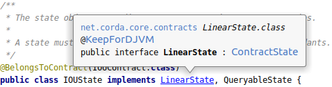

3. It opens `LinearState`. Same here, you <kbd>Command-Click</kbd> on `ContractState`:

    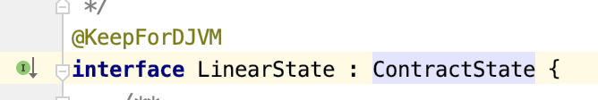

4. It opens `ContractState`, then on the left, click the small green `I`:

    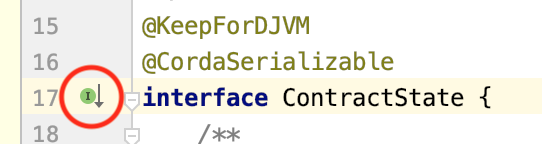

    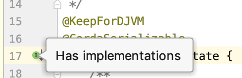
5. You get a drop-down of implementations:

    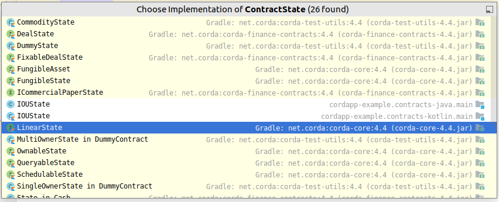

It says it found 26 implementations, which include `IOUState` in both `contracts-java` and `contracts-kotlin`. If you look to the right of the implementations list you will see that they are all found in:

* `corda-test-utils-4.3.jar`
* `corda-finance-contracts-4.3.jar`
* `corda-core-4.3.jar`

There are not 26 (minus our 2 `IOUState`) libraries. There are 3 libraries that contain 26 implementations of `ContractState`.

In this example, the team chose [`interface LinearState`](https://github.com/corda/corda/blob/68bb7a0e7bb900117c2ed0d9174fea36d3d4aedc/core/src/main/kotlin/net/corda/core/contracts/Structures.kt#L128), which offers a rudimentary way to identify successor states by way of the _linear id_. This linear id is meant to be unique. So when you use `LinearState`, it is incumbent on you, the developer, to make sure that you do not have 2 unconsumed states with the same linear id at any point in time. It is also incumbent on you to make sure that successor states have the same linear id as the states they replace. Doing otherwise defeats the purpose of `LinearState`.

#### Schema

States can be persisted in node vaults by various methods:

1. Embedded in a known transaction. This is unavoidable if the node receives a signed transaction and saves it to transaction storage. An output state is part of the serialised blob of the transaction in any case. For this reason, when a node receives a transaction you can consider that its output states have been _disclosed_.
2. Stored as a discrete state. This is automatically done by the node when it receives a transaction that mentions one of its public keys as a participant. Presumably, the node, its owners or its customers are meant to retrieve and use it.
3. Stored as a row in the node's dedicated vault SQL table. This is done explicitly by the CorDapp's developer. Doing so enables the option of running complex queries on known states.

Understand that when it is stored in fashion 3, it is also stored in fashion 2. And, when it is stored in fashion 2, it is also stored in fashion 1.

As a matter of fact, for this project, a decision was made to save `IOUState`s in their own custom vault table. This is not a necessity but this example is meant to show you methods that are available to you. To achieve it, all they had to do was declare that `IOUState` as a [`QueryableState`](https://github.com/corda/samples-java/blob/a61e2cc9910d7d5de83122bf7d36fd071796a7c3/Basic/cordapp-example/contracts-java/src/main/java/com/example/state/IOUState.java#L23) and specify the [ORM model](https://github.com/corda/samples-java/blob/a61e2cc9910d7d5de83122bf7d36fd071796a7c3/Basic/cordapp-example/contracts-java/src/main/java/com/example/state/IOUState.java#L53-L67) to use.

<MultiCodeBlock>

```java
public class IOUState implements LinearState, QueryableState {
```

```kotlin
data class IOUState(val value: Int,
        [...]
        LinearState, QueryableState {
```

</MultiCodeBlock>

and the necessary implementation:

<MultiCodeBlock>

```java
@Override public PersistentState generateMappedObject(MappedSchema schema) {
    if (schema instanceof IOUSchemaV1) {
        return new IOUSchemaV1.PersistentIOU(
                this.lender.getName().toString(),
                this.borrower.getName().toString(),
                this.value,
                this.linearId.getId());
    } else {
        throw new IllegalArgumentException("Unrecognised schema $schema");
    }
}
```

```kotlin
override fun generateMappedObject(schema: MappedSchema): PersistentState {
    return when (schema) {
        is IOUSchemaV1 -> IOUSchemaV1.PersistentIOU(
                this.lender.name.toString(),
                this.borrower.name.toString(),
                this.value,
                this.linearId.id
        )
        else -> throw IllegalArgumentException("Unrecognised schema $schema")
    }
}
```

</MultiCodeBlock>

Moving on.

### Contract

<!--
TODO


-->

The project defines an `IOUContract` in [Java](https://github.com/corda/samples-java/blob/a61e2cc9910d7d5de83122bf7d36fd071796a7c3/Basic/cordapp-example/contracts-java/src/main/java/com/example/contract/IOUContract.java#L27) and in [Kotlin](https://github.com/corda/samples-java/blob/a61e2cc9910d7d5de83122bf7d36fd071796a7c3/Basic/cordapp-example/contracts-kotlin/src/main/kotlin/com/example/contract/IOUContract.kt#L22). For it to be usable on the ledger as a contract, it has to implement the [`Contract`](https://github.com/corda/corda/blob/68bb7a0e7bb900117c2ed0d9174fea36d3d4aedc/core/src/main/kotlin/net/corda/core/contracts/Structures.kt#L254-L265) interface:

<MultiCodeBlock>

```java
public class IOUContract implements Contract {
```

```kotlin
class IOUContract : Contract {
```

</MultiCodeBlock>

Notice how [`IOUContract.ID`](https://github.com/corda/samples-java/blob/a61e2cc9910d7d5de83122bf7d36fd071796a7c3/Basic/cordapp-example/contracts-java/src/main/java/com/example/contract/IOUContract.java#L28) repeats information about itself&nbsp;- its fully qualified name. When you build a transaction and add a state to it, you will associate a contract to state by way of this fully qualified name. If you are so inclined, you can use some reflection instead:

<MultiCodeBlock>

```java
public static final String ID = IOUContract.class.getCanonicalName();
```

```kotlin
val ID = IOUContract::class.qualifiedName!!
```

</MultiCodeBlock>

#### Command

Remember that commands define intent. The only command available in this project is [`Create`](https://github.com/corda/samples-java/blob/a61e2cc9910d7d5de83122bf7d36fd071796a7c3/Basic/cordapp-example/contracts-java/src/main/java/com/example/contract/IOUContract.java#L61). It could have been defined anywhere. The design decision was to encapsulate it inside `IOUContract`. Once more, if you <kbd>Command-Click</kbd> to [`CommandData`](https://github.com/corda/corda/blob/68bb7a0e7bb900117c2ed0d9174fea36d3d4aedc/core/src/main/kotlin/net/corda/core/contracts/Structures.kt#L196-L197), notice how it is `@CordaSerializable` as this will also be serialised as part of the transaction.

<MultiCodeBlock>

```java
public interface Commands extends CommandData {
    class Create implements Commands {}
}
```

```kotlin
interface Commands : CommandData {
    class Create : Commands
}
```

</MultiCodeBlock>

These nested classes are merely marker interfaces in this instance, marker in the sense that they do not declare any function. They can also declare fields, as we shall see in a later chapter. As with states, the Corda team has created further command implementations (Click on the green <kbd>I</kbd> on the left):


#### Verify

As this is what contracts are supposed to do, it implements a [`verify(tx)`](https://github.com/corda/samples-java/blob/a61e2cc9910d7d5de83122bf7d36fd071796a7c3/Basic/cordapp-example/contracts-java/src/main/java/com/example/contract/IOUContract.java#L35) function. If the contract wants to reject a transaction, all it has to do is throw an exception. If it does not throw an exception, then it accepts the transaction.

<MultiCodeBlock>

```java
public void verify(LedgerTransaction tx) {
    final CommandWithParties<Commands.Create> command = requireSingleCommand(tx.getCommands(), Commands.Create.class);
    requireThat(require -> {
        // Generic constraints around the IOU transaction.
        require.using("No inputs should be consumed when issuing an IOU.",
                tx.getInputs().isEmpty());
        require.using("Only one output state should be created.",
                tx.getOutputs().size() == 1);
        final IOUState out = tx.outputsOfType(IOUState.class).get(0);
        require.using("The lender and the borrower cannot be the same entity.",
                out.getLender() != out.getBorrower());
        require.using("All of the participants must be signers.",
                command.getSigners().containsAll(out.getParticipants().stream().map(AbstractParty::getOwningKey).collect(Collectors.toList())));

        // IOU-specific constraints.
        require.using("The IOU's value must be non-negative.",
                out.getValue() > 0);

        return null;
    });
}
```

```kotlin
override fun verify(tx: LedgerTransaction) {
    val command = tx.commands.requireSingleCommand<Commands.Create>()
    requireThat {
        // Generic constraints around the IOU transaction.
        "No inputs should be consumed when issuing an IOU." using (tx.inputs.isEmpty())
        "Only one output state should be created." using (tx.outputs.size == 1)
        val out = tx.outputsOfType<IOUState>().single()
        "The lender and the borrower cannot be the same entity." using (out.lender != out.borrower)
        "All of the participants must be signers." using (command.signers.containsAll(out.participants.map { it.owningKey }))

        // IOU-specific constraints.
        "The IOU's value must be non-negative." using (out.value > 0)
    }
}
```

</MultiCodeBlock>

Let's explore some constructs before we come back to the code above with explanations.

##### `requireSingleCommand`

As the name suggests, it extracts a single command from the transaction. Of note is that:

* It expects to be given the type of command to find, here `Commands.Create.class`. Passing a less precise `Commands.class` would work too.
* It throws if [none can be found](https://github.com/corda/corda/blob/68bb7a0e7bb900117c2ed0d9174fea36d3d4aedc/core/src/main/kotlin/net/corda/core/contracts/ContractsDSL.kt#L80-L81), expressed in the `require` wording of the function.
* It throws if [more than one is found](https://github.com/corda/corda/blob/68bb7a0e7bb900117c2ed0d9174fea36d3d4aedc/core/src/main/kotlin/net/corda/core/contracts/ContractsDSL.kt#L79), expressed in the `single` wording.

`requireSingleCommand` is in fact part of a wider set of utilities, the Contracts DSL.

##### `ContractsDSL`

Notice [`requireThat`](https://github.com/corda/corda/blob/68bb7a0e7bb900117c2ed0d9174fea36d3d4aedc/core/src/main/kotlin/net/corda/core/contracts/ContractsDSL.kt#L30), which is not a Java or Kotlin word but instead part of a Domain-Specific Language (a.k.a. DSL) created by Corda to increase the expressiveness of your code, if not the mechanisms enabling it... `requireThat`, when used [in Kotlin](https://github.com/corda/samples-java/blob/a61e2cc9910d7d5de83122bf7d36fd071796a7c3/Basic/cordapp-example/contracts-kotlin/src/main/kotlin/com/example/contract/IOUContract.kt#L34-L36), is more succinct than when used [in Java](https://github.com/corda/samples-java/blob/a61e2cc9910d7d5de83122bf7d36fd071796a7c3/Basic/cordapp-example/contracts-java/src/main/java/com/example/contract/IOUContract.java#L37-L40).

<ExpansionPanel title="Optional rabbit hole about `requireThat`">

To achieve this syntactic sugar, `requireThat` uses 3 of Kotlin's quirks whereby:

* you can have [`infix` functions](https://kotlinlang.org/docs/reference/functions.html#infix-notation), like [`using`](https://github.com/corda/corda/blob/68bb7a0e7bb900117c2ed0d9174fea36d3d4aedc/core/src/main/kotlin/net/corda/core/contracts/ContractsDSL.kt#L25), which makes it possible to have `using` be used as a member function without its preceding dot, i.e. `.using`, or its following `(`, i.e. `using(`. Try it (in Kotlin), add a `.` before one of the `using`, it does not change anything. Also try wrapping `using`'s parameter in `( )`.
* when the [last argument of a function is a lambda function](https://kotlinlang.org/docs/reference/lambdas.html#passing-a-lambda-to-the-last-parameter), the lambda body can be moved out of the parentheses. That is why you do not see the `(` in [`requireThat ({`](https://github.com/corda/samples-java/blob/a61e2cc9910d7d5de83122bf7d36fd071796a7c3/Basic/cordapp-example/contracts-kotlin/src/main/kotlin/com/example/contract/IOUContract.kt#L34).
* similarly to C# you can add <del>extension methods</del> [a receiver type](https://kotlinlang.org/docs/reference/lambdas.html#function-types) to functions. This is how `using` is added as a member function to the `String` type via its declaration [`String.using(`](https://github.com/corda/corda/blob/c834162cd488784a0412bba4c9e638da89912ac2/core/src/main/kotlin/net/corda/core/contracts/ContractsDSL.kt#L23). The receiver type is also used within [`requireThat`](https://github.com/corda/corda/blob/68bb7a0e7bb900117c2ed0d9174fea36d3d4aedc/core/src/main/kotlin/net/corda/core/contracts/ContractsDSL.kt#L30)'s parameter such that the callback named `body` is interpreted as _run within_ a [`Requirements`](https://github.com/corda/corda/blob/68bb7a0e7bb900117c2ed0d9174fea36d3d4aedc/core/src/main/kotlin/net/corda/core/contracts/ContractsDSL.kt#L22), making the `using` function readily available inside the body of `body`.

Also note that `.using(` is an `inline` function, which means that the function's code is "copied" in its destination instead of being called up as a function. This is beneficial, otherwise, via the stacktrace, the exception thrown would always originate from [`ContractsDSL.kt`](https://github.com/corda/corda/blob/67e3e09a4edb41d17b8adfa669d671c690c5db33/core/src/main/kotlin/net/corda/core/contracts/ContractsDSL.kt#L26), which is obfuscating, not informative.

Ok, stepping out of the rabbit hole.

</ExpansionPanel>

Why go through all this trouble when the Java syntax is not necessarily the most expressive? It removes the visual noise of the usual pattern, e.g. `if (!happy) { throw new IllegalArgumentException("why not"); }` and it lets you focus on the important elements of the constraints: `happy` and `"why not"`. The Corda team themselves are big users of Kotlin, so they benefited from their own efforts.

##### Other points

Do not miss the [Java static imports](https://github.com/corda/samples-java/blob/a61e2cc9910d7d5de83122bf7d36fd071796a7c3/Basic/cordapp-example/contracts-java/src/main/java/com/example/contract/IOUContract.java#L13). IntelliJ may fold the code near line 3. Expand the fold to reveal important dependencies.

<MultiCodeBlock>

```java
import static net.corda.core.contracts.ContractsDSL.requireThat;
```

```kotlin
import net.corda.core.contracts.requireThat
```

</MultiCodeBlock>

A couple of notes about the requirements in the `verify` function:

* We mentioned earlier that the `IOUState` did not itself ensure that the `value` is strictly positive. We now see that [it is enforced here](https://github.com/corda/samples-java/blob/a61e2cc9910d7d5de83122bf7d36fd071796a7c3/Basic/cordapp-example/contracts-java/src/main/java/com/example/contract/IOUContract.java#L50-L51), in the `verify` function, among all other constraints.
* It is very restrictive in that it requires:
    * [a single IOU Create command](https://github.com/corda/samples-java/blob/a61e2cc9910d7d5de83122bf7d36fd071796a7c3/Basic/cordapp-example/contracts-java/src/main/java/com/example/contract/IOUContract.java#L36),
    * absolutely [no inputs](https://github.com/corda/samples-java/blob/a61e2cc9910d7d5de83122bf7d36fd071796a7c3/Basic/cordapp-example/contracts-java/src/main/java/com/example/contract/IOUContract.java#L39-L40)
    * and [a single output](https://github.com/corda/samples-java/blob/a61e2cc9910d7d5de83122bf7d36fd071796a7c3/Basic/cordapp-example/contracts-java/src/main/java/com/example/contract/IOUContract.java#L41-L42) which must be of IOU type.

    Note that the contract still allows a transaction where another non-IOU Create command is present. This is welcome. It means you could hypothetically mix this contract with a Token state and contract. The Token would be the owed value of the "I owe you" idea. Indeed, you may want to create the IOU state at the same time you transfer some tokens in an atomic way. To make this possible, the restriction on inputs and outputs would have to be adjusted so that the IOU contract only checks the `IOUState`s. In effect:

    <MultiCodeBlock>

    ```java
    require.using("No IOU inputs should be consumed when issuing an IOU.", tx.inputsOfType(IOUState.class).isEmpty());
    // Notice inputsOfType, which allows you to only select the type you care about.
    require.using("Only one output state should be created.", tx.outputsOfType(IOUState.class).size() == 1);
    // Notice outputsOfType, which allows you to only select the type you care about.
    ```

    ```kotlin
    "No inputs should be consumed when issuing an IOU." using tx.inputsOfType<IOUState>().isEmpty()
    // Notice inputsOfType, which allows you to only select the type you care about.
    "Only one output state should be created." using (tx.outputsOfType<IOUState>().size == 1)
    // Notice outputsOfType, which allows you to only select the type you care about.
    ```

    </MultiCodeBlock>
    Doing so would signal that this contract only cares about its states, in effect delegating the control of the Token states to the Token contract.
* Both the Java and Kotlin versions make assumptions on outputs size and then getting the first, or only, state. However they awkwardly make those assumptions on different lists. The size is checked on the absolute list of outputs [here](https://github.com/corda/samples-java/blob/a61e2cc9910d7d5de83122bf7d36fd071796a7c3/Basic/cordapp-example/contracts-java/src/main/java/com/example/contract/IOUContract.java#L41-L42) and [there](https://github.com/corda/samples-java/blob/a61e2cc9910d7d5de83122bf7d36fd071796a7c3/Basic/cordapp-example/contracts-kotlin/src/main/kotlin/com/example/contract/IOUContract.kt#L37). This absolute list of outputs contains `IOUState`s and states of other types. So when the first element is taken in Java on the _modified_ list of `IOUState`, this modified list may well be empty, and the [`.get(0)`](https://github.com/corda/samples-java/blob/a61e2cc9910d7d5de83122bf7d36fd071796a7c3/Basic/cordapp-example/contracts-java/src/main/java/com/example/contract/IOUContract.java#L43) yield an `IndexOutOfBoundsException`. Similarly in Kotlin, the [only element](https://github.com/corda/samples-java/blob/a61e2cc9910d7d5de83122bf7d36fd071796a7c3/Basic/cordapp-example/contracts-kotlin/src/main/kotlin/com/example/contract/IOUContract.kt#L38) is taken on the modified list, which may well be empty. An improvement to both contracts would be to make sure the size is checked on the modified `tx.outputsOfType<IOUState>()` list as seen on the samples above. This improvement would yield more intelligible error messages on invalid transactions.
* Notice how the [command](https://github.com/corda/samples-java/blob/a61e2cc9910d7d5de83122bf7d36fd071796a7c3/Basic/cordapp-example/contracts-java/src/main/java/com/example/contract/IOUContract.java#L36) is picked at the beginning of the `verify` function. If the command is missing or there is more than one of this type, it will fail. Notice too how the require was on `Commands.Create.class`, this means that if you want to add other commands to your contract, in order to signal other intents, then you will need to revisit this line and use the parent class `Commands.class` instead. This should become clearer when you code, in a few chapters.
* Finally, it requires that the [participants need to <del>have signed off</del> be marked as signers](https://github.com/corda/samples-java/blob/a61e2cc9910d7d5de83122bf7d36fd071796a7c3/Basic/cordapp-example/contracts-java/src/main/java/com/example/contract/IOUContract.java#L46-L47) on the transaction. Correct, the contract does not check the signatures. Instead the transaction, via the commands, here `Create`, informs which signers are required and the contract checks that the expected signers are listed, and then only the Corda system makes sure that the signatures of the required signers are present before accepting a transaction as final. Belabouring the point, the contract verifies who needs to have signed off, it does _not_ verify the signatures. Verifying the signatures, and verifying that all the required signers have indeed signed is the purview of the Corda framework, before it commits the new transaction to the node's ledger. What was the rationale behind asking both participants to sign?

    * asking the borrower is absolutely necessary. After all, this IOU is a liability for the borrower, so you need to confirm that the borrower is ok with acquiring a new liability. Otherwise it would be too easy to just drop IOUs on rich people.
    * asking the lender is less clear-cut. After all, the lender gains an asset, the future value that the borrower is promising to return. Who would reject helicopter money? On the other hand, entering an IOU may be legally binding, or may have tax implications, which both represent a liability for the lender. Since that is the case, the lender signature should be required. Additionally, as this is an example CorDapp, there was a desire to demonstrate a flow that requires signing from a counterparty.

In effect, the contract is in charge of validating transitions of the state machine. Valid transitions are expressed in the following diagram:

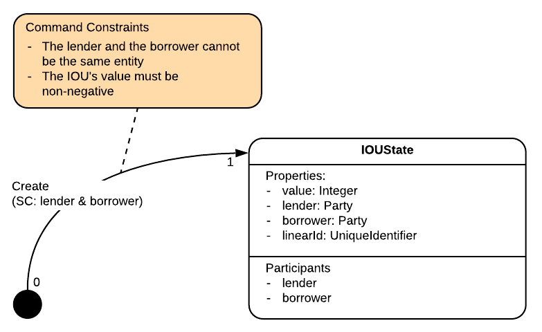

Where SC is short for _Signing Constraints_.

Finally the `Contract` interface, it too has some available implementations:


### Flow

You have learned that flows encapsulate the business process. They create valid transactions agreed between parties. Here there are 2 parties, the lender and the borrower, and they both need to sign off, a.k.a. agree, on the transaction proposal. They want to arrive at a consensus and achieve this state evolution:

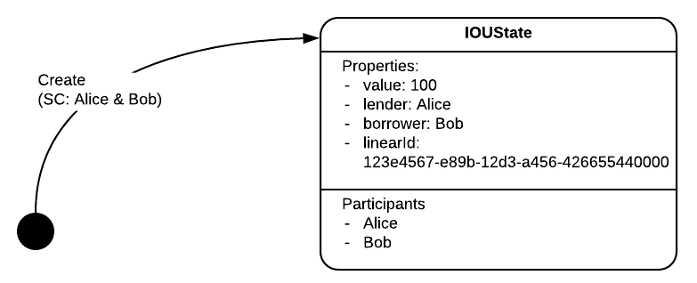

Note the difference from the previous state machine view, seen before. Here, we expressed a single state evolution, one that reaches a state with well-defined values.

To achieve this consensus, the flow goes through a number of steps:

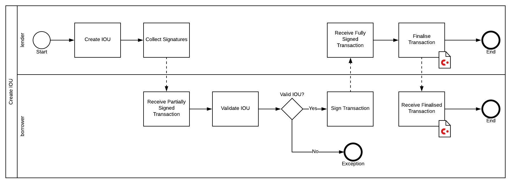

As we will see later, it was a design decision to have the lender initiate the process and for the borrower to then accept the transaction proposal. The back and forth business process is expressed in:

* the [`Initiator extends FlowLogic<>`](https://github.com/corda/samples-java/blob/a61e2cc9910d7d5de83122bf7d36fd071796a7c3/Basic/cordapp-example/workflows-java/src/main/java/com/example/flow/ExampleFlow.java#L33-L35), which, you will notice is annotated with `@InitiatingFlow`.
* the [`Acceptor extends FlowLogic <>`](https://github.com/corda/samples-java/blob/a61e2cc9910d7d5de83122bf7d36fd071796a7c3/Basic/cordapp-example/workflows-java/src/main/java/com/example/flow/ExampleFlow.java#L122-L123), which is annotated with `@InitiatedBy(Initiator.class)`.

In other flow examples you will often see this _initiator_ / _responder_ naming convention.

#### About the Flows

Both classes could be in their own file, and it was again a design decision to encapsulate both as `static` classes inside a class for Java, or in a singleton `object` for Kotlin. Also, it is not immediately apparent that it is the lender that needs to initiate the process, this detail reveals itself in the code.

Flows are pseudo-synchronous processes. They are written as synchronous code which, with the help of [`quasar`](https://github.com/corda/samples-java/blob/a61e2cc9910d7d5de83122bf7d36fd071796a7c3/Basic/cordapp-example/workflows-java/build.gradle#L4), can be _frozen_ and saved to disk, a.k.a. checkpointed; and they can be _revived_ later when necessary. Such _checkpointable_ functions are annotated with [`@Suspendable`](https://github.com/corda/samples-java/blob/a61e2cc9910d7d5de83122bf7d36fd071796a7c3/Basic/cordapp-example/workflows-java/src/main/java/com/example/flow/ExampleFlow.java#L80). And we see that both `Initiator` and `Acceptor` have this `call()` function that is suspendable.

Since a flow can be suspended, there is a mechanism that lets observers know what stage the flow is at. That is the role of the [`progressTracker`](https://github.com/corda/samples-java/blob/a61e2cc9910d7d5de83122bf7d36fd071796a7c3/Basic/cordapp-example/workflows-java/src/main/java/com/example/flow/ExampleFlow.java#L72-L75). [Before](https://github.com/corda/samples-java/blob/a61e2cc9910d7d5de83122bf7d36fd071796a7c3/Basic/cordapp-example/workflows-java/src/main/java/com/example/flow/ExampleFlow.java#L109) and [after](https://github.com/corda/samples-java/blob/a61e2cc9910d7d5de83122bf7d36fd071796a7c3/Basic/cordapp-example/workflows-java/src/main/java/com/example/flow/ExampleFlow.java#L116) checkpoints, or [any](https://github.com/corda/samples-java/blob/a61e2cc9910d7d5de83122bf7d36fd071796a7c3/Basic/cordapp-example/workflows-java/src/main/java/com/example/flow/ExampleFlow.java#L87) [other](https://github.com/corda/samples-java/blob/a61e2cc9910d7d5de83122bf7d36fd071796a7c3/Basic/cordapp-example/workflows-java/src/main/java/com/example/flow/ExampleFlow.java#L99) [point](https://github.com/corda/samples-java/blob/a61e2cc9910d7d5de83122bf7d36fd071796a7c3/Basic/cordapp-example/workflows-java/src/main/java/com/example/flow/ExampleFlow.java#L104) really, it can be updated with a descriptive state.

Our `Initiator` is annotated with `@InitiatingFlow` and our `Acceptor` is annotated with `@InitiatedBy(Initiator.class)`. This means that once the `Initiator` flow has made its first contact with a peer node, the `Acceptor` flow is automatically instantiated on the peer node:

* At this point, the 2 flow instances are connected to each other by a [session id](https://github.com/corda/samples-java/blob/a61e2cc9910d7d5de83122bf7d36fd071796a7c3/Basic/cordapp-example/workflows-java/src/main/java/com/example/flow/ExampleFlow.java#L127) identifying the 1-to-1 link.
* If the initiator makes contact with more than 1 peer node, then there are as many 1-to-1 sessions as there are peer nodes, with 1 responder flow instance per peer node.
* Additionally, if the `Initiator` ever needs to ask more than one piece of information from the `Acceptor` flow, it can keep asking for those pieces on the same session. The `Acceptor` flow would, of course, need to be coded so that it also receives and sends the information in accordance with the **choreography** coded in the `Initiator`.
* Even while 2 peer nodes are linked by a session between 1 instance of an initiator flow and 1 instance of a responder flow, nothing prevents the same 2 peer nodes from creating a new session between 2 flow instances of the same type or of different types.

For the avoidance of doubt, know that **not** all flows come in pairs. Indeed, you may create a so called unary flow to make a calculation, query and return local data or query an external API. Additionally, even if flows come in pairs, there are 2 types of pairs:

* **auto-initiated session pair**, as we have seen above, whereby the flows have been annotated with `@InitiatingFlow` and `@InitiatedBy(XX.class)`.
* **inlined** or **free-riding pair**, whereby the _responder_ is not necessarily automatically awoken by the _initiator_, but instead it is the responsibility of the encapsulating flows to both launch the initiator and the responder at the right point in the choreography, as we'll see with `CollectSignaturesFlow`. Inlined flows always take a flow session among their constructor parameters.

A productive way to look at flows is as small pieces of a workflow that can be composed or chained together in order to achieve a larger orchestration.

Another point is that, in this example, the `Initiator` and the `Acceptor` flows have been coded together by the same developer, and distributed to interested parties. In real life, each party would subclass these flows in order to add custom, and private, code for their internal processes, while sticking to the agreed common **choreography** defined by the base class.

#### `ExampleFlow.Initiator` flow

Here, the initiator flow creates the full transaction proposal and then only sends it for acceptance. So the flow:

* [gathers the notary](https://github.com/corda/samples-java/blob/a61e2cc9910d7d5de83122bf7d36fd071796a7c3/Basic/cordapp-example/workflows-java/src/main/java/com/example/flow/ExampleFlow.java#L84)
* [creates the `IOUState`](https://github.com/corda/samples-java/blob/a61e2cc9910d7d5de83122bf7d36fd071796a7c3/Basic/cordapp-example/workflows-java/src/main/java/com/example/flow/ExampleFlow.java#L90). Notice that `me = getOurIdentity()` is placed in the `lender` position. So really this flow has to be started by the lender. The code could make this a bit more explicit, for instance, when using Kotlin's [named arguments](https://kotlinlang.org/docs/reference/functions.html#named-arguments), like so:

    ```kotlin
    val iouState = IOUState(
        value = iouValue,
        lender = serviceHub.myInfo.legalIdentities.first(),
        borrower = otherParty)
    ```
* [creates a command](https://github.com/corda/samples-java/blob/a61e2cc9910d7d5de83122bf7d36fd071796a7c3/Basic/cordapp-example/workflows-java/src/main/java/com/example/flow/ExampleFlow.java#L91-L93) with the required signers.
* [associates](https://github.com/corda/samples-java/blob/a61e2cc9910d7d5de83122bf7d36fd071796a7c3/Basic/cordapp-example/workflows-java/src/main/java/com/example/flow/ExampleFlow.java#L95) the `IOUState` with the `IOUContract`. This is where the state is actually _pointing_ to the contract that will verify the transaction on its behalf. In fact, the [`BelongsToContract`](https://github.com/corda/samples-java/blob/a61e2cc9910d7d5de83122bf7d36fd071796a7c3/Basic/cordapp-example/contracts-java/src/main/java/com/example/state/IOUState.java#L22) annotation allows the compiler to add cross-checks in order to minimise mistakes. There is the [`StateAndContract`](https://github.com/corda/corda/blob/67e3e09a4edb41d17b8adfa669d671c690c5db33/core/src/main/kotlin/net/corda/core/contracts/Structures.kt#L342) class that you could use too in order [to achieve the same](https://github.com/corda/corda/blob/67e3e09a4edb41d17b8adfa669d671c690c5db33/core/src/main/kotlin/net/corda/core/transactions/TransactionBuilder.kt#L120).
* [verifies locally](https://github.com/corda/samples-java/blob/a61e2cc9910d7d5de83122bf7d36fd071796a7c3/Basic/cordapp-example/workflows-java/src/main/java/com/example/flow/ExampleFlow.java#L101) that the transaction is valid. Do you remember that the contract does not check for the presence of signatures, only of expected signers? Here the contract accepts the transaction before it has been signed.
* [signs it](https://github.com/corda/samples-java/blob/a61e2cc9910d7d5de83122bf7d36fd071796a7c3/Basic/cordapp-example/workflows-java/src/main/java/com/example/flow/ExampleFlow.java#L106) with the lender's signature.
* [opens a peer-to-peer session](https://github.com/corda/samples-java/blob/a61e2cc9910d7d5de83122bf7d36fd071796a7c3/Basic/cordapp-example/workflows-java/src/main/java/com/example/flow/ExampleFlow.java#L111) with the borrower, [without sending](https://github.com/corda/corda/blob/67e3e09a4edb41d17b8adfa669d671c690c5db33/core/src/main/kotlin/net/corda/core/flows/FlowLogic.kt#L144-L149) anything yet. The remote peer will be notified only when an actual request is made.
* [asks for signatures](https://github.com/corda/samples-java/blob/a61e2cc9910d7d5de83122bf7d36fd071796a7c3/Basic/cordapp-example/workflows-java/src/main/java/com/example/flow/ExampleFlow.java#L112-L113) from the borrower. This triggers a checkpoint on the initiating peer as the initiating peer awaits a fully signed transaction.
* at some point it receives the fully signed transaction and carries on.
* [finalises](https://github.com/corda/samples-java/blob/a61e2cc9910d7d5de83122bf7d36fd071796a7c3/Basic/cordapp-example/workflows-java/src/main/java/com/example/flow/ExampleFlow.java#L118), without communicating with the notary in this case because there are no input states, by sending the transaction to the borrower. We could choose to send it to more than the `participants`, for instance to a regulator or observer.

There are quite a number of steps although they should make sense. Notice how, when asking for signatures, it specifically calls [`CollectSignaturesFlow`](https://github.com/corda/corda/blob/67e3e09a4edb41d17b8adfa669d671c690c5db33/core/src/main/kotlin/net/corda/core/flows/CollectSignaturesFlow.kt#L67), which is an inlined flow, not a `@InitiatingFlow`. This means that the `Acceptor` flow will have to respond with the responder [`SignTransactionFlow`](https://github.com/corda/corda/blob/67e3e09a4edb41d17b8adfa669d671c690c5db33/core/src/main/kotlin/net/corda/core/flows/CollectSignaturesFlow.kt#L261) at the appropriate position in the choreographed sequence.

<HighlightBox type="info">

Notice how `CollectSignaturesFlow` asks you to pass [`val sessionsToCollectFrom: Collection<FlowSession>`](https://github.com/corda/corda/blob/67e3e09a4edb41d17b8adfa669d671c690c5db33/core/src/main/kotlin/net/corda/core/flows/CollectSignaturesFlow.kt#L68) the list of sessions to use. Why is that? Can't it not deduce it on itself? You see, `CollectSignaturesFlow` is not `@Initiating`. When you are in an `@Initiating` flow, and you do `initiateFlow(bob)` the first time, you always have the assurance that you just created a new session. That is not the case for inlined flows, like here, which are called from another flow. In this situation, a session may already have been created, so, calling `initiateFlow(bob)` will fail. Therefore these flows have to piggy-back on existing sessions, and that is why, if your inlined flow has a responder, it has to take the pre-existing sessions in its constructor.

</HighlightBox>

#### `ExampleFlow.Acceptor` flow

As mentioned earlier, this flow is annotated with `@InitiatedBy` so that it is bound to and responds to `Initiator` flows, and its sub classes. If you recall, the initiator initiates 2 actions that involve the responder:

1. it calls `CollectSignaturesFlow`
2. and `FinalityFlow`

Neither "sub" flow is annotated with any `@InitiatedBy`, so the responder, as part of its run, **has to** launch their respective responder actions, which, **in order**, are none other than:

1. [calling `SignTransactionFlow`](https://github.com/corda/samples-java/blob/a61e2cc9910d7d5de83122bf7d36fd071796a7c3/Basic/cordapp-example/workflows-java/src/main/java/com/example/flow/ExampleFlow.java#L151), which conditionally adds a signature to the transaction,
2. [and `ReceiveFinalityFlow`](https://github.com/corda/samples-java/blob/a61e2cc9910d7d5de83122bf7d36fd071796a7c3/Basic/cordapp-example/workflows-java/src/main/java/com/example/flow/ExampleFlow.java#L153), which conditionally saves the transaction to the vault.

Fear not, there is no guess-work involved here. If you go to:

* `CollectSignaturesFlow`, you will find the responder [on the same page](https://github.com/corda/corda/blob/68bb7a0e7bb900117c2ed0d9174fea36d3d4aedc/core/src/main/kotlin/net/corda/core/flows/CollectSignaturesFlow.kt#L261).
* `FinalityFlow`, the responder is [documented there](https://github.com/corda/corda/blob/68bb7a0e7bb900117c2ed0d9174fea36d3d4aedc/core/src/main/kotlin/net/corda/core/flows/FinalityFlow.kt#L272) too.

As you may have suspected, it is always a good decision to keep the flow pair in a single file.

#### Security considerations

Now, this `ExampleFlow.Acceptor` flow is automatically spawned when a request arrives. That is a potential security risk. What if this acceptor flow, that you think remains dormant on your node, suddenly accepts any lending proposition that arrives? Will you end up owing money to random peers on the network? Owing money to random peers is not desirable but is not a breakage of the ledger layer, so the contract does not protect you from that. It is the flow's responsibility. Does this example flow protect you from that risk?

Generally, with a traditional off-ledger IOU, a human borrower will want to screen what to accept, via an _inbox_ mechanism. That would require a checkpoint that waits for human input. However, Corda is designed to accommodate rapid, high-volume transactions between counterparties; and so this wait-for-approval pattern is not supported by default. Instead, to facilitate constraints specific to an individual party there is a [`checkTransaction`](https://github.com/corda/corda/blob/68bb7a0e7bb900117c2ed0d9174fea36d3d4aedc/core/src/main/kotlin/net/corda/core/flows/CollectSignaturesFlow.kt#L341) function, which must be overridden any time a `SignTransactionFlow` is instantiated. In our case, the checks are rudimentary:

* there is [one `IOUState`](https://github.com/corda/samples-java/blob/a61e2cc9910d7d5de83122bf7d36fd071796a7c3/Basic/cordapp-example/workflows-java/src/main/java/com/example/flow/ExampleFlow.java#L142-L143) in Java, or [exactly one](https://github.com/corda/samples-java/blob/a61e2cc9910d7d5de83122bf7d36fd071796a7c3/Basic/cordapp-example/workflows-kotlin/src/main/kotlin/com/example/flow/ExampleFlow.kt#L106) in Kotlin.
* the borrowed amount is [not too high](https://github.com/corda/samples-java/blob/a61e2cc9910d7d5de83122bf7d36fd071796a7c3/Basic/cordapp-example/workflows-java/src/main/java/com/example/flow/ExampleFlow.java#L145).

Very simple, and still dangerous, as the borrower could end up owing 100 many times over. After all, this project is meant as an example, and a decision was made not to overburden the beginning developer with this exercise. However, so as not to leave you with the impression that it is impossible to implement a safe responder flow, we are going to wave our hand and give you 2 other ways that can reasonably close this loophole:

1. Use the ledger and ask the borrower to create an "IOU proposal" state that:
    * has the same mentions as the eventual IOU,
    * "is signed" either only by the borrower or only by the lender,
    * and has to be consumed, and verified so by a modified IOU contract, when issuing the IOU proper.

    Only after the proposal has been issued, the party that did not sign the proposal can, and needs to, sign off on the transaction that consumes the proposal and creates the IOU proper for the mentioned amount. In effect, we have split the need for 2 signatures into 2 transactions initiated by each interested party. The fact that each party **initiated** a transaction is enough assurance that they intended the action to happen in the first place.
2. Use a private database, where the borrower:
    1. creates a private table with the allowed lenders and amounts
    2. sub-classes the `Acceptor` where:
        * the `checkTransaction` function atomically:
            1. checks the allowance in the private table, and rejects if there are any inconsistencies,
            2. and soft-locks the valid row in the private table
        * then, after the finalisation, it deletes the soft-locked valid row.

    In effect, what we have achieved here is the borrower hiding its proposal, which is a part of its decision making, while exposing to the world a simple ledger mechanism.

We will see both situations in later chapters.

For the avoidance of doubt, in the `Acceptor`'s flow, the _choreographed_ point is in action where [`subFlow`](https://github.com/corda/samples-java/blob/a61e2cc9910d7d5de83122bf7d36fd071796a7c3/Basic/cordapp-example/workflows-java/src/main/java/com/example/flow/ExampleFlow.java#L151) is called. The previous [instantiation](https://github.com/corda/samples-java/blob/a61e2cc9910d7d5de83122bf7d36fd071796a7c3/Basic/cordapp-example/workflows-java/src/main/java/com/example/flow/ExampleFlow.java#L150) is just that, an instantiation. When called with `subFlow`, the `SignTransactionFlow` picks up from there on its own, it:

* Performs the extra checks.
* Signs the transaction.
* But does not save it into its vault just yet.
* Sends the signed transaction back to the `Initiator`.

Sending the transaction back to the `Initiator` does not involve any checkpointing. Why? We mentioned in an earlier chapter that Corda uses a queue system. Sending the transaction means putting this transaction in the outbound queue, and moving on. When this is done, we are back into the `Acceptor`'s main logic, where the next step is `ReceiveFinalityFlow`, which is in essence a receive command. Here the flow is checkpointed until the transaction is received again from the `Initiator`, a.k.a. when there is data in the inbound queue. To repeat, the checkpointing happens at the start of `ReceiveFinalityFlow`, not at the end of `SignTransactionFlow`.

Finalisation is called explicitly. This is a feature, not a bug. Thanks to that, you can use flows to communicate between nodes, even if the purpose of the communication is not to create an eventual transaction. Additionally, you will not be DoS'd with a flood of irrelevant transactions going to your vault for no reason.

## Conclusion

To recap some of the ideas explained above, below is a swim-lane diagram that displays a possible interaction between 2 peers:

* `@Initiating FlowA`, launched on Alice, initiates `session1` with Bob.
* `FlowA` does a `send`, within `session1`, and keeps working locally.
* `@InitiatedBy(FlowA) FlowAHandler` is triggered on Bob within `session1`.
* `FlowAHandler` does a `receive`, on Bob within `session1`.
* `FlowA` calls (`subFlow`) inlined `FlowB` on Alice within `session1`.
* `FlowB` has a handler, so `FlowAHandler` is coded to call `FlowBHandler`, on Bob within `session1`.
* When `FlowBHandler` sends back to `FlowA`, `FlowA` does some more work then calls `@Initiating FlowC`, on Alice within `session1`.
* This creates a new session on Alice, `session2`, within which `FlowC` runs.
* `@InitiatedBy(FlowC) FlowCHandler` is triggered on Bob within `session2`.
* When `FlowCHandler` sends back to `FlowC` on Alice within `session2`, `FlowC` ends and the flow returns to `FlowA` on Alice within `session1`.
* `FlowA` does some more work, then calls inlined `FinalityFlow` on Alice within `session1`.
* That's why `FlowAHandler` explicitly calls `FinalityFlowHandler`, on Bob within `session1`.


Ok, that was quite the code walkthrough. In the next chapter we will run the project, interact with it, and check back the code when necessary.
