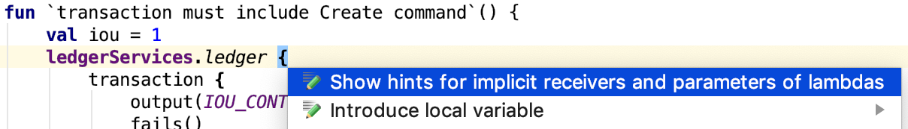
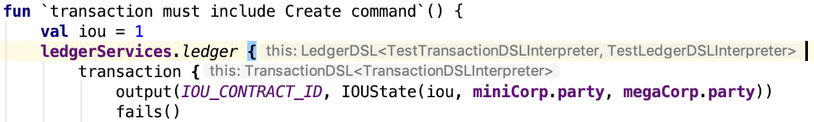
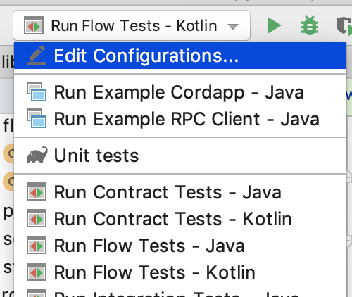
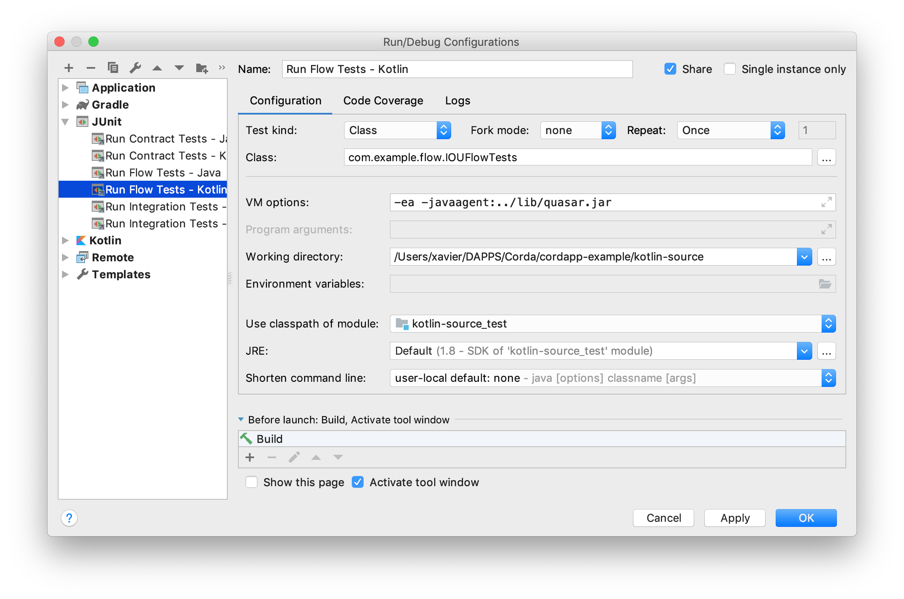
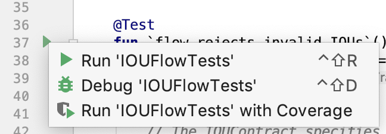

import HighlightBox from "../../src/HighlightBox"

import {MultiCodeBlock} from 'gatsby-theme-apollo-docs';

import {
  ExpansionPanel,
  ExpansionPanelList,
  ExpansionPanelListItem
} from 'gatsby-theme-apollo-docs';

You have already walked through the `cordapp-example` code and how to run it. Now you can go through the unit tests provided.

In this section, you will:

- Test the contract.
- Dig a little deeper into the tests.
- Test the flow.

## Tests on the contract

<HighlightBox type="warn">

Your contract is what preserves your ledger layer's integrity. It's very important, so your tests should be thorough.

</HighlightBox>

The first thing that you will probably notice, is that function names can be [funky](https://github.com/corda/samples-java/blob/a61e2cc9910d7d5de83122bf7d36fd071796a7c3/Basic/cordapp-example/workflows-kotlin/src/test/kotlin/com/example/test/contract/IOUContractTests.kt#L18) in Kotlin. This is a practice accepted only in [tests](https://kotlinlang.org/docs/reference/coding-conventions.html#naming-rules). In [Java](https://github.com/corda/samples-java/blob/a61e2cc9910d7d5de83122bf7d36fd071796a7c3/Basic/cordapp-example/workflows-java/src/test/java/com/example/test/contract/IOUContractTests.java#L23) function names are usually tame by comparison. JUnit5 introduces the concept of [`@DisplayName`](https://junit.org/junit5/docs/current/user-guide/#writing-tests-display-names), which helps achieve similar results. Exercise caution, as JUnit5 has not yet been thoroughly tested with Corda.

The typical contract unit test:

1. Builds a transaction.
2. Then asks the contract(s) to verify it.
3. Then confirms the expectation was met.

1 and 2 is a good approximation of what happens in real life as a Corda node receives a transaction and verifies it before recording it.

Notice these 2 commands:

* [`fails()`](https://github.com/corda/samples-java/blob/a61e2cc9910d7d5de83122bf7d36fd071796a7c3/Basic/cordapp-example/workflows-java/src/test/java/com/example/test/contract/IOUContractTests.java#L27)
* and [`verifies()`](https://github.com/corda/samples-java/blob/a61e2cc9910d7d5de83122bf7d36fd071796a7c3/Basic/cordapp-example/workflows-java/src/test/java/com/example/test/contract/IOUContractTests.java#L29).

They encapsulate 2 things:

1. Run `.verify` for all contracts in the transaction.
2. Confirm the expectation was met. You guessed it:
    1. With `fails()`, the expectation is that it fails.
    2. With `verifies()`, the expectation is that it passes.

`fails` and `verifies` do not modify the transaction they are testing, so you can add [more than 1 calls](https://github.com/corda/samples-java/blob/a61e2cc9910d7d5de83122bf7d36fd071796a7c3/Basic/cordapp-example/workflows-java/src/test/java/com/example/test/contract/IOUContractTests.java#L27-L29) in a single test, conveniently confirming which element was required. If you want to be more strict with your tests (and you should), you may want to add a string to the `fails` assertion, with `failsWith`, or [`'fails with'`](https://github.com/corda/samples-java/blob/a61e2cc9910d7d5de83122bf7d36fd071796a7c3/Basic/cordapp-example/workflows-java/src/test/java/com/example/test/contract/IOUContractTests.java#L43). In particular, if you replace the first [`fails`](https://github.com/corda/samples-java/blob/a61e2cc9910d7d5de83122bf7d36fd071796a7c3/Basic/cordapp-example/workflows-java/src/test/java/com/example/test/contract/IOUContractTests.java#L27) with a `failsWith`, you will notice that the error message is `A transaction must contain at least one command`. This message does not come from the contract, it comes from the [Corda framework](https://github.com/corda/corda/blob/68bb7a0e7bb900117c2ed0d9174fea36d3d4aedc/core/src/main/kotlin/net/corda/core/transactions/WireTransaction.kt#L73). In other words, this `fails` is testing the Corda framework  instead of the `IOUContract` contract. Testing the framework should have no place in our unit tests; perhaps in a separate set of tests that help you learn about the framework.

Ok, testing the text message of the error is not as good as testing the exception type, but unfortunately, all these `requireThat` throw `IllegalArgumentException`, so this is the best we can do with that.

Wait, doesn't a transaction require a notary too? Yes, it was created by default [here](https://github.com/corda/corda/blob/68bb7a0e7bb900117c2ed0d9174fea36d3d4aedc/testing/node-driver/src/main/kotlin/net/corda/testing/node/NodeTestUtils.kt#L23).

### Digging a bit

Speaking of `requireThat` and `NodeTestUtils.kt`, you will recall that it is part of a DSL for contracts. Here too, we have a number of DSLs, this time for the ledger and transactions. Let us dig a little bit; the following is nice-to-know, not a need-to-know.

[`ledgerServices`](https://github.com/corda/samples-java/blob/a61e2cc9910d7d5de83122bf7d36fd071796a7c3/Basic/cordapp-example/workflows-java/src/test/java/com/example/test/contract/IOUContractTests.java#L17) is a mocked `ServiceHub`, the "access-everything-internal interface" that we you remember from the flows. Now, [`ledger(ledgerServices` in Java](https://github.com/corda/samples-java/blob/a61e2cc9910d7d5de83122bf7d36fd071796a7c3/Basic/cordapp-example/workflows-java/src/test/java/com/example/test/contract/IOUContractTests.java#L24) or [`ledgerServices.ledger` in Kotlin](https://github.com/corda/samples-java/blob/a61e2cc9910d7d5de83122bf7d36fd071796a7c3/Basic/cordapp-example/workflows-java/src/test/java/com/example/test/contract/IOUContractTests.java#L24) is not a function of the `ServiceHub` or `MockServices`. And yet it is possible to access it as such because as we have seen, in Kotlin you can define a [function receiver](https://kotlinlang.org/docs/reference/lambdas.html#function-literals-with-receiver), which in this case is defined [here](https://github.com/corda/corda/blob/68bb7a0e7bb900117c2ed0d9174fea36d3d4aedc/testing/node-driver/src/main/kotlin/net/corda/testing/node/NodeTestUtils.kt#L22). Also, notice the [`@file:JvmName` annotation](https://github.com/corda/corda/blob/68bb7a0e7bb900117c2ed0d9174fea36d3d4aedc/testing/node-driver/src/main/kotlin/net/corda/testing/node/NodeTestUtils.kt#L1) to make this function pretend it is a [`static`](https://github.com/corda/samples-java/blob/a61e2cc9910d7d5de83122bf7d36fd071796a7c3/Basic/cordapp-example/workflows-java/src/test/java/com/example/test/contract/IOUContractTests.java#L14) member of a class, and so be usable in [tests in Java](https://github.com/corda/samples-java/blob/a61e2cc9910d7d5de83122bf7d36fd071796a7c3/Basic/cordapp-example/workflows-java/src/test/java/com/example/test/contract/IOUContractTests.java#L24).

A quick note here. If we look into [`NodeTestUtils.transaction`](https://github.com/corda/corda/blob/68bb7a0e7bb900117c2ed0d9174fea36d3d4aedc/testing/node-driver/src/main/kotlin/net/corda/testing/node/NodeTestUtils.kt#L50), we see that it then calls `NodeTestUtils.ledger`. This means that since our contract tests add a single transaction to the test ledger, we could simplify like so:

<MultiCodeBlock>

```java
public void transactionMustIncludeCreateCommand() {
    transaction(ledgerServices, tx -> {
        tx.output(IOUContract.ID, [...]
```

```kotlin
fun `transaction must include Create command`() {
    ledgerServices.transaction {
        output(IOUContract.ID, [...]
```

</MultiCodeBlock>

You will recall that in Kotlin, when the last parameter of a function is a lambda function, this function can be taken out of the `()`. This is why you see no `()` [in Kotlin](https://github.com/corda/samples-java/blob/a61e2cc9910d7d5de83122bf7d36fd071796a7c3/Basic/cordapp-example/workflows-kotlin/src/test/kotlin/com/example/test/contract/IOUContractTests.kt#L19) and you see them [in Java](https://github.com/corda/samples-java/blob/a61e2cc9910d7d5de83122bf7d36fd071796a7c3/Basic/cordapp-example/workflows-java/src/test/java/com/example/test/contract/IOUContractTests.java#L24). Not only that, if you look carefully, you will see that the lambda function named `script` is declared to have [`LedgerDSL` as its receiver](https://github.com/corda/corda/blob/68bb7a0e7bb900117c2ed0d9174fea36d3d4aedc/testing/node-driver/src/main/kotlin/net/corda/testing/node/NodeTestUtils.kt#L24). Thanks to its receiver, this means that inside this lambda function, you have access to all the functions of [`LedgerDSL`](https://github.com/corda/corda/blob/68bb7a0e7bb900117c2ed0d9174fea36d3d4aedc/testing/test-utils/src/main/kotlin/net/corda/testing/dsl/LedgerDSLInterpreter.kt#L132), such as [`transaction`](https://github.com/corda/corda/blob/68bb7a0e7bb900117c2ed0d9174fea36d3d4aedc/testing/test-utils/src/main/kotlin/net/corda/testing/dsl/LedgerDSLInterpreter.kt#L139) without any [`this.` or `ledger.`](https://github.com/corda/samples-java/blob/a61e2cc9910d7d5de83122bf7d36fd071796a7c3/Basic/cordapp-example/workflows-kotlin/src/test/kotlin/com/example/test/contract/IOUContractTests.kt#L20), as you would need [in Java](https://github.com/corda/samples-java/blob/a61e2cc9910d7d5de83122bf7d36fd071796a7c3/Basic/cordapp-example/workflows-java/src/test/java/com/example/test/contract/IOUContractTests.java#L25).

If this is not already the case, you can press <kbd>Alt-Enter</kbd> to get IntelliJ's contextual suggestions:



After which it hints at `this`:



The same tricks apply to [`transaction`](https://github.com/corda/corda/blob/68bb7a0e7bb900117c2ed0d9174fea36d3d4aedc/testing/test-utils/src/main/kotlin/net/corda/testing/dsl/LedgerDSLInterpreter.kt#L140) and its "inner" part [`output`](https://github.com/corda/corda/blob/68bb7a0e7bb900117c2ed0d9174fea36d3d4aedc/testing/test-utils/src/main/kotlin/net/corda/testing/dsl/TransactionDSLInterpreter.kt#L56).

So there you have it, Kotlin syntactic sugar helps us build transactions succinctly in what seems to be like a DSL (Domain Specific Language).

Notice another syntactic help courtesy of Kotlin, using what is called [Implementation by Delegation](https://kotlinlang.org/docs/reference/delegation.html#implementation-by-delegation). Here, [`LedgerDSL`](https://github.com/corda/corda/blob/68bb7a0e7bb900117c2ed0d9174fea36d3d4aedc/testing/test-utils/src/main/kotlin/net/corda/testing/dsl/LedgerDSLInterpreter.kt#L132) delegates its implementation of `LedgerDSLInterpreter<TransactionDSLInterpreter>` [to the constructor argument named `interpreter`](https://github.com/corda/corda/blob/68bb7a0e7bb900117c2ed0d9174fea36d3d4aedc/testing/test-utils/src/main/kotlin/net/corda/testing/dsl/LedgerDSLInterpreter.kt#L133). Kotlin dispenses with the boiler plate that would have you reimplement all the `LedgerDSLInterpreter` functions just to wrap the `interpreter`'s functions.

Let's step out of the rabbit hole.

## Tests on the flow

### Setup

We learned earlier that flows can be checkpointed to disk. Checkpointing to disk is not something that Java does on its own. In our case, this is done with the help of [Quasar](https://github.com/corda/samples-java/blob/a61e2cc9910d7d5de83122bf7d36fd071796a7c3/Basic/cordapp-example/lib/quasar.jar)'s [Java agent](https://www.javacodegeeks.com/2015/09/java-agents.html). In a nutshell, what a Java agent does is run before your code and, most likely, modify your code.

A deployed Corda system is already configured to run Quasar's agent. However, with tests, you rely on IntelliJ, on Gradle, or on your CI server, to run a JVM separate from any knowledge of how Corda operates.

If you configured IntelliJ to use Gradle for build and test, as advised in a previous chapter, then Gradle takes care of [applying the Quasar agent](https://github.com/corda/samples-java/blob/a61e2cc9910d7d5de83122bf7d36fd071796a7c3/Basic/cordapp-example/workflows-java/build.gradle#L4) before running the tests.

<ExpansionPanel title="If you insist on not using Gradle...">

If you insist on using IntelliJ, and not Gradle, to run tests because it is faster, which it is, then you need to tell IntelliJ to use Quasar. And you do it by adding:

```bash
-javaagent:../lib/quasar.jar
```
To the JVM options, or whichever path applies to you. So open the Run configurations:



And add the Java agent parameter:



If you omit it, you will see the [following error](https://github.com/corda/corda/blob/68bb7a0e7bb900117c2ed0d9174fea36d3d4aedc/node/src/main/kotlin/net/corda/node/services/statemachine/SingleThreadedStateMachineManager.kt#L323) when running your tests:

```bash
java.lang.IllegalStateException: Missing the '-javaagent' JVM argument. Make sure you run the tests with the Quasar java agent attached to your JVM.
See https://docs.corda.net/troubleshooting.html - 'Fiber classes not instrumented' for more details.
```
Keep this in mind in particular if you are running the test functions individually, yes you will have to go into the Run configuration again and update that one too.



</ExpansionPanel>

### Walk-through

After that, when you review the content of the tests, it is easy to discern the intent. The [setup](https://github.com/corda/samples-java/blob/a61e2cc9910d7d5de83122bf7d36fd071796a7c3/Basic/cordapp-example/workflows-java/src/test/java/com/example/test/flow/IOUFlowTests.java#L34-L43) mocks a Corda network, creates test parties, registers flows and [flushes the network](https://github.com/corda/corda/blob/68bb7a0e7bb900117c2ed0d9174fea36d3d4aedc/testing/node-driver/src/main/kotlin/net/corda/testing/node/MockNetwork.kt#L399) of all messages once.

Then [the first `flowRejectsInvalidIOUs` test](https://github.com/corda/samples-java/blob/a61e2cc9910d7d5de83122bf7d36fd071796a7c3/Basic/cordapp-example/workflows-java/src/test/java/com/example/test/flow/IOUFlowTests.java#L57-L59) initiates a flow and once again flushes the network. Here, you may want to make it easier for the test to not pass. We expect a failure immediately because the error will be detected in the [initiating flow](https://github.com/corda/samples-java/blob/a61e2cc9910d7d5de83122bf7d36fd071796a7c3/Basic/cordapp-example/workflows-java/src/main/java/com/example/flow/ExampleFlow.java#L101). So we could replace `network.runNetwork()` with `network.runNetwork(1)`.

On the other hand, for the second test, [`signedTransactionReturnedByTheFlowIsSignedByTheInitiator `](https://github.com/corda/samples-java/blob/a61e2cc9910d7d5de83122bf7d36fd071796a7c3/Basic/cordapp-example/workflows-java/src/test/java/com/example/test/flow/IOUFlowTests.java#L67-L70), you would need to give `network.runNetwork(7)` for the test not to time out. This gives you an idea of the back and forth going on here.

Quickly have a look too at [the use](https://github.com/corda/samples-java/blob/a61e2cc9910d7d5de83122bf7d36fd071796a7c3/Basic/cordapp-example/workflows-kotlin/src/test/kotlin/com/example/test/flow/IOUFlowTests.kt#L20-L22) of Kotlin's [`lateinit`](https://kotlinlang.org/docs/reference/properties.html#late-initialized-properties-and-variables) modifier, which lets you declare a variable without initial value, when you know you are going to [define it](https://github.com/corda/samples-java/blob/a61e2cc9910d7d5de83122bf7d36fd071796a7c3/Basic/cordapp-example/workflows-kotlin/src/test/kotlin/com/example/test/flow/IOUFlowTests.kt#L26-L31) before it is first used; and fail hard if you omitted it. And note the use of [`node.transaction`](https://github.com/corda/samples-java/blob/a61e2cc9910d7d5de83122bf7d36fd071796a7c3/Basic/cordapp-example/workflows-java/src/test/java/com/example/test/flow/IOUFlowTests.java#L130) to [wrap some actions on the SQL database](https://github.com/corda/corda/blob/68bb7a0e7bb900117c2ed0d9174fea36d3d4aedc/testing/node-driver/src/main/kotlin/net/corda/testing/node/MockNetwork.kt#L243-L247) and avoid [this kind of error](https://github.com/corda/corda/blob/68bb7a0e7bb900117c2ed0d9174fea36d3d4aedc/node-api/src/main/kotlin/net/corda/nodeapi/internal/persistence/CordaPersistence.kt#L138):

```
java.lang.IllegalStateException: Was not expecting to find existing database transaction on current strand when setting database: Thread[main,5,main], net.corda.nodeapi.internal.persistence.DatabaseTransaction@10874b79
```

The rest of the tests, you shall find out:

* Check that the flow created:
  * The intended transaction.
  * The intended output.
  * The intended signatures.
* Check that the flow saved it all into the vault.

## Conclusion

You now know what tests on a contract and on a flow look like, and what they test. Perhaps you learned a bit about Kotlin's syntax.

In the next chapter, you will step away from the code and think about design.

<ExpansionPanel title="Optional reading list">

* Have a look on your own at [Corda's own testing documentation](https://docs.corda.net/api-testing.html).

</ExpansionPanel>