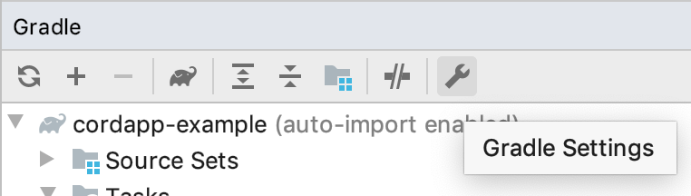
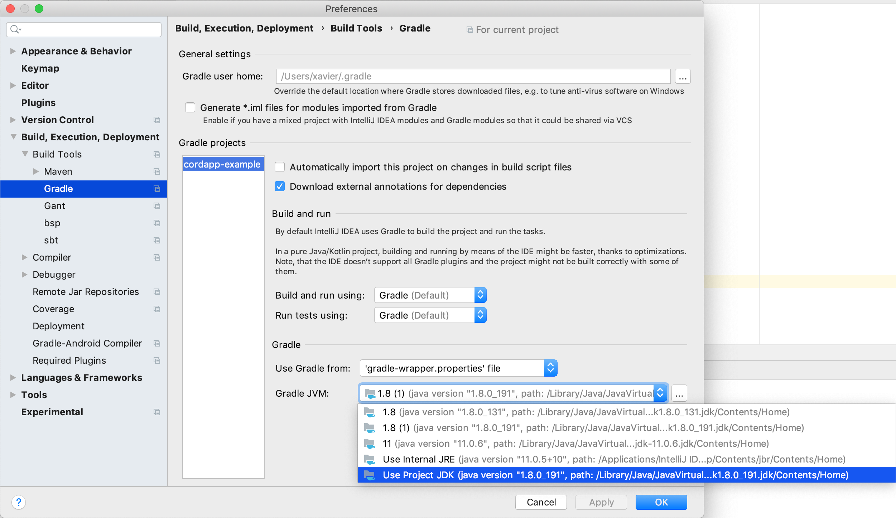
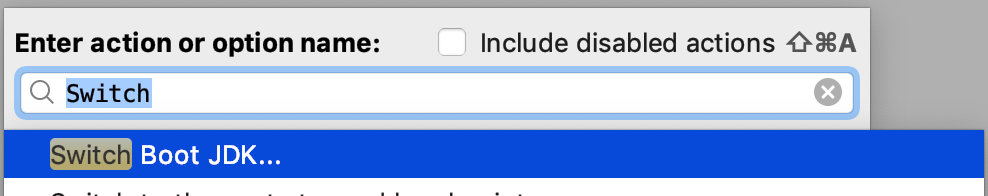
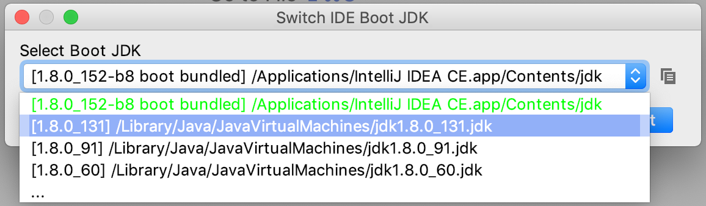

import {
  ExpansionPanel,
  ExpansionPanelList,
  ExpansionPanelListItem
} from 'gatsby-theme-apollo-docs';

You need a number of tools before you can start working on your CorDapp. In this section, you will install a minimal set. You can rely on project configurations to download the rest of the dependencies.

CorDapps (Corda Distributed Apps) are pieces of Java bytecode, so you will need at least a passing familiarity with this language.

In this section, you will:

- Download and install a minimal suite of required tools.
- Check and correct your Java version to Java8.
- Access the Corda Git repository constellation.
- Take a look at new Corda release snapshots.
- Trouble shoot your setup.

This section is an essential requirement if you want to complete the hands-on coding without a hitch. Even seasoned coders should go through this list and check they have the required minimum setup.

## Tooling

Find a thorough guide [here](https://docs.corda.net/docs/corda-os/4.3/getting-set-up.html). The following is the minimal setup to get started:

- **Oracle JDK:** This is important. Be sure to install the [Oracle JDK version 8](https://www.oracle.com/java/technologies/javase/javase-jdk8-downloads.html) (not the JRE) at version 8u171 or higher. If you have a newer version of Java installed, you need to install version 8 alongside your newer version. Below, and later in the course, you will see how you can point Corda to the desired version.
- **IDE:** You may use any Java-able IDE you like. [IntelliJ IDEA Community Edition](https://www.jetbrains.com/idea/download/#section=mac) is this training's first choice and it will be used throughout. In a later section, you will be introduced to Visual Studio Code; not the Web version.
- **Git:** As you may have guessed already, Git is used for source control. If it is not already part of your system, [download and install](https://git-scm.com/downloads) for your OS. If your OS isn't supported, your workaround is to download repositories as Zip files.
- **Gradle:** Corda uses the Gradle build system. However, you do not need to install anything. You will use the IDE's project commands which will download it as necessary.
- **Kotlin:** Corda itself is written in Kotlin which has excellent Java interoperability. CorDapps _can_ be written in Kotlin as well. IntelliJ comes with support for Kotlin so you do not need to install anything extra.

### Java versions

Corda requires Java8, so if you have a more recent version installed, it will likely be the default, potentially causing problems such as:

```
 INFO Cannot initialize scripting support because this JRE does not support it. java.lang.NoClassDefFoundError: javax/script/ScriptEngineManager
```
In case this is relevant, now or in the future, let's collect the different ways available to overcome such hurdles.

1. If you want to run a Java JAR with a different Java version, you can do:

    ```bash
    $ /Library/Java/JavaVirtualMachines/jdk1.8.0_191.jdk/Contents/Home/bin/java -jar corda.jar
    ```
    Where you put the `jdk1.8.0_xxx.jdk` path that works for you.
2. If you want to run a script once with a different `JAVA_HOME`, you can do:

    ```bash
    $ JAVA_HOME=/Library/Java/JavaVirtualMachines/jdk1.8.0_191.jdk/Contents/Home YOUR_SCRIPT
    ```
    Where you put the `jdk1.8.0_xxx.jdk` path that works for you.
3. If you want to run a Gradle command once with a different `java.home`:

    ```bash
    $ ./gradlew -Dorg.gradle.java.home=/Library/Java/JavaVirtualMachines/jdk1.8.0_191.jdk/Contents/Home build
    ```
    Where you replace the path and the command as desired.
4. If you want to do the same for Gradle when launched by double-click from IntelliJ, you open the Gradle Settings  and select the desired version in the drop-down:

    

## Corda repository constellation

R3 has created many repos on [Github](https://github.com/corda), with the most important ones at this stage of your journey being:

- [samples-java](https://github.com/corda/samples-java): if you are looking for a code example, or a way to do something, an example can probably be found there.
- [samples-kotlin](https://github.com/corda/samples-kotlin): the same but in Kotlin.
- [corda](https://github.com/corda/corda/): is the open-source Corda platform code.
- [corda-template-java](https://github.com/corda/cordapp-template-java) / [kotlin](https://github.com/corda/cordapp-template-kotlin): simple project scaffolds to help you get started.

## Snapshots and Releases

The Corda team merges ongoing work into snapshots that may be unstable. Generally, unless you have a very good reason for needing to use a snapshot version or a release candidate, the more cautious approach is to run with major releases which you can find [here](https://github.com/corda/corda/releases).

You will see releases marked “M” for milestone and “RC” for release candidates; the official releases generally include a changelog. For example, at the time of writing, the most current stable release was Corda 4.3.

## Troubleshoot

### IntelliJ's own JDK

It is highly unlikely, but if, at a later stage, you encounter the following:

```
The newly created daemon process has a different context than expected.
Java home is different.
Expecting: '/Applications/IntelliJ IDEA CE.app/Contents/jdk/Contents/Home' but was: '/Library/Java/JavaVirtualMachines/jdk1.8.0_131.jdk/Contents/Home'.
Please configure the JDK to match the expected one.
Open JDK Settings
```
You need to [change the boot SDK](https://intellij-support.jetbrains.com/hc/en-us/articles/206544879-Selecting-the-JDK-version-the-IDE-will-run-under). Note that the fix, may have to be called slightly differently from the help page above: <kbd>Help</kbd> / <kbd>Find Action</kbd> / <kbd>Switch Boot JDK</kbd>:





### Weird missing dependencies

It might happen that IntelliJ and&nbsp;/ or Gradle would say that a dependency is missing, and you have looked around a lot and nothing makes sense. In this rare case, in IntelliJ, consider doing <kbd>File</kbd> -> <kbd>Invalide Caches / Restart...</kbd>.
