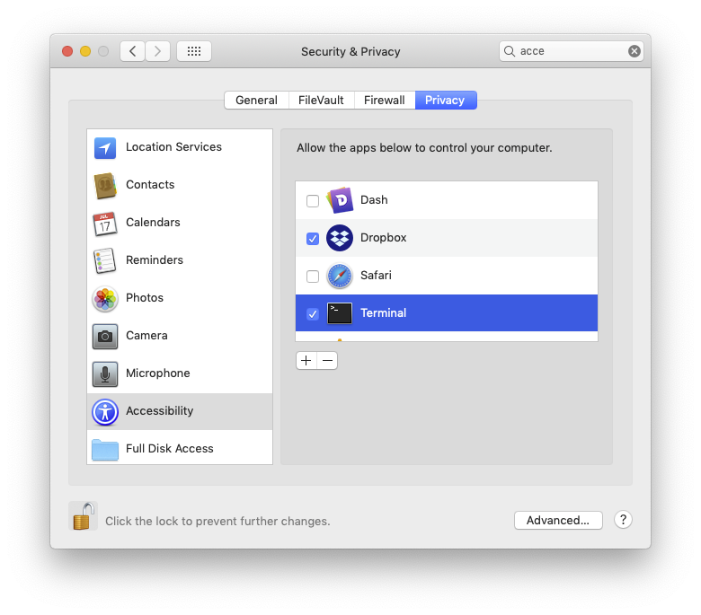

import HighlightBox from "../../src/HighlightBox"

import {MultiCodeBlock} from 'gatsby-theme-apollo-docs';

import {
  ExpansionPanel,
  ExpansionPanelList,
  ExpansionPanelListItem
} from 'gatsby-theme-apollo-docs';

## Build the nodes

In the previous chapter, you looked at the example Cordapp code, here you are going to run it and get a feel of what is going on. You are going to run it all on your computer, in what can be described as a development network.

Running the project in a test and development context is a 3 step process. You will:

1. Declare the configuration.
2. Create the nodes' configuration files.
3. Launch the executables.

Here is a screencast of what comes ahead. You can always come back to it when you hit difficulties doing it on your own.

`vimeo: 417639538`

### Declare the configuration

The configuration is already declared with the help of [`deployNodes`](https://github.com/corda/samples-java/blob/a61e2cc9910d7d5de83122bf7d36fd071796a7c3/Basic/cordapp-example/workflows-java/build.gradle#L70-L114). Each `node` task statically declares a new node and its configuration. Together, these nodes represent a small, though whole, network, complete with a notary. Indeed, however small, a network needs a network map service to help each node connect to the other nodes it will interact with. The `deployNodes` task, among other things, distributes the network information on all declared nodes.

Since all nodes will run on a single machine, all ports need to be unique and assigned. If you did not assign ports, the nodes would all use the [default of 10002](https://github.com/corda/corda-gradle-plugins/blob/a0329ce4532f4cedfd34f9e6862bc8386ab0b76a/cordformation/src/main/kotlin/net/corda/plugins/Node.kt#L59) and that would create a port conflict on a single machine. The p2p address is not mentioned so it will default to [`localhost`](https://github.com/corda/corda-gradle-plugins/blob/a0329ce4532f4cedfd34f9e6862bc8386ab0b76a/cordformation/src/main/kotlin/net/corda/plugins/Node.kt#L27). Now, if you wanted to run your services on different machines, you would update the configuration with externally resolvable names or IPs under the label [`p2pAddress:`](https://github.com/corda/corda-gradle-plugins/blob/a0329ce4532f4cedfd34f9e6862bc8386ab0b76a/cordformation/src/main/kotlin/net/corda/plugins/Node.kt#L112), like so `p2pAddress "192.168.0.15:10006"`.

### Build the configuration files

Be sure you are in your `cordapp-example` working directory. Let us run this build task with:

<MultiCodeBlock>

```shell
$ ./gradlew deployNodes
```

```powershell
C:\cordapp-example> gradlew deployNodes
```

</MultiCodeBlock>

as [explained](https://docs.corda.net/tutorial-cordapp.html#building-the-example-cordapp) by the Corda team.

<ExpansionPanel title="Troubleshooting">
<ExpansionPanelList>
<ExpansionPanelListItem number="1">

#### Did you get this error?

    ```
     INFO Cannot initialize scripting support because this JRE does not support it. java.lang.NoClassDefFoundError: javax/script/ScriptEngineManager
    ```
    If yes, look back at the "Prepare your computer" chapter, and look for the part where running Gradle with a `JAVA_HOME` is described. It differs from your default configuration. That may mean running something like:

    ```bash
    $ ./gradlew -Dorg.gradle.java.home=/Library/Java/JavaVirtualMachines/jdk1.8.0_191.jdk/Contents/Home deployNodes
    ```

</ExpansionPanelListItem>
<ExpansionPanelListItem number="2">

#### Or this one

`Build failed with an exception.` caused by: `error: package com.google.common.collect does not exist`.

To resolve that, open `IOUState.java` and:

- Remove this import: `import com.google.common.collect.ImmutableList;` near line 5.
- Modify `ImmutableList.of(new IOUSchemaV1())` to `Arrays.asList(new IOUSchemaV1())` near line 65.

Also open, `IOUSchemaV1.java` and:

- Remove this import: `import com.google.common.collect.ImmutableList;` near line 3.
- Modify `ImmutableList.of(PersistentIOU.class)` to `Arrays.asList(PersistentIOU.class)` ner line 17.

</ExpansionPanelListItem>
</ExpansionPanelList>
</ExpansionPanel>

This task takes a long time, so this is a good time to refill your cup. Not only does the task take time on its own, but you are running 2 of them - one for `workflows-java` and the other for `workflows-kotlin`.

<HighlightBox type="tip">

In the future, to save time, run only the task for `workflows-java`, like so:

```bash
$ ./gradlew --build-file workflows-java/build.gradle deployNodes
```

</HighlightBox>

With the nodes built, as seen in `./workflows-java/build/nodes`. Inside this folder you will find the different nodes and their `node.conf` files, with their expected parameters. Also, helpfully, certificates have been created.

### Run the nodes

Now that your nodes have been deployed, do as per what the [documentation says](https://docs.corda.net/tutorial-cordapp.html#id1) and run this command:

<MultiCodeBlock>

```shell
$ ./workflows-java/build/nodes/runnodes
```

```powershell
C:\cordapp-example> workflows-java\build\nodes\runnodes
```

</MultiCodeBlock>

You should get 4 pop-up windows; do not move focus away from them until all 4 show the welcome message:

```bash
   ______               __
  / ____/     _________/ /___ _
 / /     __  / ___/ __  / __ `/         I had an account with a bank in the
/ /___  /_/ / /  / /_/ / /_/ /          North Pole, but they froze all my assets
\____/     /_/   \__,_/\__,_/

--- Corda Open Source 4.3 (d679784) -------------------------------------------------------------


Logs can be found in                    : /home/user/corda/r3/samples/cordapp-example/workflows-java/build/nodes/Notary/logs
! ATTENTION: This node is running in development mode!  This is not safe for production deployment.
Advertised P2P messaging addresses      : localhost:10000
RPC connection address                  : localhost:10001
RPC admin connection address            : localhost:10002
Loaded 0 CorDapp(s)                     :
Node for "Notary" started up and registered in 17.03 sec


Welcome to the Corda interactive shell.
Useful commands include 'help' to see what is available, and 'bye' to shut down the node.

Wed Mar 11 12:10:00 CDT 2020>>>
```

<ExpansionPanel title="Troubleshooting">
<ExpansionPanelList>
<ExpansionPanelListItem number="1">

#### Did you get this error?

```
[quasar] ERROR: java/lang/Object
java.lang.IllegalArgumentException
        at co.paralleluniverse.asm.ClassReader.<init>(Unknown Source)
        at co.paralleluniverse.asm.ClassReader.<init>(Unknown Source)
```
If yes, look back to the "Prepare your computer" chapter, and look for the part where running Gradle with a `JAVA_HOME` is described. It differs from your default configuration. That may mean running something like:

```bash
$ JAVA_HOME=/Library/Java/JavaVirtualMachines/jdk1.8.0_191.jdk/Contents/Home workflows-java/build/nodes/runnodes
```

</ExpansionPanelListItem>
<ExpansionPanelListItem number="2">

#### Is your Mac asking you to give some rights to the Terminal

If so, do it, so that one terminal can open other tabs:



</ExpansionPanelListItem>
</ExpansionPanelList>
</ExpansionPanel>

Notice:

<!--
* the `Database connection url` which you will use in H2 console later to explore each node's vault
-->

* the `Node for "Notary"` mention.
* the [quips data bank](https://github.com/corda/corda/blob/67e3e09a4edb41d17b8adfa669d671c690c5db33/node/src/main/kotlin/net/corda/node/internal/NodeStartup.kt#L362).

## Interact with the nodes

You are going to create your first IOU where PartyB owes 50 to PartyA. Because of how the flows are coded:

1. You need to initiate the flow from the lender, i.e. PartyA.
2. PartyB will receive it.
3. PartyC will be oblivious.

To show points 2 and 3, let's prepare PartyB and PartyC with an `IOUState` tracker. On the interactive shells of both nodes of `PartyB` and `PartyC`, run:

```bash
>>> run vaultTrack contractStateType: com.example.state.IOUState
Snapshot:
states: []
statesMetadata: []
totalStatesAvailable: -1
stateTypes: "UNCONSUMED"
otherResults: []

Updates:
Waiting for completion or Ctrl-C ...
```

<ExpansionPanel title="About this command">

This will watch `com.example.state.IOUState` for new states. Notice that the name of the state type to watch has to be the fully qualified name, so must include the package in which it is [declared](https://github.com/corda/samples-java/blob/a61e2cc9910d7d5de83122bf7d36fd071796a7c3/Basic/cordapp-example/contracts-java/src/main/java/com/example/state/IOUState.java#L1):

```java
package com.example.state;
```

</ExpansionPanel>

Then head to the interactive shell of PartyA and launch the `flow` as per [the docs](https://docs.corda.net/docs/corda-os/4.4/tutorial-cordapp.html#creating-an-iou-via-the-interactive-shell):

```bash
# In PartyA
>>> flow start ExampleFlow$Initiator iouValue: 50, otherParty: "O=PartyB,L=New York,C=US"
```

<ExpansionPanel title="About this command">

So, Party A will start (with `Initiator`) the `ExampleFlow` with the other party, Party B. In case `O=PartyB,L=New York,C=US` is unclear, that is PartyB's `name`, which you can find in [`workflows-java/build.gradle`](https://github.com/corda/samples-java/blob/a61e2cc9910d7d5de83122bf7d36fd071796a7c3/Basic/cordapp-example/workflows-java/build.gradle#L97). As a reminder, the network topology, members and certificates were set up by `./gradlew deployNodes`. A production network uses a Network Map Service for name resolution and finding nodes, and a Doorman Service to manage admission.

</ExpansionPanel>

It takes a few seconds because the processes are started lazily. Notice the last line, that looks like:

```
Flow completed with result: SignedTransaction(id=EC06EA903314BE02610032933FBA2392151732CFD87408A4681C3AFEA83C53B1)
```
Head over to PartyC and see that the tracker has not seen anything, but on PartyB, you should see something like:

```
Observation 1: consumed: []
produced:
- state:
    data: !<com.example.state.IOUState>
      value: 50
      lender: "O=PartyA, L=London, C=GB"
      borrower: "O=PartyB, L=New York, C=US"
      linearId:
        externalId: null
        id: "0c0dd4e2-dc4e-4810-aa59-97f6bbe69567"
    contract: "com.example.contract.IOUContract"
    notary: "O=Notary, L=London, C=GB"
    encumbrance: null
    constraint: !<net.corda.core.contracts.SignatureAttachmentConstraint>
      key: "aSq9DsNNvGhYxYyqA9wd2eduEAZ5AXWgJTbTEw3G5d2maAq8vtLE4kZHgCs5jcB1N31cx1hpsLeqG2ngSysVHqcXhbNts6SkRWDaV7xNcr6MtcbufGUchxredBb6"
  ref:
    txhash: "EC06EA903314BE02610032933FBA2392151732CFD87408A4681C3AFEA83C53B1"
    index: 0
flowId: null
type: "GENERAL"
references: []
```
Nice, it worked as expected:

* nothing was consumed: `Observation 1: consumed: []`,
* and a single state was created, or `produced`, with the expected values. This concludes your first interaction with a flow from the command line.

In the next chapter, you will do the same but look deeper into the database.
