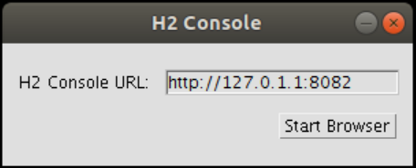
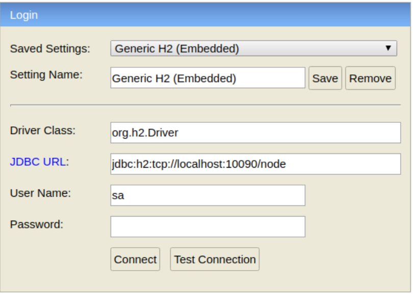
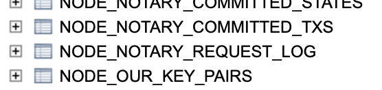
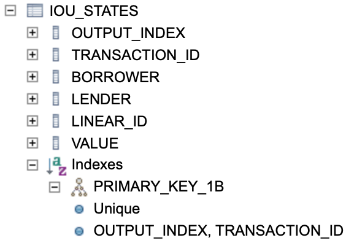
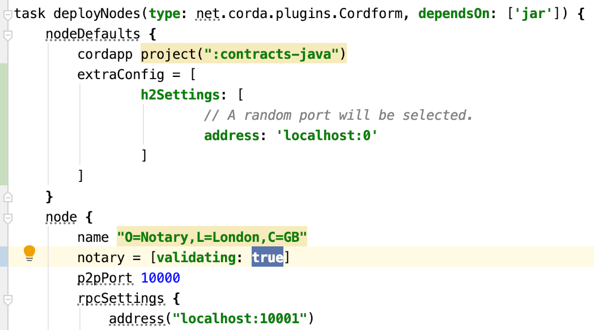
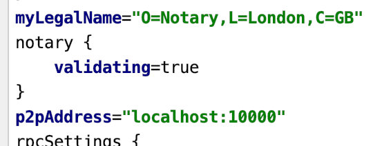

import HighlightBox from "../../src/HighlightBox"

import {MultiCodeBlock} from 'gatsby-theme-apollo-docs';

import {
  ExpansionPanel,
  ExpansionPanelList,
  ExpansionPanelListItem
} from 'gatsby-theme-apollo-docs';

In this section, you will take a medium-deep dive into Corda and SQL databases.

You will do the following:

* Dig a little deeper into the SQL database.
* Install the H2 console.
* Configure the nodes.
* Troubleshooting.
* Look at empty states.
* Create your second IOU.
* Confirm your IOU.
* More troubleshooting.
* Create a third IOU.

If you have never dealt with SQL databases, and have no intention of doing so, you can skip this chapter.

Here is a screencast of what comes ahead. You can always come back to it when you hit difficulties doing it on your own.

`vimeo: 417639615`

## Database digging

Care to peak into the databases of the nodes and see in detail what was stored? The problem is, the database is not accessible with an external tool. You need to do some additional configuration steps.

The database used in a development network is H2. To access it, you need to:

* Install some H2 software
* Reconfigure your nodes

### Install the H2 console

[Follow the instructions](https://docs.corda.net/docs/corda-os/4.3/node-database-access-h2.html#connecting-using-the-h2-console) to install the H2 Console. What the "JDBC URL" is will become clear shortly.

### Configure the nodes

Stop your running nodes by typing `bye` into each shell. You will have to press ctrl-c in the shells for nodes Party B and Party C to return to the shell prompt.

then, inside `workflow-java/build.gradle`'s [`deployNodes.nodeDefaults`](https://github.com/corda/samples-java/blob/a61e2cc9910d7d5de83122bf7d36fd071796a7c3/Basic/cordapp-example/workflows-java/build.gradle#L71-L73), set the H2 database port by adding the below section:

```groovy
extraConfig = [
    h2Settings: [
        // A random port will be selected.
        address : 'localhost:0'
    ]
]
```
Then:

1. Build the nodes as you did earlier
2. Run the nodes as you did earlier

On each running node shells, you should see a new line, like:

```
Database connection url is              : jdbc:h2:tcp://localhost:59196/node
```
Here for instance, the JDBC URL to use is `jdbc:h2:tcp://localhost:59196/node`.

Now start the H2 console, run `sh /bin/h2/bin/h2.sh` or from whichever location you placed it (on Windows, launch H2 Console from the Start Menu). A window may pop up to prompt for the H2 Console URL (accept the default) or it may proceed directly to the login console, depending on your OS and the implementation:



Each time you click "Start Browser" a new tab in your default browser will open showing H2's login console:



As mentioned earlier, each node terminal displays the `Database connection url `, so if you want to connect to a given node just copy the URL and paste it in `JDBC URL` in H2's login console. Don't change anything else. Click "Connect".

<ExpansionPanel title="Troubleshooting">
<ExpansionPanelList>
<ExpansionPanelListItem number="1">

#### Error in SQL statement

On rare occasions, you may get an error that looks approximately like this:

```bash
Syntax error in SQL statement "SET FORBID_CREATION[*] TRUE"; expected "@,
AUTOCOMMIT, MVCC, EXCLUSIVE, IGNORECASE, PASSWORD, SALT, MODE, COMPRESS_LOB,
DATABASE, COLLATION, BINARY_COLLATION, UUID_COLLATION, CLUSTER,
DATABASE_EVENT_LISTENER, ALLOW_LITERALS, DEFAULT_TABLE_TYPE, CREATE,
HSQLDB.DEFAULT_TABLE_TYPE, PAGE_STORE, CACHE_TYPE, FILE_LOCK, DB_CLOSE_ON_EXIT,
AUTO_SERVER, AUTO_SERVER_PORT, AUTO_RECONNECT, ASSERT, ACCESS_MODE_DATA,
OPEN_NEW, JMX, PAGE_SIZE, RECOVER, NAMES, SCOPE_GENERATED_KEYS, SCHEMA,
DATESTYLE, SEARCH_PATH, SCHEMA_SEARCH_PATH, JAVA_OBJECT_SERIALIZER, LOGSIZE,
FOREIGN_KEY_CHECKS"; SQL statement:
SET FORBID_CREATION TRUE [42001-200] 42001/42001 (Help)
```

Find the process called `javaw.exe` (or similar, depending on your OS). Terminate it. It will be restarted the next time you call for the H2 Console. Alternatively, reboot your system to resolve the issue. In effect, this is how to restart the server the console relies on. You can confirm that the process you are thinking of terminating is the console server (which may be hung or malfunctioning) by verifying that the process is indeed listening on the same port the browser is inspecting, normally port 8082.

</ExpansionPanelListItem>
</ExpansionPanelList>
</ExpansionPanel>

### Empty states

Start by connecting to your notary on your first H2 tab. Click on `NODE_NOTARY_REQUEST_LOG`:



This should populate the query field with `SELECT * FROM NODE_NOTARY_REQUEST_LOG`. Press <kbd>Run</kbd>. There are no rows. This means that as of now you have not had any state that was consumed.

On another tab, connect to PartyA. Click on `VAULT_STATES` and <kbd>Run</kbd>. Again, empty.

### Create your second IOU

Well, it will be the first as far as these newly reconfigured nodes are concerned. Just like before, run this in the shell on the PartyA node:

```bash
>>> flow start ExampleFlow$Initiator iouValue: 50, otherParty: "O=PartyB,L=New York,C=US"
[...]
Flow completed with result: SignedTransaction(id=EC06EA903314BE02610032933FBA2392151732CFD87408A4681C3AFEA83C53B1)
```

Back to PartyA's H2 browser tab. Rerun the `VAULT_STATES` query. Now you have 1 state. The IOU you just created. Notice how the state mentions:

* The transaction id of the transaction that created it
* The `output_index` of `0`, it was the only output after all
* The contract class name that it is associated with
* The notary name that will record its eventual consumption
* The interestingly named [state_status](https://github.com/corda/corda/blob/67e3e09a4edb41d17b8adfa669d671c690c5db33/node/src/main/kotlin/net/corda/node/services/vault/VaultSchema.kt#L61-L62), which is now [unconsumed](https://github.com/corda/corda/blob/67e3e09a4edb41d17b8adfa669d671c690c5db33/core/src/main/kotlin/net/corda/core/node/services/VaultService.kt#L124-L126)

Now, run the same `*` query on another table: `SELECT * FROM IOU_STATES `. Here again, you have a single state:


And yes, it displays expected values, with, you will note, the same column names as were defined in the `IOUState`'s [schema](https://github.com/corda/samples-java/blob/a61e2cc9910d7d5de83122bf7d36fd071796a7c3/Basic/cordapp-example/contracts-java/src/main/java/com/example/state/IOUState.java#L56-L59).

You will recall that a state is uniquely identified by the transaction that created it, and its index in the list of created outputs. This pair of identifiers is neatly packaged in the [`StateRef`](https://github.com/corda/corda/blob/67e3e09a4edb41d17b8adfa669d671c690c5db33/core/src/main/kotlin/net/corda/core/contracts/Structures.kt#L154-L163) class. Therefore, you should expect to see this pair in different places:

* In both `IOU_STATES` and `VAULT_STATES`, their primary key is the pair `(OUTPUT_INDEX, TRANSACTION_ID)`. Both values were persisted thanks to the [parent schema of `PersistentIOU`](https://github.com/corda/samples-java/blob/a61e2cc9910d7d5de83122bf7d36fd071796a7c3/Basic/cordapp-example/contracts-java/src/main/java/com/example/schema/IOUSchemaV1.java#L22), i.e. the schema of [`PersistentState`](https://github.com/corda/corda/blob/67e3e09a4edb41d17b8adfa669d671c690c5db33/core/src/main/kotlin/net/corda/core/schemas/PersistentTypes.kt#L85):

    
* In the notary, which [keeps track](https://github.com/corda/corda/blob/67e3e09a4edb41d17b8adfa669d671c690c5db33/core/src/main/kotlin/net/corda/core/internal/notary/SinglePartyNotaryService.kt#L35-L36) of the <del>unspent</del> unconsumed `StateRef`s.

Open 2 other tabs to your H2 console and connect to PartyB and PartyC. You can confirm that:

* PartyB has the same `IOU_STATE` and almost the same `VAULT_STATES`. The `VAULT_STATES` of PartyB may be a second behind PartyA. The reason for this is that it is PartyA that controls the initiating flow and it was finalised on PartyA first.
* PartyC has no `IOU_STATE` and no `VAULT_STATES`. It was not a party to this IOU so it has no knowledge of it.

### Digging deeper in the DB

Let us look at what else is in the database of PartyA.

Run `SELECT * FROM NODE_ATTACHMENTS`. You should receive your `CorDapp Example` contracts found in `workflows-java/build/nodes/PartyA/cordapps/`. Furthermore, when you run `SELECT * FROM NODE_ATTACHMENTS_CONTRACTS`, you will see your `IOUContract` associated with the attachment in question. Note that PartyC also has the same attachments. In effect, the vault has been primed with these jar files. It has not waited for a flow to add them. And indeed, a flow does not add jars, as you will see below.

If you run `SELECT * FROM NODE_INFO_HOSTS`,  you get 4 rows, one for each Notary and PartyA to C as defined in `build.gradle`. You can look at a few other tables that all deal with identities.

If you run `SELECT * FROM NODE_TRANSACTIONS`, you will see one row. The state machine id is that of the machine that ran the creation [flow](https://github.com/corda/corda/blob/67e3e09a4edb41d17b8adfa669d671c690c5db33/core/src/main/kotlin/net/corda/core/internal/FlowStateMachine.kt#L41) of this transaction. Recall that a flow may be checkpointed to disk. This is what this state machine represents. It is the machine in which the flow unfolds.

### Confirm your IOU

Turn your attention from the database to PartyA's interactive shell:

```yaml
>>> run vaultQuery contractStateType: com.example.state.IOUState
```
You get a composite object of `IOU_STATES`, `NODE_ATTACHMENTS`, `VAULT_STATES` and `VAULT_LINEAR_STATES_PARTS`.

This `vaultQuery` command was declared [here](https://github.com/corda/corda/blob/67e3e09a4edb41d17b8adfa669d671c690c5db33/node/src/main/kotlin/net/corda/node/internal/CordaRPCOpsImpl.kt#L325).

### More shell commands

There are other commands found in this file. Let us try:

```yaml
>>> run
run
Command                                        Parameter types
-----------------------------------------------------------------------------------
acceptNewNetworkParameters                     parametersHash: SecureHash
addVaultTransactionNote                        txnId: SecureHash, txnNote: String
attachmentExists                               id: SecureHash
clearNetworkMapCache
...
>>> run registeredFlows
[
  "com.example.flow.ExampleFlow$Initiator",
  "net.corda.core.flows.ContractUpgradeFlow$Authorise",
  "net.corda.core.flows.ContractUpgradeFlow$Deauthorise",
  "net.corda.core.flows.ContractUpgradeFlow$Initiate",
  "net.corda.finance.flows.CashConfigDataFlow",
  "net.corda.finance.flows.CashExitFlow",
  "net.corda.finance.flows.CashIssueAndPaymentFlow",
  "net.corda.finance.flows.CashIssueFlow",
  "net.corda.finance.flows.CashPaymentFlow"
]
```
You get the same list as `flow list`.

[Here](https://github.com/corda/corda/blob/67e3e09a4edb41d17b8adfa669d671c690c5db33/node/src/main/kotlin/net/corda/node/internal/CordaRPCOpsImpl.kt#L299), you see you can ask:

```yaml
>>> run partiesFromName query: Party, exactMatch: false
[
  "O=PartyA, L=London, C=GB",
  "O=PartyC, L=Paris, C=FR",
  "O=PartyB, L=New York, C=US"
]
```
If you are curious about how this parameter passing works its magic, look [over here](https://docs.corda.net/shell.html#parameter-syntax) for Parameter syntax.

### Create your third IOU

Again, you will use PartyA as the lender, but PartyC will now be the borrower. This time, you are going to experiment with a checkpointed state machine. You will remember that a checkpoint happens when a flow is waiting for something coming from elsewhere. In the IOU case, PartyA has to wait for PartyC to return the transaction it signed. It is at this point that PartyA will checkpoint. PartyA will checkout whether PartyC is running or stopped.

However, for PartyA's checkpointed state to last long enough for you to see it, you will first stop PartyC. Type `bye` into PartyC's shell. While you are at it, also stop the Notary.

```bash
# On PartyC:
>>> bye
# On Notary:
>>> bye
```

Now back in PartyA's shell:

```yaml
>>> flow start ExampleFlow$Initiator iouValue: 20, otherParty: "O=PartyC, L=Paris, C=FR"
       Generating transaction based on new IOU.
       Verifying contract constraints.
       Signing transaction with our private key.
       Gathering the counterparty's signature.
          Collecting signatures from counterparties.
            Verifying collected signatures.
```
It remains stuck at `Collecting signatures from counterparties`. That makes sense because PartyC is down. You will note that the steps are made explicit [in the code](https://github.com/corda/samples-java/blob/a61e2cc9910d7d5de83122bf7d36fd071796a7c3/Basic/cordapp-example/workflows-java/src/main/java/com/example/flow/ExampleFlow.java#L40-L43) itself.

Do not interrupt PartyA's flow. Return to your H2 console connected to PartyA and run the following queries:

* `SELECT * FROM IOU_STATES`, no new IOU, only the previous one. The transaction proposal is still in PartyA's message queue so, nothing has been persisted.
* `SELECT * FROM NODE_CHECKPOINTS` returns 1 line. Interesting. This is what happened when the initiator flow [handed over to the responder flow](https://github.com/corda/samples-java/blob/a61e2cc9910d7d5de83122bf7d36fd071796a7c3/Basic/cordapp-example/workflows-java/src/main/java/com/example/flow/ExampleFlow.java#L112-L113) on the other party. The state machine was checkpointed to disk, and the flow is in effect, [suspended](https://github.com/corda/samples-java/blob/a61e2cc9910d7d5de83122bf7d36fd071796a7c3/Basic/cordapp-example/workflows-java/src/main/java/com/example/flow/ExampleFlow.java#L80).

Ok, start PartyC again. You will start the individual node from the `workflows-java/build/nodes` folder that was created by `./gradle deployNodes`.

<MultiCodeBlock>

```shell
$ cd workflows-java/build/nodes/PartyC
$ java -jar corda.jar
```

```powershell
C:\example-cordapp> cd workflows-java\build\nodes\PartyC
C:\PartyC> java -jar corda.jar
```

</MultiCodeBlock>

<ExpansionPanel title="Troubleshooting">
<ExpansionPanelList>
<ExpansionPanelListItem number="1">

#### Did you get this error?

```
[quasar] ERROR: java/lang/Object
java.lang.IllegalArgumentException
        at co.paralleluniverse.asm.ClassReader.<init>(Unknown Source)
        at co.paralleluniverse.asm.ClassReader.<init>(Unknown Source)
```
If yes, look back at the "Prepare your computer" chapter, and look for the part about running a JAR with a different version than your default. That may mean running something like:

```bash
$ /Library/Java/JavaVirtualMachines/jdk1.8.0_191.jdk/Contents/Home/bin/java -jar corda.jar
```

</ExpansionPanelListItem>
</ExpansionPanelList>
</ExpansionPanel>

Back to PartyA's shell. It takes perhaps a minute for it to retry again and finish the flow. Notice how it also went through the "Notary" parts even though the notary is down. Indeed, the transaction proposal has no input states so no Notary is involved.

Again, you can go to your H2 console and confirm the new state has been persisted and there is no longer any node checkpoint.

## Tweak at the edges

### Verifying notary

You have seen that the notary was not contacted on creation of the IOU. And, since you have yet no flow that consumes an input state, you have no way of observing the notary's inner workings.

What if you said the notary should also be `validating`? In `workflows-java/build.gradle`:



Make the change, be sure your working directory is `samples/cordapp-example` and recreate the nodes with `./gradlew --build-file workflows-java/build.gradle deployNodes`. Confirm the change has been effected in the `build/nodes/Notary/node.conf` file:



Here you need to close all the previously launched nodes. That is 4 terminal tabs in all. You should also close your H2 Console browser tabs because the nodes are configured to use random database ports. Then:

* Launch `workflows-java/build/nodes/runnodes` afresh.
* Stop the Notary and PartyB.
* In PartyA, run `>>> flow start ExampleFlow$Initiator iouValue: 50, otherParty: "O=PartyB,L=New York,C=US"`
* Confirm it waits at `Collecting signatures from counterparties.`
* Restart PartyB (from `workflows-java/build/nodes/PartyB` run `java -jar corda.jer`).
* Return to PartyA and, after a minute or so, confirm it completes - all the way to the end.

The notary was not contacted (not needed), even when the notary is `validating: true`. Why is that? Recall that the Notary proves uniqueness of the transaction inputs to ensure they can be consumed only once. There were no inputs in _this_ transaction, so the notary was not consulted.

### Potential `.jar` injection?

Ok, so your `Acceptor` flow can be triggered remotely by a party that launches the `Initiator` flow. Is this so mechanical? You saw that your `nodes/PartyA/cordapps/cordapp-example-contracts-0.1.jar` file was referred to in the H2 database as an attachment. So now, redeploy your nodes and remove this jar file from PartyB:

* Delete the whole `workflows-java/build` folder
* Run `./gradlew --build-file workflows-java/build.gradle deployNodes`
* Remove the `workflows-java/build/nodes/PartyB/cordapps/cordapp-example-contracts-0.1.jar` file manually
* Run `workflows-java/build/nodes/runnodes`

Now open a H2 console to PartyB, run the queries `SELECT * FROM NODE_ATTACHMENTS` and `SELECT * FROM NODE_ATTACHMENTS_CONTRACTS`, and sure enough, the result set is empty.

Now in PartyA, run `>>> flow start ExampleFlow$Initiator iouValue: 50, otherParty: "O=PartyB,L=New York,C=US"`. You get:

```bash
   Gathering the counterparty's signature.
       Collecting signatures from counterparties.
       Verifying collected signatures.
...
   Counter-flow errored
```
That is good to hear. The node needs to enable the contract jar files if it wants to, in effect, reply to approved flows. You can do something similar by removing only `cordapp-example-workflows-0.1.jar`. It will simply never reply - a dead-letter.

<ExpansionPanel title="Optional reading list">

* [Overview of the Corda State Machine](https://www.corda.net/blog/overview-of-the-corda-state-machine/)

</ExpansionPanel>
