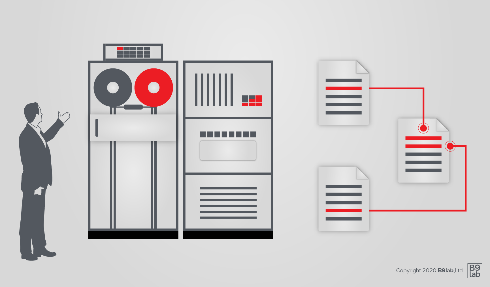

To put blockchain into context we are going all the way back to the advent of computing. 
The aim of this and the following modules is to give you a sense of how blockchain technology fits into the overall development of computing and what concepts it draws from.

Of course all of this is known to you, but let us start by taking a look at data and databases, the developmental steps and concepts involved.

First, a few definitions:

* Data is a series of one or more symbols given meaning by acts of interpretation.
* A database is an organised collection of data.
* A database management system (DBMS) is a program (or system), used to manage and interact with a database.

The history of databases is often categorised into 3 different eras: navigational, relational and post-relational databases.

Let us have a closer look at the different types of databases and their evolution in time.

<!-- Data and Databases https://www.youtube.com/watch?v=8BhzjcF79B8 -->
