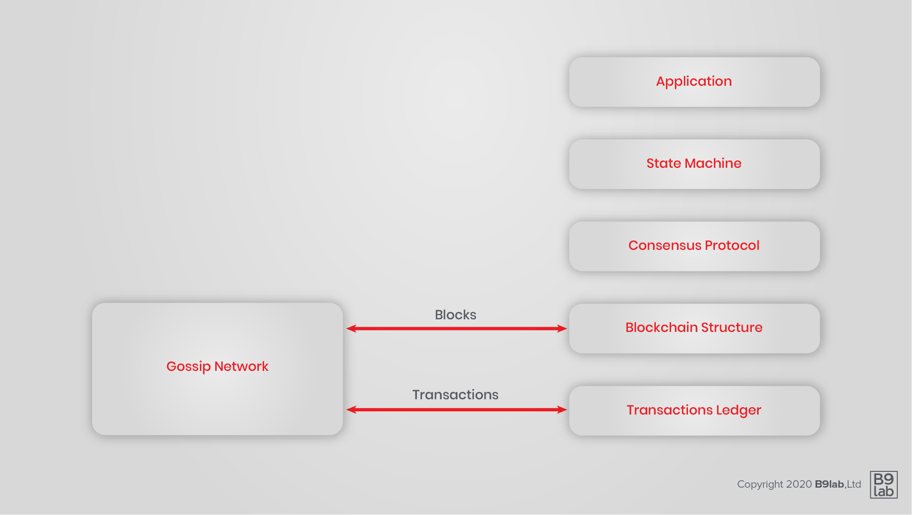
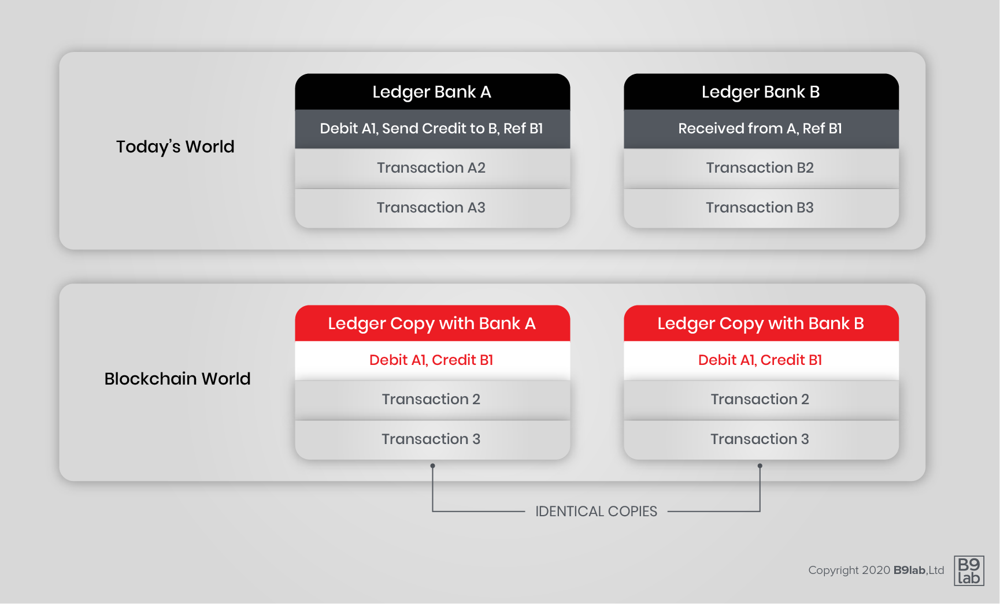
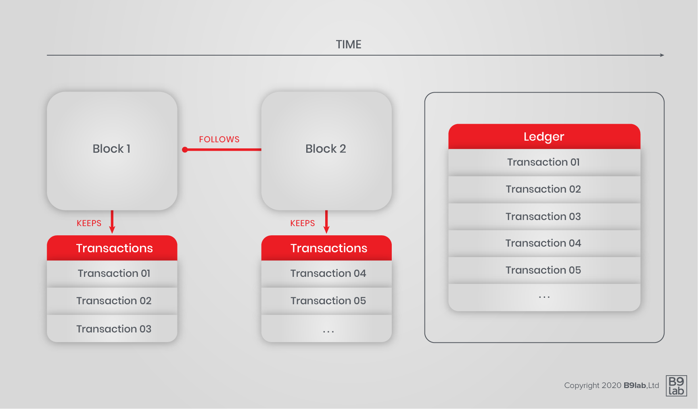
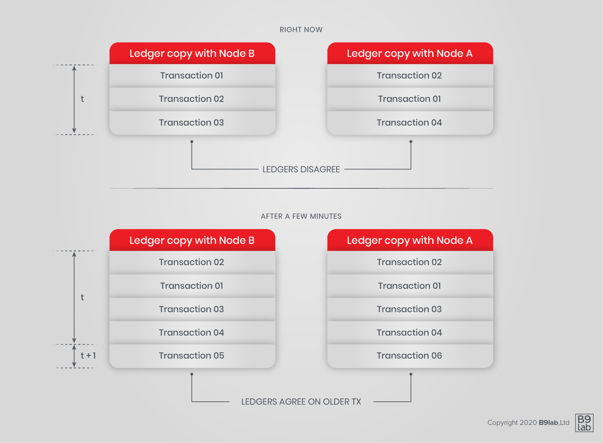
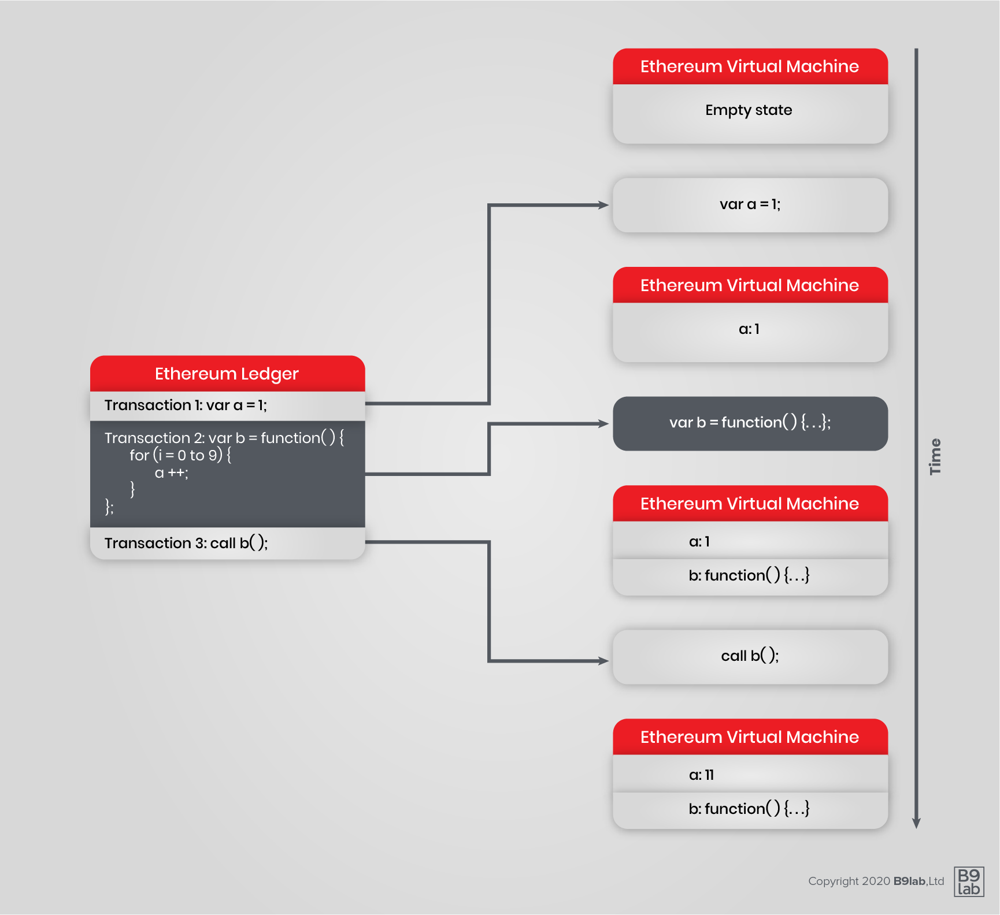
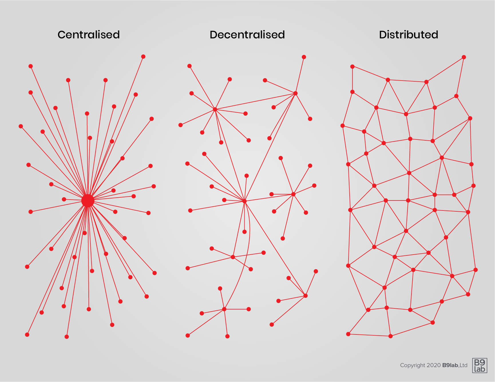

### What

Blockchain is a complex and rapidly evolving technology. It took many bright minds many years of development, plus a combination of advances in cryptography, distributed computing and economics to arrive at the current technology. So, expect grasping blockchain to require serious effort.

There are many different ways to look at blockchain technology. In order to give you a thorough understanding and a complete view we do not restrict ourselves to one definition of blockchain but give you multiple. In the OSI network model fashion, we can break down the technology thus:

### Transaction you say?

A transaction is an atomic event - an event whose parts make no sense in isolation.

If the word _transaction_ conjures up a financial transaction in your mind, this is indeed appropriate. For instance, a single transaction may be described as follows:

* reduce account A by $10
* increase account B by $9
* increase account C by $1

We immediately understand this transaction as a payment. If you were told only "reduce account A by \$10" happened, you would rightfully ask where did those \$10 go? This is what it means to be atomic.

If the word _transaction_ conjures up an SQL transaction in your mind, this too is appropriate. For instance, technology permitting, a single transaction may be described as follows:

* charge customer for \$10
* ship 1 widget
* add 1 en-route shipment for customer
* reduce widget stock by 1

In the context of blockchain, a transaction is any atomic event that is allowed by the underlying protocol.

### Blockchain as a distributed ledger

In this definition:

* a transaction is an atomic event
* the blockchain is the ordered list of all transactions since inception

Banks, especially, are prone to identify blockchain as a distributed ledger as it indeed dovetails with their world models.

In this view, instead of each bank relying exclusively on their own table of accounts in their own siloed (SQL) databases, the blockchain offers the promise of consolidating the table of accounts of one bank with the table of accounts of another bank, typically in the case of a transaction between accounts. At the moment, this is done through netting and then settlement via central bank or corresponding accounts, which turns out to be expensive and time-consuming.

That is one reason why transactions between banks, especially if in different countries, take so long.

The blockchain's elegant solution is to use a single transaction to update separate tables of accounts for the whole network, i.e. of all participating banks. Banks view this technology, at the very least, as an opportunity to reduce operational costs by using a common, distributed ledger with their peers.

(cf. R3 Distributed Ledger Group)

### Blockchain as a data structure

As the name suggests, a blockchain is a chain of blocks (cf. Nakamoto).

In this view:

* a transaction is, as ever, an atomic event
* a block is a list of transactions in a set sequence
* a blockchain is a well-ordered set of blocks (cf. Blockstream)

### Blockchain as a decentralised consensus network

A blockchain is a well-ordered set of data, on which all peers *eventually* agree.
What all participants agree upon is construed as the single truth.
This single truth is the single true state of the distributed ledger.

### Blockchain as a digital common

There is much talk about tech giants milking their positions and monetising data generated by users of their open platforms. Because they are ultimately in control of their platforms, they can erect barriers, censor and seek rents.

The blockchain, as a distributed system, is, in a way, in charge of itself. To participate may not be free (as in _free beer_), but is nonetheless governed by rules defined in the protocol and enforced by all participants, and as such can be seen as free (as in _free speech_). However small, an honest participant, contributes to the enforcement of the protocol rules.

Additionally, a blockchain-based organisation could decide on how to reward participants, and evolve such reward structure. This would be different from current organisations that are typically defined at the outset.

In this, and other, regard, blockchain can be seen as a digital common. Or any number of digital commons.

### Blockchain as a new computing paradigm

Imagine a computer, how do you describe its working? It takes commands then executes them in an ordered and deterministic fashion. The sequence of execution determines the state the computer is in.

Ethereum is a blockchain that implements Turing-complete Smart Contracts, like Hyperledger Fabric. Each transaction is in effect a command, and the "execution" of all these commands results in a state that is the Ethereum computer's state. Each new transaction changes the state of this computer. In effect an Ethereum blockchain defines a distributed state machine, a world computer, the state of which all nodes agree on.

With this introduction, a smart contract is a program on the world computer, a distributed application (or DApp) is one too, as is a coordinated collection of smart contracts.

## Blockchain as a Merge of Data Storage and Network

In the history of computing, data storage and network have long been kept separate, essentially because the former was adopted long before the latter.
Storage was then *connected* to the network.

Blockchain merges these two concepts into one by combining elements of databases with a P2P network.
The data storage is done as in a decentralised database.
In addition, blockchain also describes a network typology, since it relies on P2P networking.

This has immense implications on the techno-social systems building on top of the technological layer.

See Vinay Gupta elaborate on the [significance of blockchains](https://vimeo.com/161183966).

### Distributed vs. Decentralised

The degree of decentralisation has vast implications on the functioning of a network.

There is great debate as to what properly constitutes distributed as opposed to decentralised systems. In addition, systems can in fact be a mix of both.

In 1964, before major discoveries and developments such as public key crypto systems and P2P networking, Paul Baron published a paper [*On Distributed Communications*](https://www.rand.org/content/dam/rand/pubs/research_memoranda/2006/RM3420.pdf).
In it, he attempted to differentiate between diverse degrees of decentralisation.
Networks could be either centralised, decentralised or distributed.

In Baran’s conceptualisation of the degree of centralisation, he identified a spectrum of network typologies - centralisation and decentralisation were attributes introduced long before to describe political systems and power structures.
The main point of differentiation between the different typologies is the number of so-called points of failures.
Centralised networks only have one point of failure, whereas erasing point of failure leads to less centralisation and towards a distributed network.
A point of failure can be understood as a node or part of a system, respectively a network, which upon failing leads to the whole system/network shutting down and/or no longer being able to perform the intended operations.

After Baran’s typology and accompanied by developments in regard to networks, databases, computing and cryptography, a more detailed continuum of typologies was proposed.
Among other aspects, the importance of resource and power control was emphasised.

But as [Greg Slepak](https://www.youtube.com/watch?v=7S1IqaSLrq8) points out, differentiating  distributed and decentralised networks by the location and control of resources does still include a linear spectrum notion of centralisation in networks.

Please watch <a href="https://www.youtube.com/watch?v=7S1IqaSLrq8">Greg Slepak</a> explain the concept of decentralisation in 5 minutes.

There has been an evolving debate in regard to the benefits and disadvantages of centralised, decentralised and distributed networks.
One can conclude that network design has implications on functionality and more general issues regarding for example privacy, transparency, etc.
It is important to keep in mind, that a network does not have to be centralised, decentralised or distributed -it can be a mix of different components of each- and that network design should always match the envisioned functions of the network.
