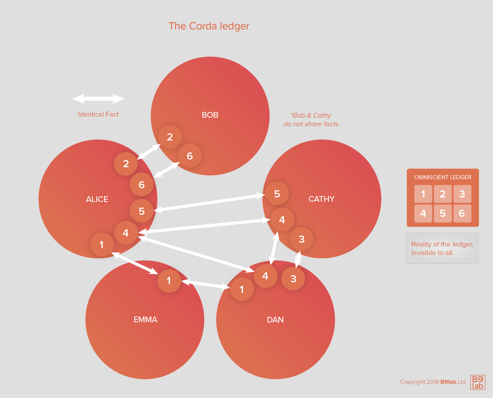
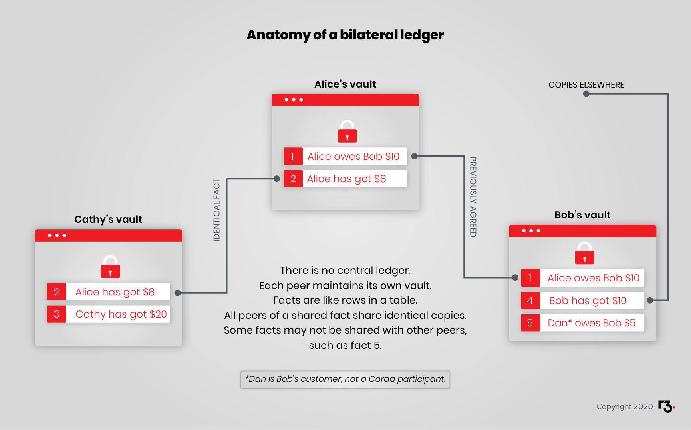
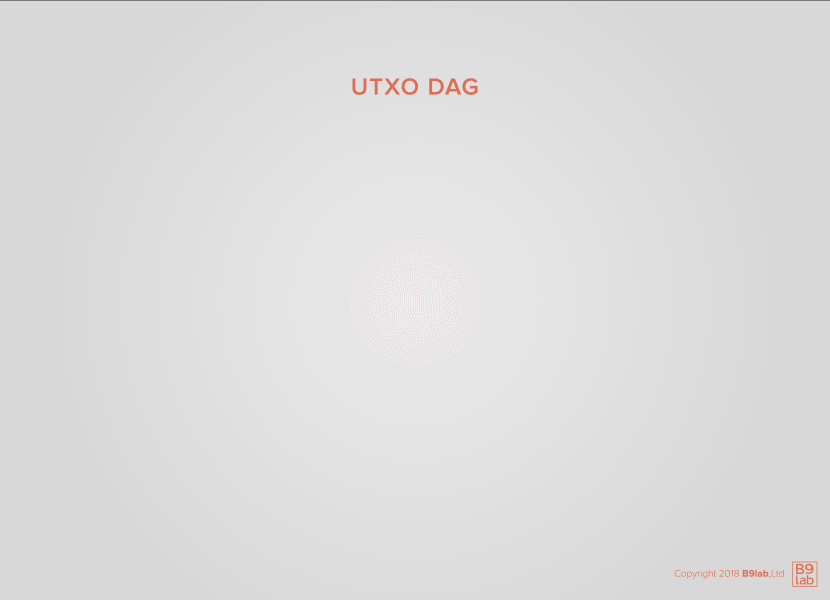
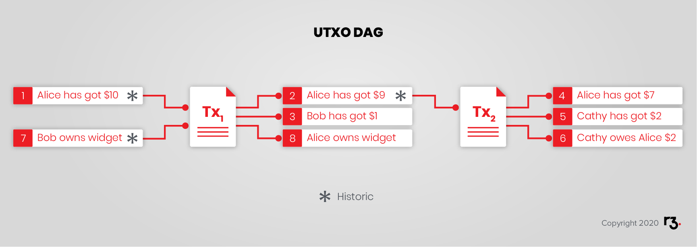
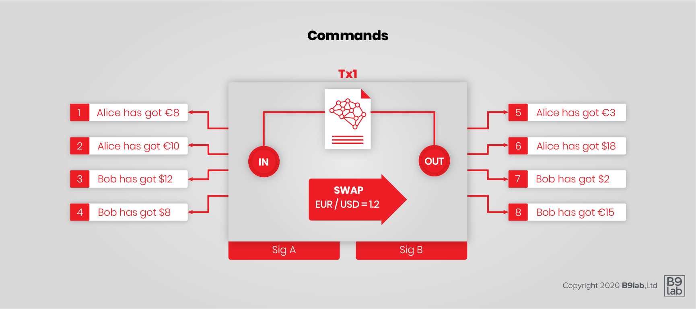
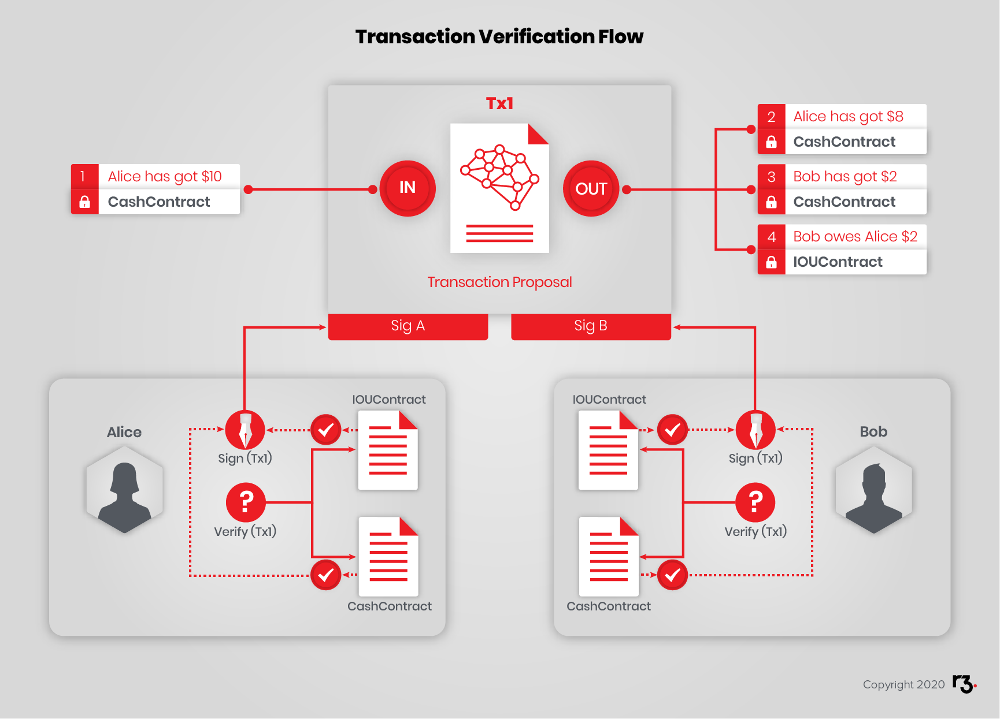
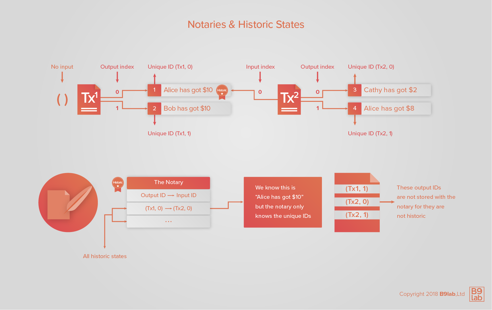
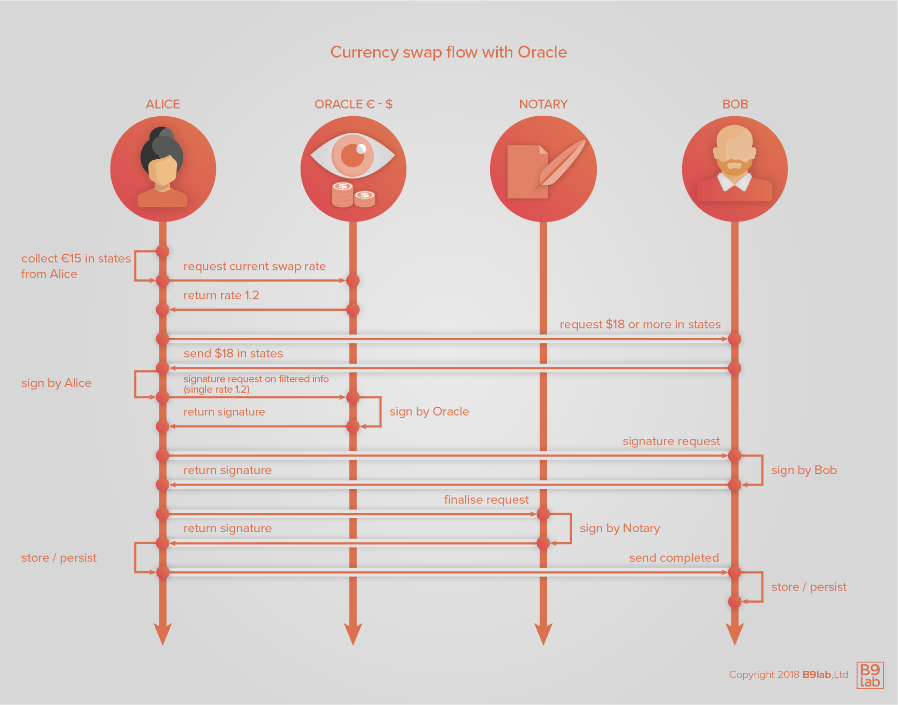
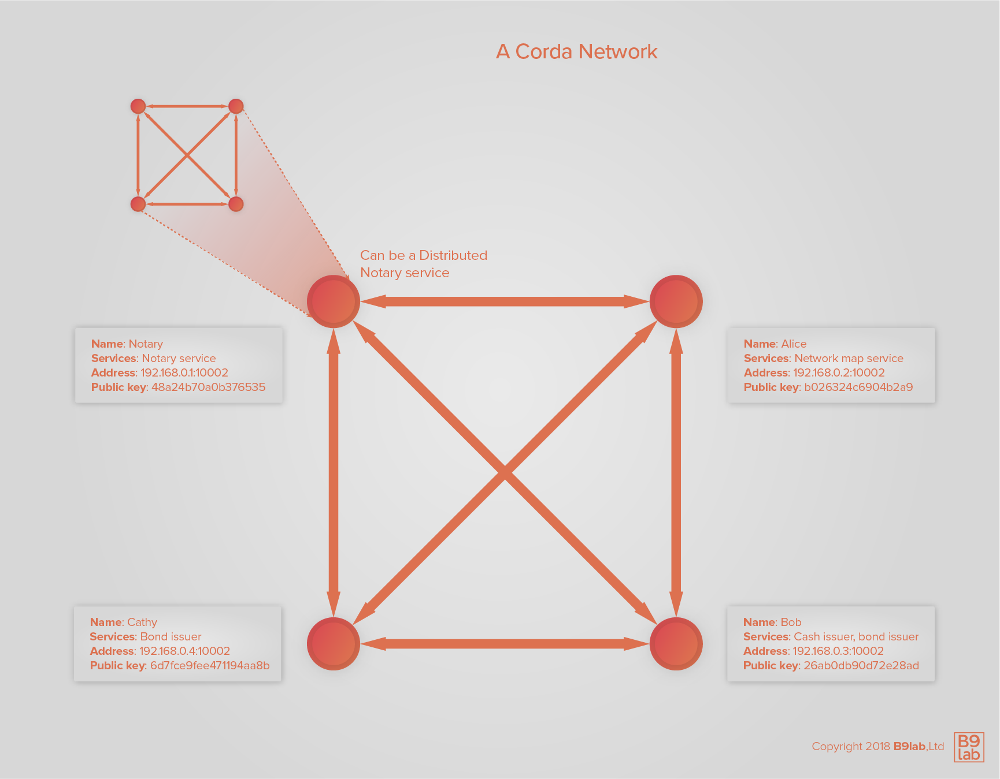

## Corda Network

Corda networks are fully connected graphs with connectivity from every peer to every other peer. There is no global broadcast or gossip. Peers communicate reliably, asynchronously and securely using AMQP over TLS (think SMTP). A Network Map service publishes a list of peers (think directory service).

## Nodes

A node is a piece of software that participates in a Corda system or network.

## States

The aggregate of all states held by all nodes of the network is the distributed ledger state. There is no central ledger, and not all nodes know all states, so the overall ledger is subjective from the perspective of each participant. Most states are found in/on at least two different nodes.

### Bilateral ledger

Each node maintains its own *vault* of states. In this example, Alice and Bob have both copies of their shared states as well as states that are known only to themselves.

As previously said, states are the parts of a UTXO DAG. Only the "unspent" states define the current state of the world. The "spent" states are part of the history of the state.

States reference different types of data that we can look at later on.

An example of a state is cash. "Alice has $10" is a state. If Alice spends $1 in a transaction, then the original state ("Alice has $10") is replaced by a new state ("Alice has $9") plus another state. Someone, let's say "Bob, has $1".

## Transactions

Transactions are what consume states and produce new states. They are atomic. Transactions either complete entirely or have no effect. There are no partially complete, "in-flight" transactions although they do have a lifecycle with various stages.

A transaction in Corda is not like in SQL or Ethereum where a command and parameters are passed along, and the state machine "decides" what is the new state.

Instead, a transaction references existing input states and future output states. A transaction that is not yet accepted by the parties is called a proposed transaction.

Let’s return to the cash example. A transaction can reference an input state "Alice has $10," and an output state "Bob has $10". The transaction consumed "Alice has $10" so that’s a historical state which is part of the past. The layman's description of the transaction is that cash has changed hands.

## Smart Contracts

Smart contracts in Corda do not describe how states are created. Instead, they are stateless pieces of code that give the thumbs up, or down, about a transaction.
In effect, one or more parties of a transaction propose a new state of the world, and the smart contract agrees with this new state, or not. Contracts also mention Legal Prose that, in case of a dispute, would presumably be accepted in a court of law. States reference contracts. In effect, states mention the code that will allow or prevent their consumption.

For the cash example, the contract could ensure that the cash amount of the input is the same as that of the output. So you could not have a transaction that had as input "Alice has $10" and as output "Bob has $9". A simple cash contract would enforce a conservation rule stating that the sum of the inputs must equal the sum of the outputs. Such a structure is sufficiently flexible to apply the rule to more complex situations. A transaction could, for example, propose to take $100 from Alice, $200 from Bob and then give $150 each to Carol and Dave. The contract would ensure that all the cash inputs equal all the cash outputs.

If we make a parallel with Bitcoin, we could say that Bitcoin's smart contract is hard-coded in the client. It would check the sum of the outputs is less or equal to the sum of the inputs. The difference goes to the miner, but that is part of the consensus.

With states, transactions and contracts, we have the basic elements of data and transitions.

## Commands

We've seen how contracts lay out rules about allowable state transitions and transactions propose state transitions. We have seen that the necessary signatures are collected to prepare to finalise a transaction which will consume the input states and create new output states. We could say that the purpose of a transaction is *implied*.

In case this isn't clear, consider that Alice proposes to adjust her IOU down by $10 while giving $10 to Bob. *Implicitly* she is offering to make a payment and she is informing Bob about her opinion of what that means. State transition proposals are technically sufficient to model transactions, but it becomes confusing as complexity and the variety of possible transaction types increases. What if Bob has difficulty understanding Alice's intent?

For practicality on more complex contracts and transactions, the Corda team created the concept of commands. Commands are part of a transaction and give them intent, which helps guide interpretation.

Using the cash example, if "Alice creates $10" out of thin air, we would call this "minting" or "issuance." If we consumed this state and output "Bob has $10", we would call this "paying." If we had no output state, we would call this "burning" or "retiring."

Commands signal the intention of a proposed state transition which helps the receiver classify received transactions and move on to considering the proposal. Smart contracts too, can branch their verification logic based on the command. More precisely, commands parameterise transactions by hinting at their intent, collecting the inputs, and specifying the list of required signers (by their public keys).

## Timestamps

In Corda, Timestamps assert that something happened within a specified window. These windows can be open closed. For example:

- between the earliest time and the latest time
- before deadline time
- after commencement time

Never:

- At exact time

Time ranges map to our understanding of real-world business processes and Legal Prose that is (presumably) enforceable in law courts. For example, an offer open to acceptance before a certain deadline becomes invalid quite naturally as the overseeing verification rules disregard acceptance if it arrives after the deadline.

## Attachments

Corda transactions may include attachments that are included with the transaction but are not part of the transaction itself. These are .ZIP files attached to the transactions.

Attachments can include:

- Legal Prose with the template and parameters
- Data files that support transactions such as calendars, currency definitions or even financial data
- Contract code and associated state definitions (`.class` files) that define the transaction states mentioned

## Flows

Flows model the business processes that oversee the evolution of transactions states. Consider the simple example of Alice's IOU. Alice first proposes the IOU which includes reference to the IOU contract that informs the contract state to be created, as well as a proposal that Bob will credit Alice's account with some currency. There is a process of gathering approvals before this proposed transaction is final.

First Alice will sign. Then Bob will sign. That's a simple flow. Still, the flow needs to add the proper command, and the proper list of required signers to the transaction, so that the smart contract(s), which invariably verify the presence of the relevant signers, approve the transaction.

Flows can be more complex and can include more than two parties. For example, if regulatory oversight is required, then the flow would indicate a third step to inform the regulator. Separately, if the flow is started from Alice's side, she would first have to ask Bob to find and aggregate enough cash states before proceeding to signing a transaction.

Flows are light-weight processes that coordinate multi-step processes that help peers reach consensus about shared states.

## Consensus

Consensus is the process by which all parties achieve certainty about the shared states. Corda applies two types of consensus:

### Validation Consensus

Validation consensus is when all peers achieve certainty that a transaction is signed by all peers listed in the commands and satisfies all constraints defined by the contracts referred to by the input and output states.

### Uniqueness Consensus

Uniqueness consensus is when peers reach certainty that the output states generated by a transaction are the unique successors to the input states referenced by said transaction. This is how Corda prevents double spending.

Suppose Alice has $10. More precisely, suppose Alice has a checking account contract with the Bank, and the current unspent state of the contract says Alice has $10. When Alice spends $1 this transaction will consume the existing state of Alice's checking account and generate a new one that indicates Alice has $9. There would, of course, be other related details such as what happened to the dollar she spent. We will set that concern aside and focus on Alice's balance.

Suppose Alice was able to reference the input state of $10 again. Alice would be able to spend more money than she has. But, the original state has a successor state that indicates that Alice has $9. The $9 state is a successor to the historical $10 state in the history of Alice's account. The rule is that a state can only be consumed one time. Or, said another way, that the output states created are the unique successors of the input states.

Notaries help confirm uniqueness.

## Notary Services

Notaries are comparable to traditional Notary Public services that provide reliable witness to events. In simple terms, Notaries maintain a key map of input states and the transactions that consumed them. They need not know the content of states and transactions; they only need a reliable way to uniquely identify them.

In Corda, every transaction is Notarised along with the peer that requested Notarisation and the transaction that marked the input state as historic.

In the simplest implementation, the Notary Service is implemented as a fault-tolerant service and all the peers will use the same Notary for every transaction.

When a peer sends a transaction to the Notary Service, one of two things will happen. If any of the input states are already referenced in the Notary's map, then the Notary will throw an exception. If none of the input states are known to have been previously consumed, then the Notary adds each input state to the map and signs the proposed transaction. This process provides uniqueness consensus.

Notarisation provides uniqueness consensus. Together with verification consensus, this gives all parties to the transaction certainty about transaction finality.

To protect themselves against a potential DoS attack, whereby an attacker submits bogus transactions, a notary can be made to _verify_ transactions. In this case, the notary will act as a regular node, and accept the transaction only if its smart contracts approve of it.

## Oracles

Oracles provide authoritative information about the external world. For example, consider a currency swap. We'll say Alice wishes to trade with Bob 10 Euros for 12 Dollars. Is that fair?

The parties can agree to use a third party quote to establish a rate of exchange. This third party is known as an Oracle. The Oracle would provide the rate of exchange to Alice, then Alice would use the "swap" command to parameterise a transaction proposing that she sends 15 Euros to Bob, Bob sends 18 Dollars to Alice, *and* the current rate is 1:1.2. Alice, Bob *and the Oracle* are listed as required signers in the swap command.

In effect, the oracle, through its signature, vouches for the information that is included in the transaction. It may also provide valid information on demand, such that a node has an easier time crafting a transaction that the oracle will approve. Additionally, with a goal of additional privacy, it is possible, via the use of a Merkle tree and of a Merkle proof, to send only the minimum required information to the oracle.

## Corda Node and CorDapps

Corda nodes implement a number of services needed to participate in a Corda Network.

### CorDapps

CorDapps are the distributed applications built on Corda. Notice that these are implemented as extensions to the Node. The Corda Node is constructed in Kotlin as are the CorDapps and the source code of the node is open to inspection and extension. Kotlin itself is based on Java. In fact, CorDapps can also be coded in Java.

CorDapps consist of Contracts, State definitions, Flows, and Services.

### Node Services

Clients connect to the Node via RPC. CorDapps connect via a service interface. The Node includes a messaging service for connecting with other Peers as well as Storage, Identity and the Vault. The Vault is the storage repository where the node records states as key/value pairs. Below all this is the persistence layer, which is a SQL database.

Here is a diagram courtesy of R3:

### Corda Network

A Corda network is a fully connected graph. As well as two or more peer participants there are important special roles that form a complete implementation.

- One doorman which provides permissioning and certificate signing for the permissioned network
- Zero or more Oracles
- One network Map Service
- One or more Notary Services

## Summary

A Corda ledger is a set of facts shared unevenly between network peers on a need-to-know basis. The system consists of uniquely identifiable states that are constrained by verification rules in contracts. Transactions consume zero or more states and produce zero or more new states. Transactions can include attachments such as Legal Prose, class definitions and external data. Flows help multiple parties coordinate the lifecycle of transactions, meaning the evolution of the input and output states and the collection of signatures. Peers reach certainty about shared states via two types of consensus, verification consensus, and uniqueness consensus. Contracts provide verification consensus, and the Notary Service(s) provide uniqueness consensus. CorDapps are extensions of the base Corda Node, which provides services for participating in a Corda Network.

## Links

- [Corda Introductory Whitepaper](https://docs.corda.net/_static/corda-introductory-whitepaper.pdf)
- [Corda Technical Whitepaper](https://docs.corda.net/_static/corda-technical-whitepaper.pdf)
- [Kotlin, a massive leap forward](https://proandroiddev.com/kotlin-a-massive-leap-forward-78251531f616)
